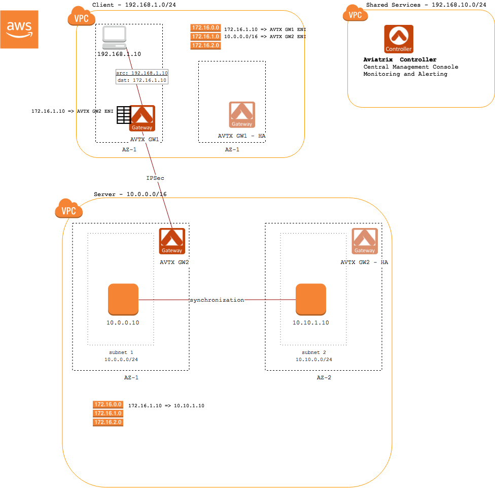
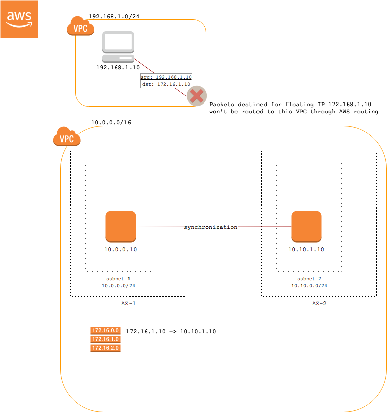
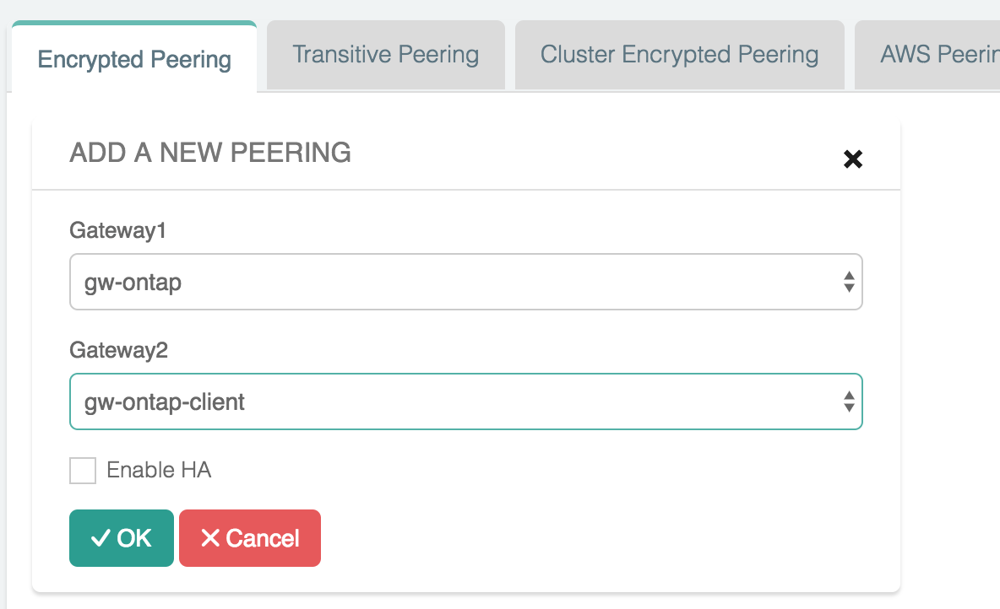
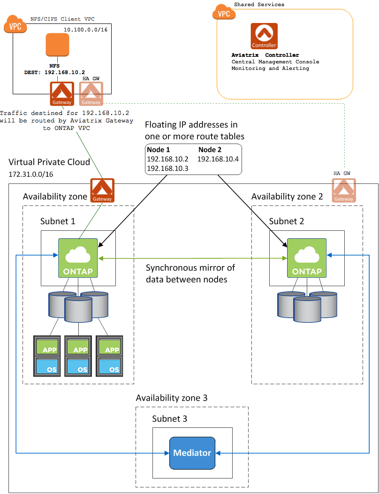
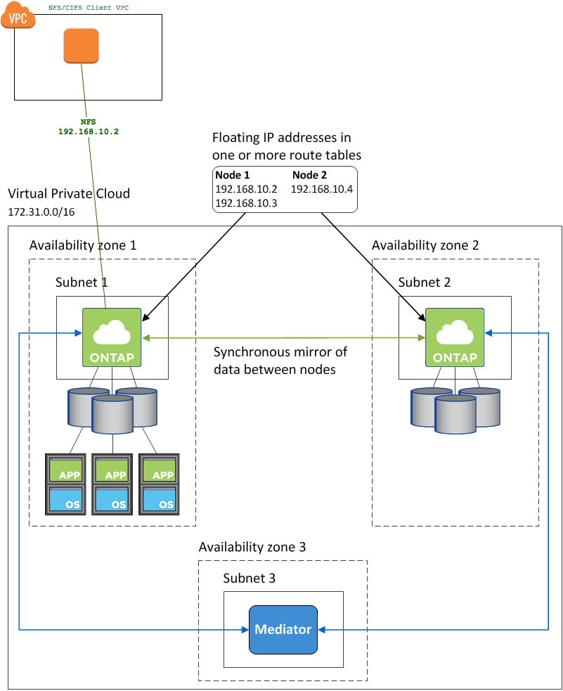
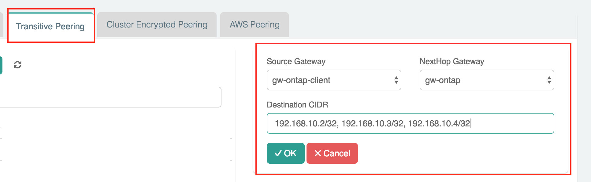

======================================================================
Connect to Floating IP Addresses in Multiple AWS AZs
======================================================================

Overview
--------

A subnet cannot span more than one availability zone (AZ) in AWS [1]_.  Because of this, the IP address assigned to an instance in one AZ cannot be reassigned to another instance in a different AZ.

Applications that require users to have a single IP address for connectivity, such as cloud-based NFS and CIFS services, need a way to failover to a different instance when the node fails.  This fault tolerance is key to services like NetApp's ONTAP Cloud.  A single AZ solution does not satisfy users' demands for a guarantee of an always-on solution.

In order to overcome the AWS limitation, applications like NetApp Cloud rely on "floating" IPs addresses for failover between nodes in different AZs.  Floating IP addresses are outside the range of the VPC CIDR.  In order to route to these addresses within AWS, they must not overlap with any CIDR range in the same AWS region.

Clients connect to the floating IP address rather than the IP address of the node itself.  When a node failure (or even an entire AZ failure) is detected, the floating IP address is "moved" to an instance in another AZ.

Problem
-------

The floating IP solution works well if the client is in the same VPC as the server.  However, if the client is not in the same VPC, AWS routing does not support routing to these IP addresses that are outside of the CIDR range for the VPC.  Those packets will never exit the VPC.

|imageProblem|

Aviatrix Solution
-----------------

Aviatrix solves this problem by handling routing of the floating IP addresses in the client VPC.  All packets destined for the floating IP address(es) will be delivered to the Aviatrix Gateway.  The gateway maintains an internal route table that points those packets to an Aviatrix gateway in the server VPC.

|imageAviatrixSolution|

Aviatrix Step-by-Step Deployment Guide for NetApp
-------------------------------------------------

Overview
########

|imageNetappHA|

What you will need:

#. A shared services VPC where the Aviatrix central controller will be installed.
#. AWS account credentials or the ability to create new IAM roles.  This is how the Aviatrix Controller will connect to your AWS account.
#. Access to the VPC where the client resides.
#. Access to the VPC where the NetApp ONTAP Cloud is installed.

Aviatrix Controller
###################

If you have already installed an Aviatrix Controller, you can skip this step.

#. Follow the steps in `this guide <../StartUpGuides/aviatrix-cloud-controller-startup-guide.html>`__ to install a Controller in a VPC of your choice (a shared services VPC, for example)

Client VPC
##########

Provision an Aviatrix Gateway in the VPC where your client application resides:

.. note::

   The Aviatrix gateway must be installed in a public subnet.  If you do not have one created in the VPC where your client application resides, please create one before continuing.

#. Login to your Aviatrix Controller
#. Click on the `Gateways` item in the navigation menu
#. Click on `+ New Gateway` to create a new Gateway
#. Select the VPC and subnet and provide a name for this Gateway (e.g., "netapp-client")
#. Leave the other options at their default values
#. Click `OK`

NetApp ONTAP Cloud VPC
######################

Next, create a Gateway in the VPC of your NetApp Cloud installation.

.. note::

   The Aviatrix gateway must be installed in a public subnet.  If you do not have one created in the VPC where your NetApp Cloud is installed, please create one before continuing.

#. Login to your Aviatrix Controller
#. Click on the `Gateways` item on the navigation menu
#. Click on `+ New Gateway` to create a new Gateway
#. Select the VPC and subnet and provide a name for this Gateway (e.g., "netapp-ontap")
#. Leave the other options at their default values
#. Click `OK`

For redundancy, enable HA:

.. note::

   The Aviatrix HA gateway must be installed in a public subnet.  If you do not have one created in the VPC where your NetApp Cloud is installed, please create (another) one before continuing in a different AZ than the previous gateway.

#. Login to your Aviatrix Controller
#. Click on the `Gateways` item on the navigation menu
#. Select the gateway just created (e.g., "netapp-ontap")
#. Click on the `Edit` button above the table
#. Below `Gateway for High Availability Peering`, select the public subnet that is in a different AZ from the earlier gateway
#. Click `Create`

Peer the Client VPC with the ONTAP VPC
########################################

First, set up a connection for traffic to go between the client and the ONTAP VPC:

#. Login to your Aviatrix Controller
#. Click on the `Peering` item on the navigation menu
#. Click on `+ New Peering` to create a new peer
#. Select `netapp-client` for `Gateway1` and `netapp-ontap` for `Gateway2`
#. Click `OK`

   |imageAddPeer|

Route Floating IP routes from client to the ONTAP VPC
########################################################
Next, set up a route for traffic for the floating IP addresses through the client gateway to the ONTAP gateway:

#. Login to your Aviatrix Controller
#. Click on the `Peering` item on the navigation menu
#. Click on the `Transitive Peering` tab
#. Click on `+ New Peering` to create a new transitive peer definition
#. Select the `netapp-client` for the `Source Gateway` and `netapp-ontap` for the `NextHop Gateway`
#. In the `Destination CIDR`, enter the list of floating IP addresses (comma-separated).  For example, ``192.168.10.2/32, 192.168.10.3/32, 192.168.10.4/32``.
#. Click `OK`

   |imageAddTransitivePeer|

Add Floating IP routes to ONTAP Controllers
###########################################

In the NetApp Cloud Manager, be sure to select the subnet(s) where the Aviatrix Gateway(s) is installed when `modifying AWS route tables <http://docs.netapp.com/occm/index.jsp?topic=%2Fcom.netapp.doc.onc-cloud-mgr-ug-330%2FGUID-7DD84149-4A73-4A1D-84FF-31F096781EF4.html>`__ with the routes to the floating IPs.

Validate
########

Mount a share on an instance in the client VPC and test connectivity.

The final architecture will look like this:

|imageFinal|

.. [1] https://docs.aws.amazon.com/AmazonVPC/latest/UserGuide/VPC_Subnets.html#vpc-subnet-basics
.. [2] https://library.netapp.com/ecmdocs/ECMLP2484721/html/GUID-46865CCE-19CE-45C2-BEC4-2FA222CE9537.html#GUID-46865CCE-19CE-45C2-BEC4-2FA222CE9537__SECTION_0428B81160F7479CAC70E140483818F2

