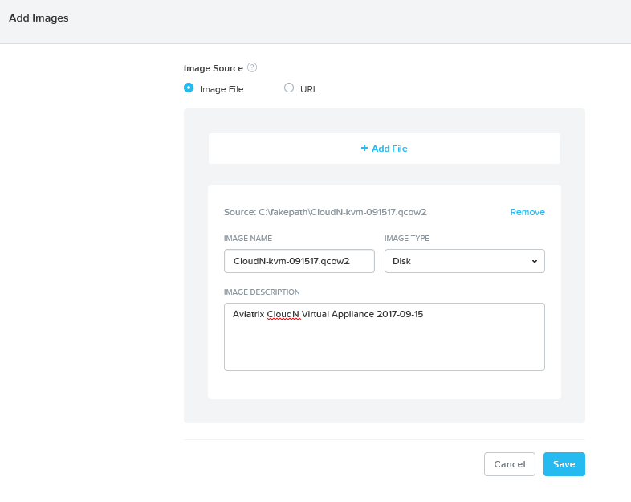
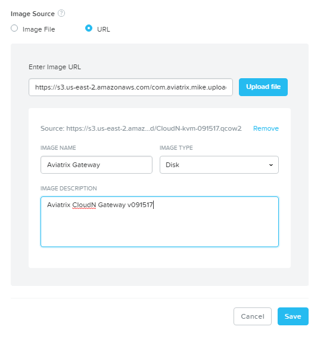
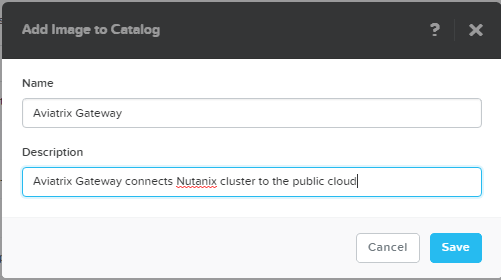
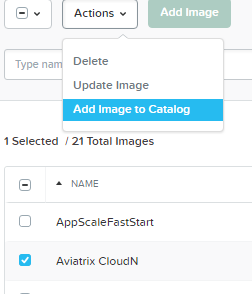
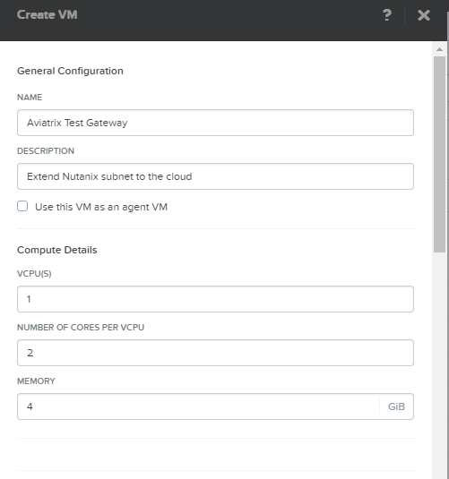
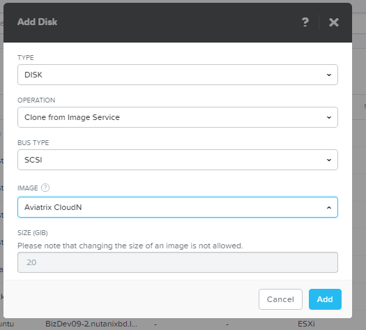
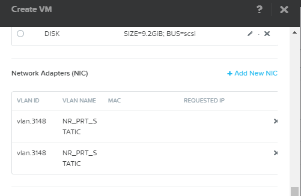
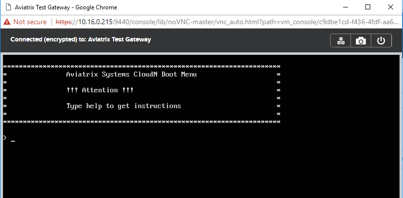
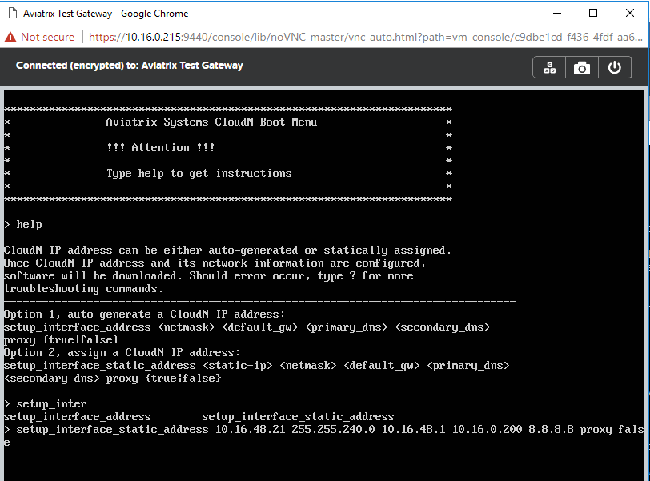

.. meta::
   :description: Aviatrix Virtual Appliance CloudN Startup Guide for Nutanix
   :keywords: Aviatrix Cloud Interconnect, DCCX, CloudN, datacenter extension, nutanix

=======================================
Aviatrix Virtual Appliance for Nutanix
=======================================

Aviatrix CloudN is a virtual appliance that is deployed in your Nutanix environment.

This applicance supports 3 primary use cases:

- `Datacenter Extension <../Solutions/aviatrix_aws_meshVPC.html>`__ - Layer 2 bridge to the cloud (AWS or Azure)
- `Site to Cloud <../HowTos/cloudn-site2cloud.html>`__ - Build encrypted tunnel to existing VPC (AWS) or VNet (Azure)
- `IPmotion <../HowTos/ipmotion.html>`__ - Migrate on-premise VMs to AWS or Azure while preserving IP addresses

Getting Started
===============
There are 3 steps to getting started:

#. `Download and add <#step1>`__ the Aviatrix Virtual Appliance image to Nutanix
#. `Create a new VM <#step2>`__ in Nutanix
#. Set up `Aviatrix <#step3>`__
#. Configure Aviatrix for your `Use Case <#step4>`__

.. _Step1:

Download and Add the CloudN Image to Nutanix
============================================

#. Download the KVM image from `here <http://docs.aviatrix.com/Downloads/cloudndownload.html>`__
#. Extract the .qcow2 file
#. Upload the image file to Nutanix

   |imageNutanixAddImage|

   .. note::
      Due to the size of the .qcow2 image file, you may need to upload it first to an S3 bucket and then pass the URL of the S3 file to Nutanix.

      |imageNutanixAddImageS3URL|

#. Once the image has been uploaded, add it to the Catalog.

   |imageNutanixAddImageToCatalogMenu|

   |imageNutanixAddImageToCatalogDialog|

.. _Step2:

Create a new VM on Nutanix Cluster
==================================

#. Create a new VM in your Nutanix cluster
#. Populate the `Name` and `Description` fields
#. For initial configurations, we recommend 1 VCPU with 2 cores and 4 GiB of memory

   |imageNutanixCreateVMTopDialog|

#. Remove all disks currently attached to the VM
#. Add a new disk.  Be sure to select `Clone from Image Service` for the `Operation`

   |imageNutanixCreateVMAddDisk|

#. Add 2 NICs.  Prior to creating these NICs you must create a separate VLAN for the Gateway.  These 2 NICs should both be in that VLAN.

   |imageNutanixCreateVMAddNIC|

#. Power the VM on

.. _Step3:

Set up Aviatrix Gateway
==========================

#. Open the console to the Aviatrix Gateway VM
#. Login with the default username and password:

   | **username:** admin
   | **password:** Aviatrix123#

#. Once logged in, you will see a console.  There are 2 options available:

   - `setup_interface_address`
   - `setup_interface_static_address`

   |imageAviatrixConsoleInitial|

#. Run the setup command

   |imageAviatrixConsoleRunSetup|
   
.. _Step4:

Configure Aviatrix for Use Case
===============================

#. Login to the administrative web console

   https://<ip address entered in previous setup step>

   | **username:** admin
   | **password:** IP address entered in previous setup step

#. Follow instructions for your use case:
   
- `Datacenter Extension <../Solutions/aviatrix_aws_meshVPC.html>`__ - Layer 2 bridge to the cloud (AWS or Azure)
- `Site to Cloud <../HowTos/cloudn-site2cloud.html>`__ - Build encrypted tunnel to existing VPC (AWS) or VNet (Azure)
- `IPmotion <../HowTos/ipmotion.html>`__ - Migrate on-premise VMs to AWS or Azure while preserving IP addresses

