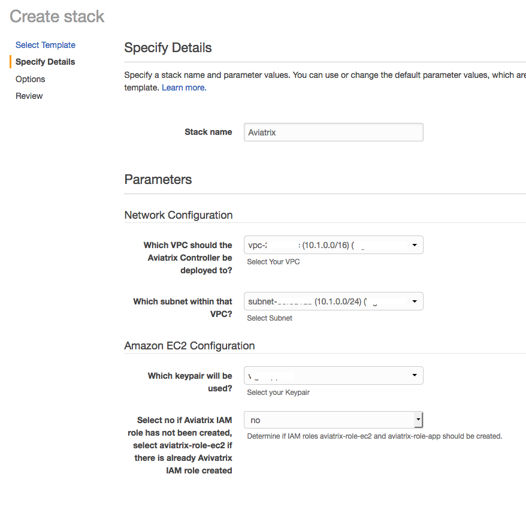

.. meta::
    :description: Install the Aviatrix Controller, 2 Gateways, and setup peering in AWS
    :keywords: Aviatrix, AWS

==================================================================
Getting Started with Aviatrix on AWS
==================================================================

Overview
--------
This guide will help you get started with Aviatrix in AWS.  If you have not installed an Aviatrix Controller in your environment and you'd like to get set up in AWS this is the right guide for you.

AWS Account
-----------
Before you start, you will need to have an `AWS account <https://aws.amazon.com/>`__.   Create a new account or login to an existing account.

.. note::

   The Aviatrix Controller supports multiple AWS accounts.

Install Software
----------------------
The easiest way to get started in AWS is to use the `CloudFormation template <https://github.com/AviatrixSystems/AWSQuickStart/blob/master/aviatrix-aws-quickstart.json>`__ available on our `GitHub repository <https://github.com/AviatrixSystems/AWSQuickStart>`__.

Accept the License Terms
^^^^^^^^^^^^^^^^^^^^^^^^
Before you get started, you'll need to accept the terms of the Aviatrix license in the AWS Marketplace.

 1. Go to the `AWS Marketplace <https://aws.amazon.com/marketplace/pp?sku=zemc6exdso42eps9ki88l9za>`__.
 2. Click `Continue to Subscribe`

   |imageAwsMarketplaceContinuetoSubscribe|

 3.  Click `Manual Launch` and then `Accept Software Terms`.

    |imageAwsMarketplaceAcceptTerms|

 4.  Once accepted, you can return to the AWS console.  We will launch the Controller from the Marketplace.

DNS Server Connectivity Check
^^^^^^^^^^^^^^^^^^^^^^^^^^^^^
If the VPC where the Controller is deployed in has a custom DNS server (via DHCP option), make sure the Controller instance can reach this DNS server. 

Install the Controller with CloudFormation Template
^^^^^^^^^^^^^^^^^^^^^^^^^^^^^^^^^^^^^^^^^^^^^^^^^^^
The Aviatrix Controller acts as a single pane of glass for all of your Cloud Networking tasks.  Just one Controller is needed and it is typically installed in the cloud.  Once you have a Controller installed, you can provision Gateways and configure security policies, etc.  The steps outlined below install Aviatrix Controller in your AWS account.

.. note::

   You can also launch the controller `manually <http://docs.aviatrix.com/StartUpGuides/aws_manual_startup_guide.html>`__.
..

 1. Download the `aviatrix-aws-quickstart.json <https://raw.githubusercontent.com/AviatrixSystems/AWSQuickStart/master/aviatrix-aws-quickstart.json>`_ file and save it locally.
 2. In the AWS console, change to the region where you would like to install the Aviatrix Controller.
 3. Once in the correct region, go to the `CloudFormation <https://console.aws.amazon.com/cloudformation/home>`_ service.
 4. Click `Create new stack` or `Create Stack`

   |imageCFCreate|

 5. Select `Upload a template to Amazon S3` and `Browse ...` to find the `aviatrix-aws-quickstart.json` downloaded in step 1.

   |imageCFSelectTemplate|

 6. Click `Next`
 7. Populate the Stack name and select a VPC, subnet, and a keypair.

   |imageCFSpecifyDetails|

.. note::

   The Aviatrix Controller must be launched on a public subnet.
..

 8. Leave the `Controller Size` at `t2.large` and keep the `IAM role creation` at "no" unless you have already created the Aviatrix roles.
 9. Click `Next`
 10. Optionally, add any key/value tags as required
 11. Optionally, select an IAM Role if your currently logged in user does not have permission to create instances.
 12. Click `Next`
     
   |imageCFOptions|

 13. Click the checkbox next to "I acknowledge that AWS CloudFormation ..." and then click `Create`.

   |imageCFCreateFinal|

 14. Once complete, click on the `Outputs` tab.  The values displayed will be needed when configuring AWS account in Aviatrix.
   
   |imageCFComplete|

Configure the Controller
^^^^^^^^^^^^^^^^^^^^^^^^
Once you have the Aviatrix Controller installed in your AWS account, you will next need to step through a couple of configuration items.

1. Open a browser window to https://&lt;AviatrixControllerEIP found in the Outputs&gt;/

.. tip::
   You may receive a warning that the connection may not be secure.  This is because the certificate is self-signed by the Controller.  It is safe to continue to the page.

   |imageControllerBrowserWarning|

2. Login with the username `admin`.

.. note::
   Use the `AviatrixControllerPrivateIP` as the password.  The `AviatrixControllerPrivateIP` is found in the Outputs section of the CloudFormation stack.
   
   |imageCFOutputsWithPassword|

3. Enter your email address.  This email will be used for alerts as well as password recovery (if needed).

   |imageControllerEnterEmail|

4. Next, you will be prompted to change the admin password.

   |imageControllerChangePassword|

5. If you have an HTTP or HTTPS proxy, enter it on the next page.  Otherwise, click `Skip`.

6. Finally, the Controller will upgrade itself to the latest version after you click on `Run`.

   |imageControllerUpgrade|

.. tip::
   The Controller upgrade takes about 3-5 minutes.  Once complete, the login prompt will appear.  Use the user `admin` and your new password to login.

Enter Your Customer ID
^^^^^^^^^^^^^^^^^^^^^^
.. tip::
   If you do not have a Customer ID, please contact info@aviatrix.com to get a trial license.
   
1. Once logged in to the Controller, click on the `Onboarding` navigation item.

   |imageAviatrixOnboardNav|

2. Click the AWS icon.

   |imageOnboardAws|

3. Enter the `Customer ID` in the field and click `Save`.

   |imageEnterCustomerID|
   
Connect AWS to the Controller
^^^^^^^^^^^^^^^^^^^^^^^^^^^^^
The next step is to provide the AWS credentials to the Controller so it can orchestrate an your behalf.

1. Click on the `Onboarding` navigation item.

   |imageAviatrixOnboardNav|

2. Click the AWS icon.

   |imageOnboardAws|

3. Fill out the fields as follows:

  +-------------------------------+--------------------------------------------+
  | Field                         | Expected Value                             |
  +===============================+============================================+
  | Account Name                  | The login/username for users who will have |
  |                               | admin access to AWS resources.             |
  |                               | For example, `AWSOpsTeam`.                 |
  +-------------------------------+--------------------------------------------+
  | E-mail                        | The e-mail address for this team.          |
  +-------------------------------+--------------------------------------------+
  | Password                      | Password for login to the controller.      |
  +-------------------------------+--------------------------------------------+
  | Confirm Password              |                                            |
  +-------------------------------+--------------------------------------------+
  | AWS Account Number            | You can find your account number           |
  |                               | on the `AWS billing` page.                 |
  +-------------------------------+--------------------------------------------+
  | IAM role-based                | Check this box.                            |
  +-------------------------------+--------------------------------------------+
  | aviatrix-role-app ARN         | Enter the value from the CloudFormation    |
  |                               | outputs `AviatrixRoleAppARN`               |
  +-------------------------------+--------------------------------------------+
  | aviatrix-role-ec2 ARN         | Enter the value from the CloudFormation    |
  |                               | outputs `AviatrixRoleEC2ARN`               |
  +-------------------------------+--------------------------------------------+

.. tip::

   Each account can use a root account, IAM role, IAM administrator account or IAM user account with access privileges required by the Aviatrix solution. We strongly recommend you to use IAM role for security reasons.
  
Once complete, click the `Create` button at the bottom of the form.

|imageCreateAccount|

Next Steps
^^^^^^^^^^
You are now ready to establish connectivity to/from the cloud.  For help getting started with your use case see:

- `User SSL VPN <../HowTos/uservpn.html>`__
- `Transit Network <../HowTos/transitvpc_workflow.html>`__
- `Egress Security Filter <..HowTos/FQDN_Whitelists_Ref_Design.html>`__

.. Warning:: Any resources created by the Controller, such as Aviatrix gateways, route entries, ELB, SQS queues, etc, must be deleted from the Controller console. If you delete them directly on AWS console, the Controller's view of resources will be incorrect which will lead to features not working properly.  

.. |imageAwsMarketplacePage1| image:: ZeroToConnectivityInAWS_media/aws_marketplace_page1.png
.. |imageAwsMarketplaceContinuetoSubscribe| image:: ZeroToConnectivityInAWS_media/aws_marketplace_step1.png
.. |imageAwsMarketplaceAccept| image:: ZeroToConnectivityInAWS_media/aws_marketplace_step2.png
.. |imageAwsMarketplaceAcceptTerms| image:: ZeroToConnectivityInAWS_media/aws_marketplace_select_region_and_accept.png
.. |imageCFCreate| image:: ZeroToConnectivityInAWS_media/cf_create.png
.. |imageCFOptions| image:: ZeroToConnectivityInAWS_media/cf_options.png
.. |imageCFCreateFinal| image:: ZeroToConnectivityInAWS_media/cf_create_final.png
.. |imageCFComplete| image:: ZeroToConnectivityInAWS_media/cf_complete_outputs.png
.. |imageCFOutputsWithPassword| image:: ZeroToConnectivityInAWS_media/cf_complete_outputs_private_ip_highlight.png
.. |imageControllerBrowserWarning| image:: ZeroToConnectivityInAWS_media/controller_browser_warning.png
   :scale: 50%

.. |imageControllerEnterEmail| image:: ZeroToConnectivityInAWS_media/controller_enter_email.png
   :scale: 50%

.. |imageControllerChangePassword| image:: ZeroToConnectivityInAWS_media/controller_change_password.png
   :scale: 50%

.. |imageControllerUpgrade| image:: ZeroToConnectivityInAWS_media/controller_upgrade.png
   :scale: 50%

.. |imageCFSelectTemplate| image:: ZeroToConnectivityInAWS_media/cf_select_template.png

.. |imageAviatrixOnboardNav| image:: ZeroToConnectivityInAWS_media/aviatrix_onboard_nav.png
   :scale: 50%

.. |imageOnboardAws| image:: ZeroToConnectivityInAWS_media/onboard_aws.png
   :scale: 50%

.. |imageEnterCustomerID| image:: ZeroToConnectivityInAWS_media/customerid_enter.png
   :scale: 25%

.. |imageCreateAccount| image:: ZeroToConnectivityInAWS_media/create_account.png
