.. meta::
    :description: Install the Aviatrix Controller in AWS
    :keywords: Aviatrix, AWS, Global Transit Network, AWS VPC Peering, VPC Peering, Egress Control, Egress firewall, OpenVPN, SSL VPN

==================================================================
AWS Startup Guide
==================================================================

.. raw:: html

    

.. raw:: html

    

.. raw:: html

    
    

Welcome to getting started on AWS! This guide takes you through the 3 steps to launch your Aviatrix Controller instance:

#. `Subscribing to the AMI (Amazon Machine Image) <https://docs.aviatrix.com/StartUpGuides/aviatrix-cloud-controller-startup-guide.html#subscribing-to-an-aviatrix-ami>`_.
#. `Launching the Controller with CloudFormation <https://docs.aviatrix.com/StartUpGuides/aviatrix-cloud-controller-startup-guide.html#id1>`_.
#. `Onboarding your AWS account in your Aviatrix Controller <https://docs.aviatrix.com/StartUpGuides/aviatrix-cloud-controller-startup-guide.html#id2>`_.
 
When complete, you'll be ready to deploy use cases. 

  |3-step|

..
    You can also `watch a video <https://youtu.be/ltL_dWjjV0w>`_ for this startup guide. 

.. important::

 The Aviatrix Controller must be launched by a Cloudformation script provided by Aviatrix. Follow the instructions in this document to launch the Controller. Do not launch the Controller instance from the AWS Console. 

Subscribing to an Aviatrix AMI 
^^^^^^^^^^^^^^^^^^^^^^^^^^^^^^^^^^^^^^^^^^^^^^^^^^^^^^^^^^

If you have already subscribed the Metered AMI on AWS Marketplace, skip this step and proceed to the Launch the Controller with CloudFormation section.

1. To subscribe to the AMI, click the AMI link below to take you to the AWS Marketplace. 

.. |marketplace_metered_link2| raw:: html

    <a href="https://aws.amazon.com/marketplace/pp/B08NTSDHKG?qid=1616801289672&sr=0-2" target="_blank" onclick="getOutboundLinkAndOpen('https://aws.amazon.com/marketplace/pp/B08NTSDHKG?qid=1616801289672&sr=0-2');">Aviatrix Secure Networking Platform Metered with Copilot</a>

|marketplace_metered_link2|

..
    `Aviatrix Secure Networking Platform Metered - Copilot & 24x7 Support <https://aws.amazon.com/marketplace/pp/B08NTSDHKG?qid=1616801289672&sr=0-2&ref=_ptnr_docs_startup_metered_copilot24x7>`_

2. Click **Continue to Subscribe**. Subscribing means that you can begin deploying the software in later steps via the CloudFormation template. 
 
   |AMI_24x7_copilot|

3. Click **Accept Terms**. Then, **return to this guide and continue**. Do not proceed to Continue to Configuration.

Launching the Controller with CloudFormation
^^^^^^^^^^^^^^^^^^^^^^^^^^^^^^^^^^^^^^^^^^^^^^^^^^^^^^^^^^^

1. Click the link below to take you to the CloudFormation page on the AWS Console with the pre-loaded template. Follow the instructions in the next steps 
to run the Cloudformation script.   

.. |CFT_link| raw:: html

    <a href="https://us-west-2.console.aws.amazon.com/cloudformation/home?region=us-west-2#/stacks/new?stackName=AviatrixController&templateURL=https://aviatrix-cloudformation-templates.s3-us-west-2.amazonaws.com/aws-cloudformation-aviatrix-metered-controller-copilot-24x7-support.template" target="_blank" onclick="getOutboundLinkAndOpen('CFT_launch');">CloudFormation for Aviatrix Secure Networking Platform Metered with Copilot</a> 

|CFT_link|

..
    `CloudFormation for Aviatrix Secure Networking Platform Metered - Copilot & 24x7 Support <https://us-west-2.console.aws.amazon.com/cloudformation/home?region=us-west-2#/stacks/new?stackName=AviatrixController&templateURL=https://aviatrix-cloudformation-templates.s3-us-west-2.amazonaws.com/aws-cloudformation-aviatrix-metered-controller-copilot-24x7-support.template>`_

**Other Aviatrix Products**

CloudFormation for Aviatrix Secure Networking Platform Metered with Copilot

* `Aviatrix Secure Networking Platform - BYOL <https://us-west-2.console.aws.amazon.com/cloudformation/home?region=us-west-2#/stacks/new?stackName=AviatrixController&templateURL=https://aviatrix-cloudformation-templates.s3-us-west-2.amazonaws.com/avx-awsmp-BYOL.template>`_
* Aviatrix Secure Networking Platform - Enterprise Subscription
* Check out `Other Aviatrix Products CloudFormation launch scripts  <https://docs.aviatrix.com/StartUpGuides/aviatrix-cloud-controller-startup-guide.html#other-aviatrix-products>`_.

2. If you have not logged in, you will be prompted to log in to the AWS console. 
3. Change to the region where you would like to install the Aviatrix Controller on the CloudFormation page. Note the CloudFormation is already loaded.

4. Click **Next**.

 |cft-next|

5. Fill in the following fields:

  * The Stack name,
  * Select a VPC in the drop down menu, 
  * Select a **public subnet in that VPC** (Go to AWS VPC console to make sure the public subnet is indeed in your selected VPC. A public subnet must have a default route point to IGW in its associated VPC route table. Read `this link  <https://docs.aws.amazon.com/AmazonVPC/latest/UserGuide/VPC_Subnets.html>`__ if you do not know what public subnet is.)
  * And a keypair (Read `how to create a keypair <https://docs.aws.amazon.com/AWSEC2/latest/UserGuide/ec2-key-pairs.html>`_ to create a keypair in AWS EC2 console if this field is blank.)

   |imageCFSpecifyDetails|

.. note::

   The Aviatrix Controller must be launched on a public subnet. If this is the first time you launch an Aviatrix Controller, select the default setting **New** for IAM Role Creation. If an Aviatrix IAM role has been created before, select **aviatrix-role-ec2** for IAM Role Creation.  The Aviatrix Controller instance is termination protected. 
..

6. Select instance size. Set the Controller Size to t3.large and keep the IAM role creation at New unless you have already created the Aviatrix IAM roles.
7. Click **Next**.
8. Click **Acknowledge**.
9. Mark the checkbox next to "I acknowledge that AWS CloudFormation ..." and then click **Create**.

   |imageCFCreateFinal|

10. When the stack creation completes (the status changes to CREATE_COMPLETE), click on the **Outputs** tab. You will need to use the values displayed when you onboard a primary access account for AWS in your Aviatrix Controller. (You might have to refresh your browser window and/or AWS console to see your Stack show up and the Status to be updated).
   
   |imageCFComplete|

Onboarding your AWS account in your Aviatrix Controller
^^^^^^^^^^^^^^^^^^^^^^^^^^^^^^^^^^^^^^^^^^^^^^^

Now that Aviatrix Controller instance has been launched, log in to your Controller and go through the onboarding process. 

1. To access the Controller, open a browser window to https://AviatrixControllerEIP, where AviatrixControllerEIP can be found in the Stack Outputs. You can also find the Controller instance EIP by going to AWS EC2 console, click the Controller instance, and locate its public IP address. 

.. tip::
   You may receive a warning that the connection may not be secure. This is because the certificate is self-signed by the Controller. It is safe to continue to the page.

..

   |imageControllerBrowserWarning|

2. Log in to the Controller:

* Username - admin
* Password - the AviatrixControllerPrivateIP from your AWS account. You can find this IP address in the Outputs section of the CloudFormation stack or by going to AWS EC2 console, clicking the Controller instance, and locating its private IP address. 

3. Enter your email address. This email will be used for alerts as well as password recovery if needed.
4. When prompted, change your password. Make sure this password is secure. 
5. Click Run. The Controller will upgrade itself to the latest software version. Wait for a few minutes for the process to finish. 

.. tip::
   The Controller upgrade takes about 3-5 minutes.  Once complete, the login prompt will appear.  Use the username "admin" and your new password to login.

..

If you wish to run a custom version, consult the Aviatrix Support team before attempting it. 

6. When you log into the Controller, the Onboarding page should open. On the Onboarding page, select AWS. 

   |imageOnboardAws|

7.  Set up a primary access account for AWS using the following information:

  * The Controller instance's AWS 12-digit account ID.

Check out `this link <http://docs.aviatrix.com/HowTos/onboarding_faq.html#what-is-an-aviatrix-access-account-on-the-controller>`__ if you have questions regarding Aviatrix access account.

Fill out the fields as follows: (The AWS Account Number can be found at the Stack Outputs section or get from `this link. <https://docs.aws.amazon.com/IAM/latest/UserGuide/console_account-alias.html>`__)

  +-------------------------------+--------------------------------------------+
  | Field                         | Expected Value                             |
  +===============================+============================================+
  | Account Name                  | Enter a name that is unique on the         |
  |                               | Controller.                                |
  |                               | Example name: `AWSOpsTeam`.                |
  +-------------------------------+--------------------------------------------+
  | AWS Account Number            | The Controller instance's 12-digit         |
  |                               | AWS account number. It can be found in the |
  |                               | Stack Outputs section `AccoundId`.         |
  +-------------------------------+--------------------------------------------+
  | IAM role-based                | Check this box.                            |
  +-------------------------------+--------------------------------------------+

8. Once complete, click **Create** at the bottom of the form.

Occasionally, you may need to update your IAM policy. See `this document <https://docs.aviatrix.com/HowTos/iam_policies.html>`_ to audit your policy to check for updates and update it if necessary.

Next: Start a Use Case 
^^^^^^^^^^^^^^^^^^^^^^^^^

Congratulations!  

You are now ready to deploy use cases. Here are some of the things you can do:

- `Build Net-Gen Transit Network for AWS <https://docs.aviatrix.com/HowTos/tgw_plan.html>`__
- `Build Egress Security <../HowTos/FQDN_Whitelists_Ref_Design.html>`__
- `Build User SSL VPN <../HowTos/uservpn.html>`__
- `Build Site to Cloud VPN <http://docs.aviatrix.com/HowTos/site2cloud_faq.html>`_
- `Build Multicloud Peering <http://docs.aviatrix.com/HowTos/GettingStartedAzureToAWSAndGCP.html>`_
- `Build Encrypted Peering <http://docs.aviatrix.com/HowTos/peering.html>`_
- `Build Firewall Network <https://docs.aviatrix.com/HowTos/firewall_network_workflow.html>`_
- `Build PrivateS3 <https://docs.aviatrix.com/HowTos/privateS3_workflow.html>`_

-  `Aviatrix Overview. <http://docs.aviatrix.com/StartUpGuides/aviatrix_overview.html>`_

.. Important:: Any resources created by the Controller, such as Aviatrix gateways, route entries, ELB, SQS queues, etc, must be deleted from the Controller console. If you delete them directly on an AWS console, the Controller's view of resources will be incorrect which will lead to features not working properly.  

For technical support, please open a support ticket at `Aviatrix Support Portal <https://support.aviatrix.com>`_.

Enjoy!

Additional Information for Controller
^^^^^^^^^^^^^^^^^^^^^^^^^^^^^^^^^^^^^^^^^

 - **Controller backup and restore**  `Controller backup instructions info <https://docs.aviatrix.com/HowTos/controller_backup.html>`_.

 - **Controller high availability**  Controller HA instructions can be found `here <https://docs.aviatrix.com/HowTos/controller_ha.html>`_.

 - **Software upgrade**  `Software upgrade procedure info <https://docs.aviatrix.com/HowTos/inline_upgrade.html>`_.

 
 
.. add in the disqus tag

.. disqus::

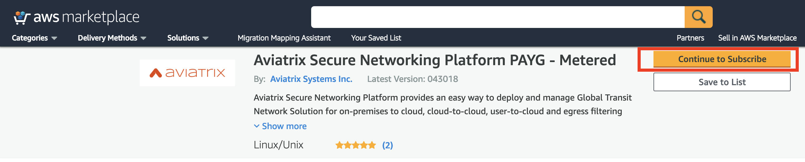

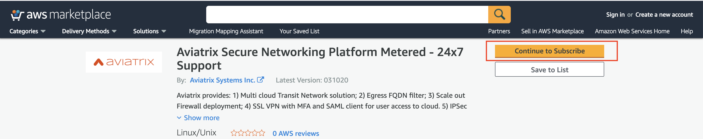

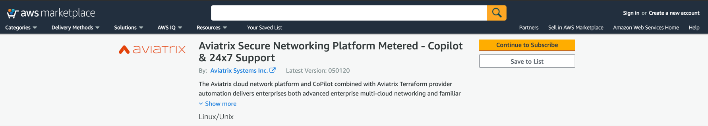

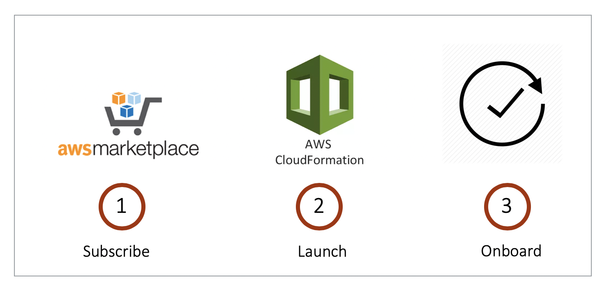

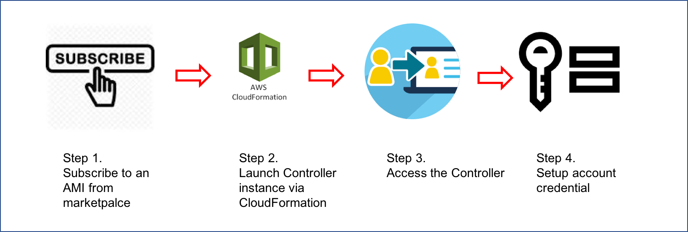

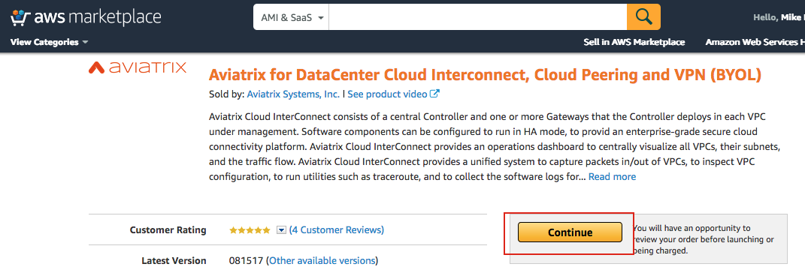
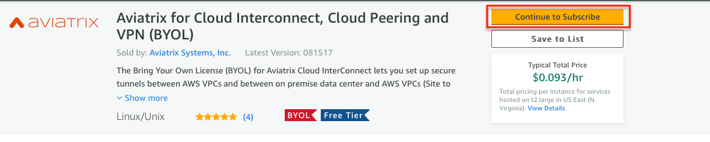
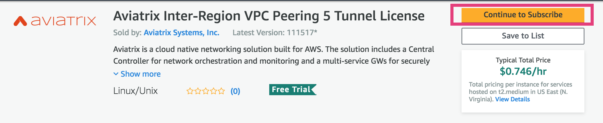
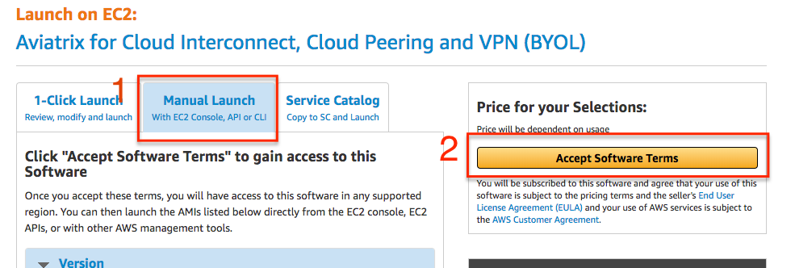
.. |imageAwsMarketplaceAcceptTerms| image:: ZeroToConnectivityInAWS_media/aws_marketplace_select_region_and_accept.png
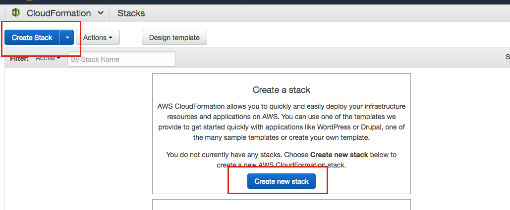
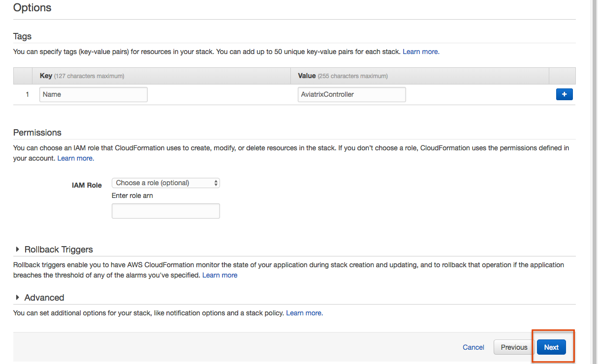
.. |imageCFCreateFinal| image:: ZeroToConnectivityInAWS_media/cf_create_final.png
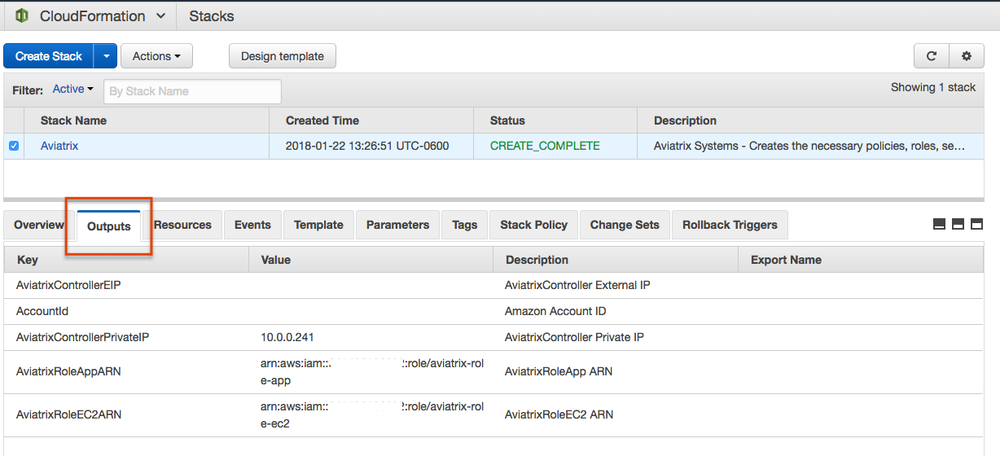
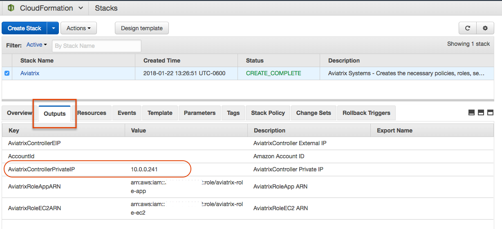
.. |imageControllerBrowserWarning| image:: ZeroToConnectivityInAWS_media/controller_browser_warning.png
   :scale: 30%

.. |imageControllerEnterEmail| image:: ZeroToConnectivityInAWS_media/controller_enter_email.png
   :scale: 50%

.. |imageControllerChangePassword| image:: ZeroToConnectivityInAWS_media/controller_change_password.png
   :scale: 50%

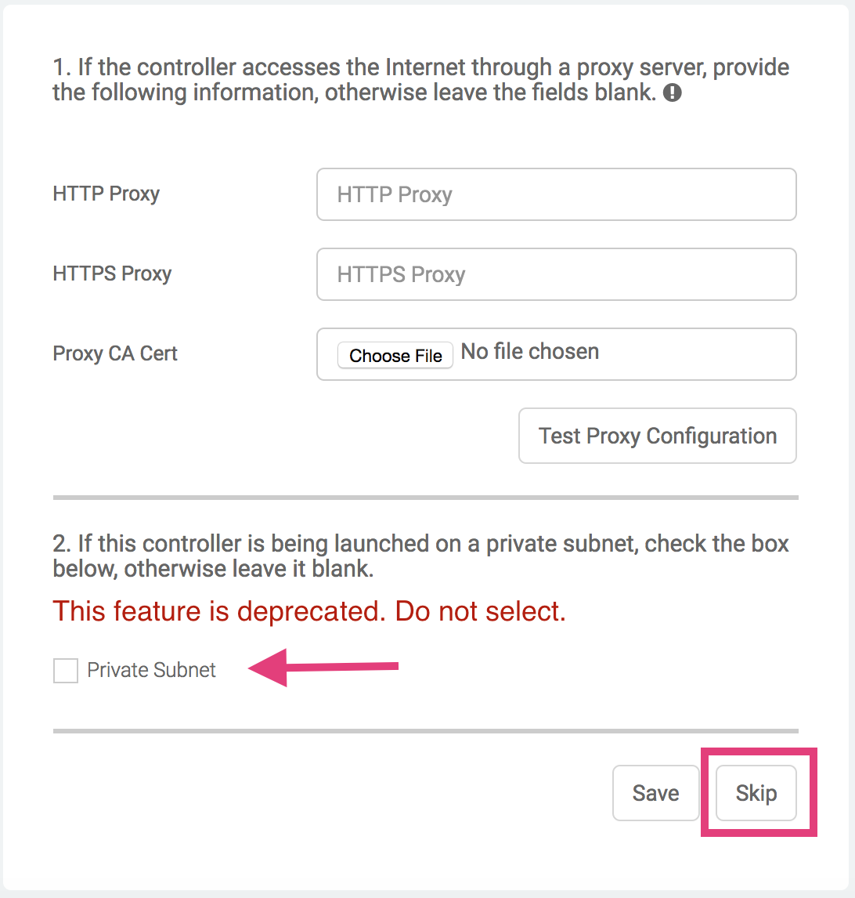

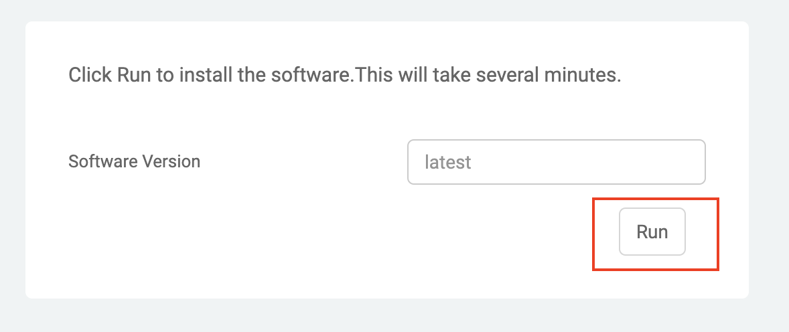

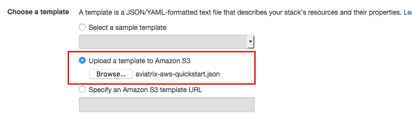
.. |imageCFSelectTemplate-S3| image:: ZeroToConnectivityInAWS_media/imageCFSelectTemplate-S3.png
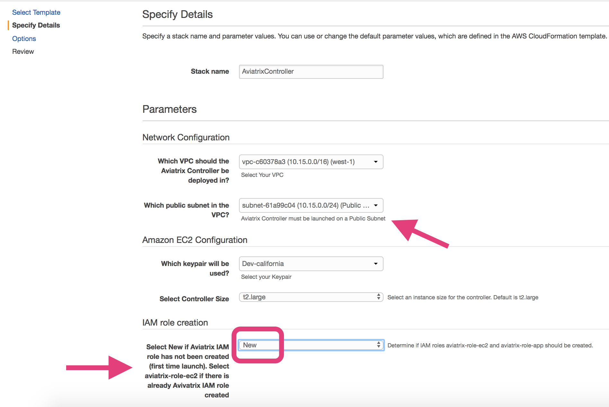

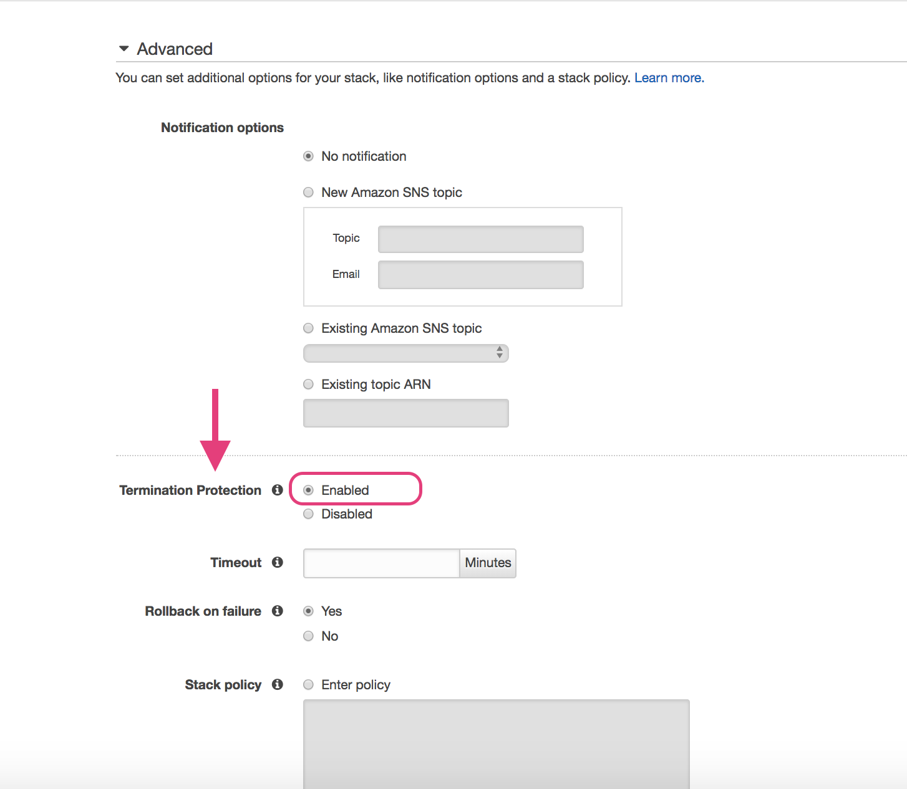

.. |imageAviatrixOnboardNav| image:: ZeroToConnectivityInAWS_media/aviatrix_onboard_nav.png
   :scale: 50%

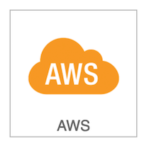

.. |imageEnterCustomerID| image:: ZeroToConnectivityInAWS_media/customerid_enter.png
   :scale: 50%

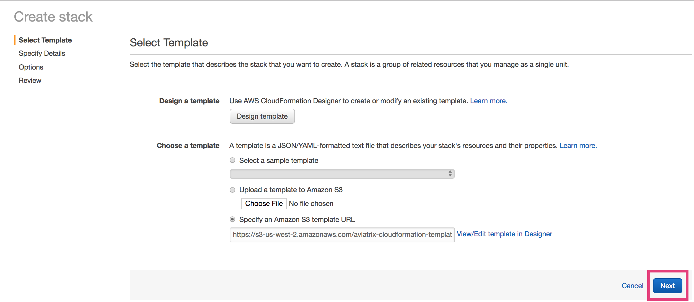

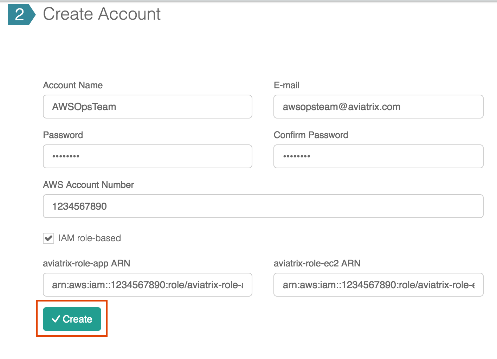
