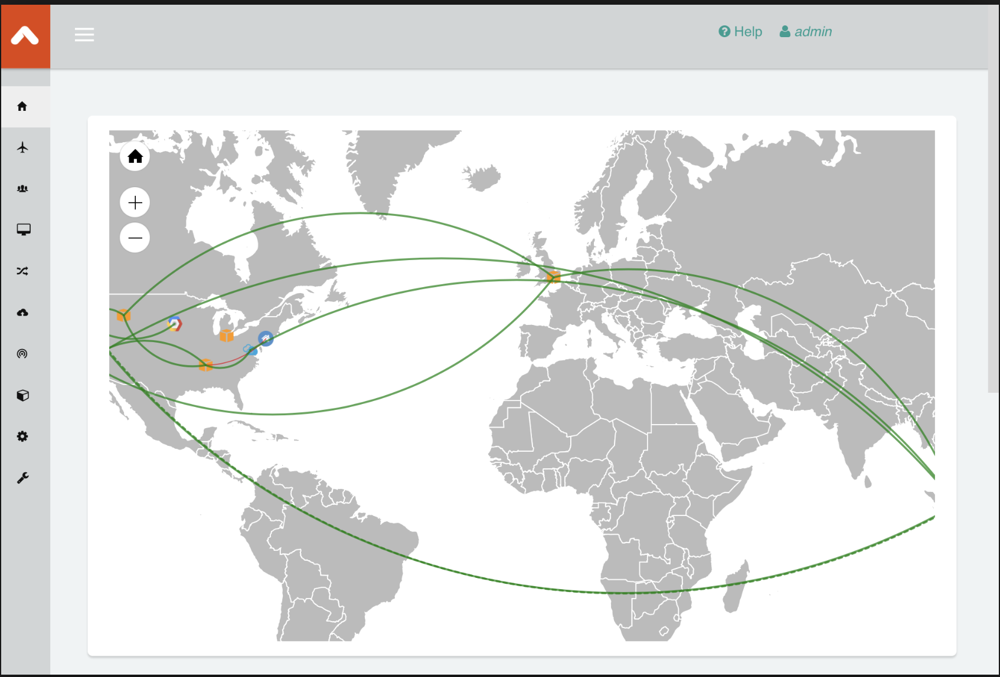

.. meta::

=============================================
Aviatrix Operations Overview
=============================================

This document summarizes 10 operation services provided by Aviatrix Solutions. 

|aviatrix_dashboard|

1. Manageability
------------------

 - **Simplicity** Point-and-Click work flow based instructions are designed for each use case and are easy to follow. Network CCIE are not required to deploy and manage the network. 
 - **Multi Accounts** Single pane of glass to manage all your cloud accounts for networking and networking security. 
 - **Multi-Cloud** Single pane of glass to manage all your public cloud deployment for networking and networking security.
 - **RBAC** Role Based Access Control allows you to manage multi accounts with fine grain access control for large organizations.
 - **Hitless Software Upgrade** Aviatrix software upgrades do not require the Controller nor gateway to reboot. The upgrade process takes a few minutes and does not cause any network downtime or packet loss. 
 - **Technical Documentation** In product links to well documented and agile publishing technical documentation site. 
 - **FAQs** A wealth of FAQs that answer commonly asked questions in problem space, benefits and useful links. 
 - **Tech Notes** A wealth of Tech Notes that provide examples for use case specific configurations.
 - **Design Patterns** A wealth of Design Patterns that addresses architectural requirements for all deployments. 

2. Automation
---------------------

 - **API** All functions support API.
 - **Terraform** Aviatrix provides its own Terraform Provider for Aviatrix created resources.  
 - **Cloud Formation** Aviatrix provides Cloud Formation Scripts for AWS Controller launch and multi-account creation. 
 - **Examples** Terraform examples are presented for various use cases.

3. Visibility
----------------

 - **Geographic Map** Dashboard provides a geographical view of network topology under management. It also displays real time latency between any two nodes of deployed Aviatrix gateways. When a network connection is down, the connection becomes a red color.
 - **Traffic Metrics** All Controller and gateway network traffic metrics are logged and displayed in time series.
 - **User Activities** Active VPN users and where they connect from is displayed. VPN user session history is logged and displayed.
 - **AWS Transit Gateway (TGW) Orchestrator View** A graphical view that displays what Security Domain and Connection Policies that have been configured. You can find for a given VPC, what other VPCs connect to it. 
 - **AWS Transit Gateway (TGW) Orchestrator List** Multi-panel tables list, in real time, the Spoke VPC route table and TGW route table. 
 - **Egress FQDN Discovery** When this mode is enabled, Aviatrix gateway monitors all egress-bound HTTP/HTTPS traffic, discovers the destination domain names and generates a report. This provides you the visibility of what APIs calls your virtual machine (EC2/Azure Virtual Machine/GCE) applications are making. You can then use this visibility and turn it into FQDN filter policies.  

4. Monitoring
----------------

 - **Tunnel Status** Encrypted tunnels status are monitored. When a tunnel status is changed, the event is logged and alerted to the administrator. 
 - **Gateway Status** Gateway health is monitored. If a gateway is unreachable, the gateway is restarted for recovery.
 - **IAM Roles & Policies** Account IAM Roles and Policies are monitored to make sure they are attached to the accounts and the policies are correct. If an anomaly is detected, the event is logged and alerted. 
 - **AWS Transit Gateway (TGW) Orchestrator Audit** The Aviatrix Controller periodically checks the consistency between what you intend to configure on Security Domains and Connection Policies and what is reflected on AWS TGW route tables. If a discrepancy is discovered, the event is logged and alerted.
 - **BGP Route Conflict Monitoring** All network routes are monitored and whenever the Controller detects conflicting routes, it logs the event and sends email alerts to the admin user and Aviatrix support team.
 - **Account Audit** The Controller periodically audits all access accounts it manages to make sure there is no accidental deletion of IAM roles and policies. When the Controller detects errors, it logs the event and sends an email alert to the admin user and the Aviatrix support team. 
 - **Gateway Disk/Memory Monitor** When Aviatrix gateway disk/memory reaches 95%, the Controller logs the event and sends an email alert to the admin user and the Aviatrix support team.
 - **VPC Tracker** Instead of using an Excel sheet, use this tool to keep track of all your network CIDRs and prevent duplicate network address ranges. 
 - **Alert Bell** Controller monitors the route table black hole, stops the instance, etc. and displays a warning on the alert bell. 

5. Logging
-------------

The Controller and gateways can export logged data to the following services:

 - **Splunk Enterprise**
 - **Sumo Logic**
 - **Elastic Search**
 - **Datadog**
 - **Remote syslog**
 - **AWS CloudWatch**
 - **Netflow**

6. Troubleshooting
--------------------------

 - **Flightpath** Single pane of glass that displays information on Security Groups, VPC/VNet route entries, Network ACL, and TGW/Azure Virtual WAN/Cloude Router/Dynamic Routing Gateway Route tables in a side-by-side presentation for both source and destination. In addition, expert diagnostics identify the faulty setup in these resources. 
 - **Trace Route & Trace Path** Use this tool to help identify the route path. 
 - **Packet Capture** Capture packets on any gateway and download the resulting PCAP file for analysis on Wireshark.
 - **Network Validation** This tool can be used to test end to end connectivity. Instead of going to the cloud provider console to launch instances, this tool automatically launches two instances and tests the connectivity for you.  
 - **Resource Lists** Lists are in use cases that retrieve in real time the cloud provider route entries. 
 - **Trace Log** The Customer can upload a trace log to Aviatrix for in depth analysis of the events that lead to the issues. 

7. High Availability
----------------------

 - **Controller Backup/Restore** All configurations are backed up to data storage solutions (S3 buckets/Azure Blob Storage/Google Cloud Storage/Object Storage Service) daily and can be restored to a new Controller in the event that the existing Controller becomes unavailable. 
 - **Controller HA** You can deploy an auto scaling group of 1 that lets AWS CloudWatch monitor the Controller health. In the event that the existing Controller becomes unavailable, it triggers an AWS Lambda function to launch a new Controller and restore its configurations. 
 - **Active/Active Gateways** Aviatrix Gateways can be deployed Active/Active in multi-AZ and forward traffic with ECMP. 

8. Compliance
------------------------

 - **FIPS 140-2 Certificate** Aviatrix has achieved FIPS 140-2 compliance with certificate `#3475 <https://csrc.nist.gov/Projects/cryptographic-module-validation-program/Certificate/3475>`_.
 - **Security Patch** Any impacting vulnerability issues are immediately addressed by applying "Hot Fix".
 - **SAML Authentication** Supports SAML authentication to login to the Controller. 
 - **LDAP** Supports LDAP authentication to login to the Controller. 
 
9. Software and Technical Support
---------------------------------------------

 - `Aviatrix Support Portal <https://support.aviatrix.com>`_ Technical problem? Have no fear. Aviatrix's most capable networking engineers are ready to help you troubleshoot issues large and small and most of them are not even related to Aviatrix solutions. Aviatrix offers 24/7 support for Platinum customers.
 - **Fast Release Cycle** New software releases become available every 6 - 8 weeks. A new software release automatically generates notification email to the Controller admin team.
 - **Hot Fix** Any showstoppers or operation impacting problems are immediately addressed by "Hot Fix" patches. 
 - **Solution Architects** Aviatrix solution architects can help you design your cloud network deployment to be simple to manage, scalable, and secure. 

10. Flexible Consumption Model
----------------------------------------------
 - **Pay as You Consume** No contract negotiation, no lengthy PO process, and no shelfware. Aviatrix provides a cloud consumption model with multi-dimensional Metered AMI for instant consumption and need-based scaling.
 - **Private Offers** Aviatrix provides a Private Offers AMI that has the same benefit as the Metered AMI but with customized pricing.  
 - **BYOL License** Aviatrix provides subscription-based long-term contracts for organizations that seek a predictable and budget-based consumption model. 

.. add in the disqus tag

.. disqus::
