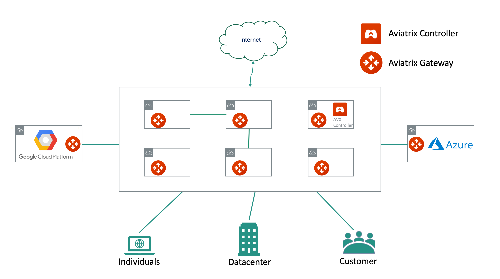
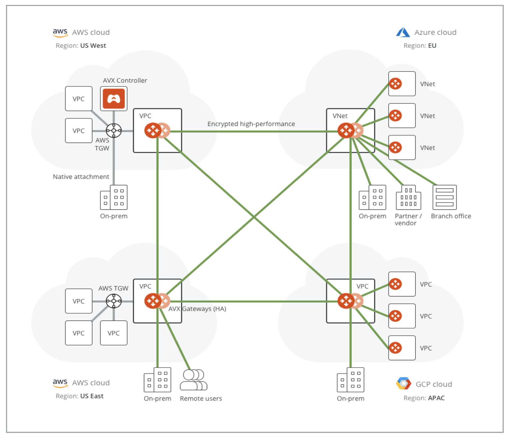
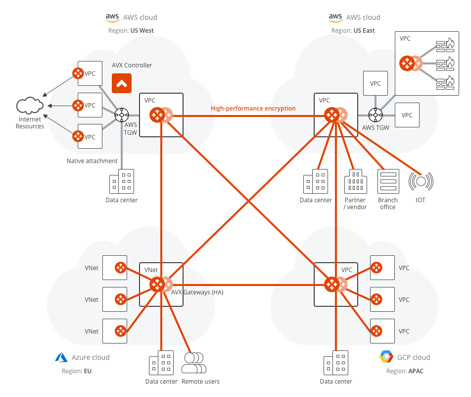
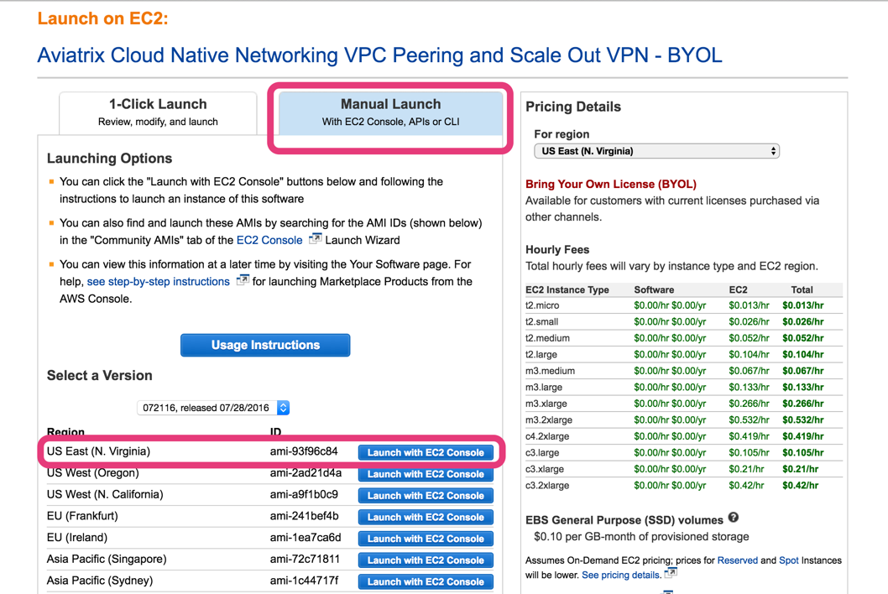
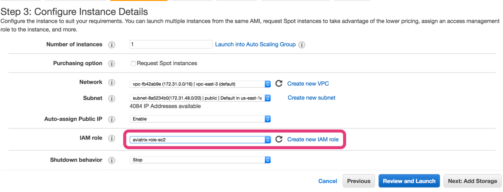
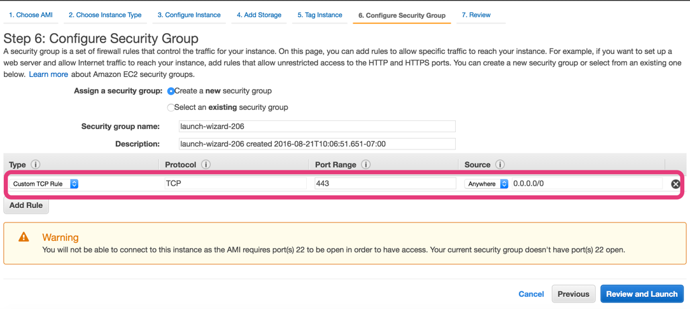
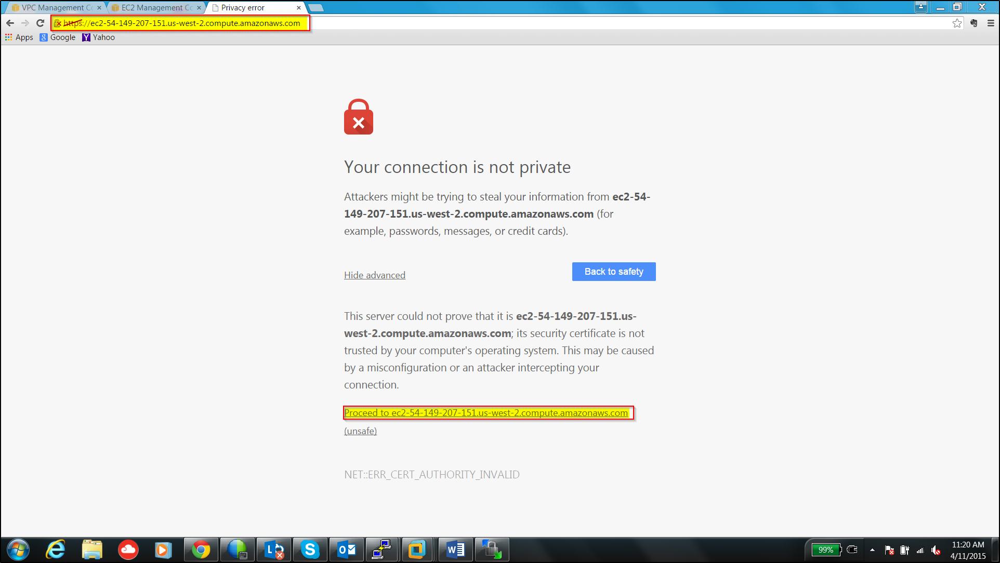
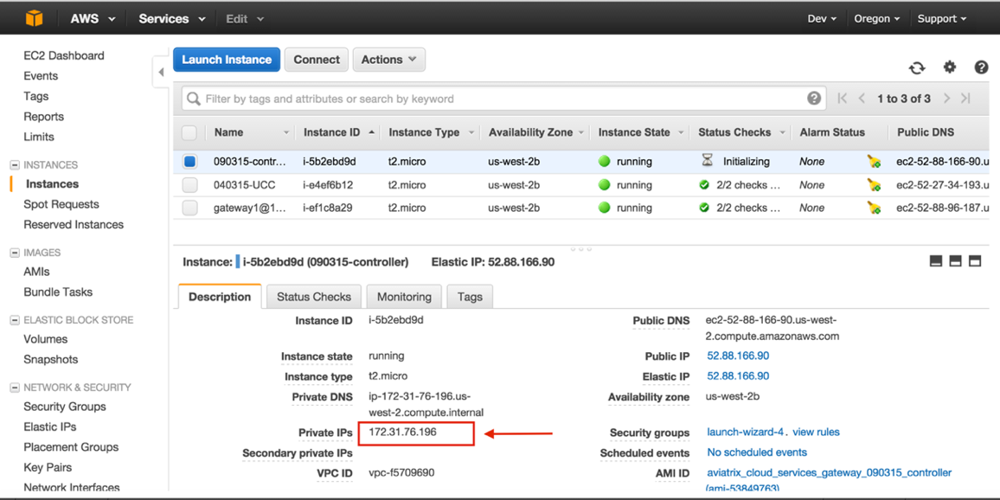
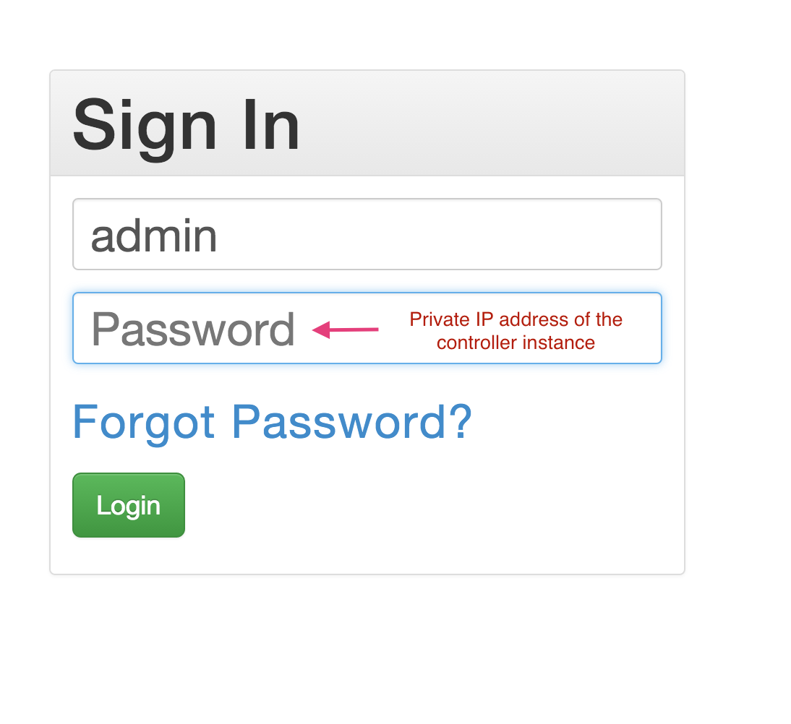

.. meta::
  :description: Aviatrix Product Overview
  :keywords: cloud networking, aviatrix, OpenVPN®, SSL VPN, Global Transit Network, site2cloud

=============================================
Aviatrix Overview
=============================================

What Do We Do?
================

Aviatrix is a cloud native networking company. Unlike any other networking vendors, the 
Aviatrix software platform understands the cloud provider's native constructs. This allows us to leverage 
and control the native constructs directly using the cloud provider's APIs extending their capabilities and 
integrating them into our software to provide organizations with turn key solutions accelerating their cloud journey. 

|aviatrix_overview|

We focus on solving common networking problems faced by enterprises on their public cloud journey while providing 
a common control plane that provides multi-account/multi-cloud automation, advanced transit services, advanced security services, advanced troubleshooting capabilities,
and unparalleled visibility that the enterprise needs.

Some common enterprise use cases are shown below: 

- Datacenter to cloud (`Aviatrix Transit Network solution <http://docs.aviatrix.com/HowTos/transitvpc_workflow.html>`_)  
- Scalable Firewall deployment in the cloud (`Firewall Network <https://docs.aviatrix.com/HowTos/firewall_network_faq.html>`_)
- Cloud to cloud VPN (`Encrypted peering <http://docs.aviatrix.com/HowTos/peering.html>`_ connectivity in a cloud and multi cloud ) 
- User to cloud VPN (`Remote user VPN (OpenVPN® based SSL VPN solution) <http://docs.aviatrix.com/HowTos/uservpn.html>`_ for developers) 
- Site to cloud VPN (`Branch and customer sites to cloud <http://docs.aviatrix.com/HowTos/site2cloud_faq.html>`_) 
- Multicloud VPN (`Multicloud Peering <http://docs.aviatrix.com/HowTos/GettingStartedAzureToAWSAndGCP.html>`_)

We also provide security features for workloads/applications in the cloud: 

- `Gateway inline L4 stateful firewall. <http://docs.aviatrix.com/HowTos/tag_firewall.html>`_ 
- `VPC Egress Security. <http://docs.aviatrix.com/HowTos/FQDN_Whitelists_Ref_Design.html>`_
- `High Speed Secure Access to AWS S3 <https://docs.aviatrix.com/HowTos/sfc_faq.html>`_.

In addition, we have specific network solutions for `cloud migration <http://docs.aviatrix.com/HowTos/ipmotion.html>`_ and 
agile `datacenter extension <http://docs.aviatrix.com/Solutions/aviatrix_aws_meshVPC.html>`_ to cloud for vmware workloads. 

You can automate Aviatrix deployment by `REST APIs <https://api.aviatrix.com/?version=latest>`_ and `Terraform configurations <https://docs.aviatrix.com/HowTos/aviatrix_terraform.html>`_.

What are the complexities in cloud networking?
---------------------------------------------------

Networking is a well established industry, what makes networking in the cloud new again? It's the complexity. 

The complexity of the cloud networking comes from the following areas and they only grow as time goes on:

1. Unprecedented Scale
^^^^^^^^^^^^^^^^^^^^^^^^^

  - Cloud networks (VPC/VNET/VCNs) are many orders of magnitude in quantity than datacenters, driven by business billing/accounting and variable isolation requirements.
  - Multiple account ownership is a new concept for networking significantly increasing the number of cloud networks.
  - Multi-cloud strategies are the new industry norm enterprise will eventually require workloads spread across multiple cloud providers where they run best.

2. Security
^^^^^^^^^^^^^^^^

  - As mission critical applications move to the cloud, security requirements applied to datacenter are catching up to the cloud.
  - Security consist of 5 types:
      - Egress to Internet: backend applications require API access to public hosted services.
      - On-prem and cloud: data moving between two security zones. 
      - East and West: data moving between cloud networks.
      - Ingress: Accessing applications in the cloud.
      - Data security: Encryption for data in motion & at rest.

3. Unprecedented Performance 
^^^^^^^^^^^^^^^^^^^^^^^^^^^^^^^^

  - As more enterprise data and workloads traverse cloud networks, the enterprise needs to account for performance requirements in their cloud architecture.
 
4. Skills Gap
^^^^^^^^^^^^^

  - Each cloud offers completely different terminology, APIS, semantics, and implementation details to provide networking.
  - Businesses cannot invest equally in time and effort to achieve skill parity across multiple cloud providers making it difficult to expand and pivot strategy. 
  - New generation of operational engineers are short in sophisticated networking skills. Older networking engineers are short in API skills. 

5. Interoperability
^^^^^^^^^^^^^^^^^^^^^

 - Enterprise datacenters have compliance and established practices. Connecting to the on-prem sites of different businesses is complex due to the large set of legacy networking and security products.    

Why Should You Consider Us?
=============================

Customers find that the most compelling value of our product is simplicity, both at configuration time and operation time. Simplicity is easier said than done in networking as it is by nature complex, so how can one achieve that? Here is how we do it:

- **Abstraction**  Abstraction is key to achieving simplicity at configuration time. Abstraction is about hiding layers and layers of complex network protocols, it is also about being use-case-driven at presentation layer by combining multiple networking components and features. APIs and Terraform templates also benefit from this abstraction as fewer of them need to be managed.

- **Service Extension** As part of the product offering, we provide service integration to Splunk, SumoLogic, Datadog, Duo, Okta, SAML IDPs and firewall appliance deployment.

- **Centrally Managed** A single pane of glass to manage all your cloud accounts and cloud network scattered in different regions and clouds. Hitless software upgrade eliminates operation downtime and maintenance window.

For example, we hide the platform differences between AWS, Azure and GCP, so that you have the same
experience when networking to any of them or between them.

As another example, we hide the complexity of building IPSEC so that you have the same
experience when you build an IPSEC tunnel as you would with AWS native peering: a couple of clicks or a couple of APIs. Taking this one step further, not only is the connectivity setup, the underlying route entry is
configured too so that you have a turn key solution.

Beyond simplicity, Aviatrix solutions solve many problems better than other products in each use case. This document summarizes these problems. Links to
configuration documents are listed at the end of each section.

Our goal is to become your go-to vendor for all things cloud networking.

What Features Are Supported in Which Cloud?
-----------------------------------------------

==========================================      ==========  =============   ======================           =================       ==========
**Feature**                                     **AWS**     **Azure**       **GCP**                          **AWS GovCloud**         **OCI**
==========================================      ==========  =============   ======================           =================       ==========
Marketplace Launch                              Yes         Yes             No (Community Image)             Yes                      Yes
Multi Accounts                                  Yes         Yes             Yes                              Yes                      Yes

Aviatrix Transit Network Spoke                  Yes         Yes             Yes                              Yes                      Yes
Aviatrix Transit Network Edge                   Yes         Yes             Yes	                      	     Yes                      Yes
Firewall Network                                Yes         Yes             No                               Yes                      No                     
Transit Gateway Peering                         Yes         Yes             Yes                              Yes                      Yes

Native Peering                                  Yes         Yes             N/A                              Yes                      No

FQDN Egress Control                             Yes         Yes             Yes                              Yes                      Yes
Stateful Firewall                               Yes         Yes             Yes                              Yes                      Yes
Advanced NAT                                    Yes         Yes             Yes                              Yes                      Yes

Remote Access User VPN                          Yes         Yes             Yes                              Yes                      Yes
Site to Cloud VPN                               Yes         Yes             Yes                              Yes                      Yes

Insane Mode Encryption                          Yes         Yes              No                              Yes                      No

Logging Service Integration                     Yes         Yes             Yes                              Yes                      Yes
FlightPath Expert Diagnostics                   Yes         Yes             Yes                              Yes                      No
IPv6                                            Yes         No              No                               No                       No
PrivateS3 (unique to AWS)                       Yes         No              No                               Yes                      No 
==========================================      ==========  =============   ======================           =================       ==========

How To Launch Aviatrix?
=========================

Our product, Aviatrix Secure Networking Platform, consists of two components, Controller and
gateway. Gateways are launched from the Controller
browser console by using your cloud account credentials with cloud provider APIs.
The Controller image is available in `AWS Marketplace, <http://docs.aviatrix.com/StartUpGuides/aviatrix-cloud-controller-startup-guide.html>`_  `Azure Marketplace, <http://docs.aviatrix.com/StartUpGuides/azure-aviatrix-cloud-controller-startup-guide.html>`_  `GCloud <http://docs.aviatrix.com/StartUpGuides/google-aviatrix-cloud-controller-startup-guide.html>`_ and `OCI <https://docs.aviatrix.com/StartUpGuides/oracle-aviatrix-cloud-controller-startup-guide.html>`_.
 

Datacenter to Cloud: Aviatrix Next-Gen Transit Network 
=========================================================

Aviatrix Transit Network solution solves many problems when connecting datacenters to a growing number of VPCs.

These problems are listed below:

 a. **AWS Transit Gateway** AWS released Transit Gateway (TGW), I need to migrate my current CSR based Transit VPC solution.
 #. **No Route Propagation** AWS Transit Gateway (TGW) does not propagate on-prem learned routes to Spoke VPC route table, it requires manual programming. 
 #. **Transit Solution for Azure** We have multiple Azure VNETs now, we need to form a transit network and connect them to on-prem and to AWS Transit network.
 #. **Change Control** Each time a new VPC is stood up, a change control process has to take place to modify the edge router for Direct Connect or IPSEC over Internet. This is not agile and the risk of errors in configuration is not acceptable.
 #. **BGP** The CSR based Global Transit solution runs VGW in each spoke VPC which runs a BGP session to Transit hub. This is operationally challenging to manage and troubleshoot. The BGP in VGW is a black box and  invisible to the outside.  
 #. **Not Secure** All spoke VPCs in The CSR based Global Transit solution have connectivity to each other through BGP route propagation. There is no network segmentation. The blast radius is my entire cloud network and datacenters. This is not acceptable by the security team. 
 #. **Reach Route Limit** AWS has route entry limits of 100 per each routing table. Combining the number of VPC CIDRs and the list of on-prem CIDRs, this route limit is fast approaching or already a problem.
 #. **Extra Charge** In the CSR based solution, traffic from one spoke VPC to another spoke VPC traverses through one transit and sometimes two transit hubs, resulting in 2x or 3x egress charge. 
 #. **Too Complex** The CloudOps is a team of 6 engineers managing 34 AWS services, the skill set and resources it takes to manage the CSR based Transit network is beyond what we want to handle. 
 #. **10Gbps Transit** My current Transit network performance is capped at 1.25Gbps, our network requires much higher bandwidth. 

Follow this `self qualification process <https://www.aviatrix.com/blog/aviatrix-global-transit-solution-differ-csr-solution/>`_ to help your team decide if Aviatrix is the right solution for you.
For how to setup the solution, follow up with `this doc. <http://docs.aviatrix.com/HowTos/transitvpc_workflow.html>`_

Bring Firewall to Cloud: Aviatrix Firewall Network
=============================================================

Here are the challenges of deploying firewalls in the cloud. 

 a. **Complexity** Our security posture requires a firewall appliance for VPC to VPC traffic inspection, but we don't like the idea of building IPSEC tunnels between networking device and firewalls. 
 #. **Functionality** We need VPC to VPC traffic inspection, but traffic cannot be source NATed.
 #. **Performance** With centralized firewall deployment, a single firewall appliance is not sufficient to meet the performance requirement. 

Read `Aviatrix Firewall Network <https://docs.aviatrix.com/HowTos/firewall_network_faq.html>`_ for more details.

Cloud to Cloud Peering
============================

The Aviatrix encrypted peering solution builds IPSEC tunnels to connect two VPC/Vnets. It solves these problems:

 a. **Regulation** My industry and regulations require packets in motion to be encrypted. AWS intra peering has no encryption. AWS inter region peering has one shared key. This is not acceptable. 
 #. **Reach Route Limit** AWS has route entry limits of 100 per each routing table. Combining the number of VPC CIDRs and the list of on-prem CIDRS, this route limit is fast approaching or already a problem.
 #. **Multi Cloud** My workloads in AWS need connectivity to workloads in Azure or Google. 
 #. **Defense in Depth** My CloudOps tools communicate to instances with data that is not encrypted. I need encryption for traffic between Shared Service VPC to workload VPC.
 #. **Require 10Gbps Encrypted Throughput** I need encryption for all data in motion and I need the performance to be up to 10Gbps.
 #. **Policy** We need to enforce stateful policies between two VPC connections. AWS native peering does not support policies. 

Aviatrix peering solution can be found `here. <http://docs.aviatrix.com/HowTos/peering.html>`_

User to Cloud Access
==============================

Giving developers, contractors and partners around the globe direct access to VPC/VNet is the best way to reduce access latency and improve productivity. Making it secure, high performance and manageable are keys to the solution. 

The Aviatrix user to cloud solution is based on OpenVPN®.  
The solution solves these problems:

 a. **Bastion Station** Bastion Station or Jump Host is a hack and insecure to allow developers to access cloud. Not acceptable. 
 #. **Too Many Certs** If each VPC runs a SSL VPN gateway and there are 50 VPCs, each developer needs to carry 50 VPN certificates and must learn which certificate to use to access which VPC. This is not acceptable. 
 #. **Large Group** We have over 500 developers, we need a VPN solution that scales beyond a single instance based VPN solution. 
 #. **OKTA** We are looking for a VPN solution that integrates with OKTA or DUO. 
 #. **Blocked by Firewall** We have a Linux machine in the office that needs to behave like a VPN client. We need a VPN solution that runs on TCP port 443 to allow this machine to go through the corporate firewall. 
 #. **Global Workforce** We have developers in multiple geo locations and cannot have them all land in the cloud in the same region. Latency will kill the user experience. 
 #. **SAML Client** We are looking for an OpenVPN® based VPN solution with SAML client support.  

The Aviatrix user VPN solution can be found `on this link. <http://docs.aviatrix.com/HowTos/uservpn.html>`_
One feature in the solution that customers like the most is `Profile Based Access Control. <http://docs.aviatrix.com/HowTos/openvpn_features.html#authorization>`_

Site to Cloud Connectivity over Internet 
=========================================

If you run a SaaS service that needs to securely move data from your customer sites to the cloud, or 
your enterprise has hundreds of branch offices that need to connect to the cloud, building a secure 
tunnel to the cloud directly over the Internet is the most economical way as you leverage the Internet infrastructure already in place. 

In this case, the cloud provider's native VPN solution falls short by a long shot. The Aviatrix site2cloud solution solves these problems:

 a. **Traffic Black Hole** When the tunnel on the primary gateway is down, VPC route entry still points to the primary gateway, it does not point to the backup gateway. .
 #. **AWS VPN Gateway Limitation** AWS VPN gateway supports 10 connections per VPC. I have more than 10 sites, the native solution is not usable. 
 #. **Azure VPN Gateway Limitation** Azure VPN gateway supports only 1 VPN connection for IKEv1. My office firewall device only supports IKEv1.
 #. **No Visibility** Cloud provider's VPN gateway is a black box, there is no visibility for troubleshooting. 
 #. **No Manual** I have to configure and manage hundreds or thousands of IPSEC tunnels, the manual way by using traditional vendors such as Cisco ASA and CSR is not possible. 
 #. **Overlapping IP addresses** We run a SaaS operation, the CIDR blocks at your customer sites are not controlled by us. If a customer CIDR block overlaps with our operation VPC CIDR, we have to find a way to NAT the address. The cloud provider native solution is not usable in this case. 
 #. **Encryption Algorithm Mismatch** As SaaS operators, we cannot control what VPN device a customer wishes to use. My end of VPN termination needs to have the flexibility to interoperate with customer equipment. The native solution does not have that flexibility. 
 #. **Too Slow to Onboard a Customer** VPN runs on UDP port 500/4500, my customers have to request corporate firewall ports to open, is there a way to run IPSEC tunnel on TCP 443?
 #. **Traffic Direction Problem** My SaaS service requires traffic to be initiated from the cloud to the customer site, AWS VPN gateway cannot support this traffic pattern. We have to setup a separate machine to constantly ping to keep the tunnel up! 
 #. **Downtime Problem** Some appliances force all IPSEC tunnels to reset and go down when a new tunnel is being established, which affects business continuity and is not acceptable when the number of sites go beyond 10.     
 #. **Skill Problem** We don't have a team of CCIEs to handle the load. 

To learn how to setup Aviatrix site2cloud, follow up with `this link. <http://docs.aviatrix.com/HowTos/site2cloud.html>`_

Gateway Inline L7 FQDN for Egress Control
==================================================

This solution is about adding security control to private workloads or applications accessing Internet. 
AWS and Azure provide a NAT gateway or NAT service, but it is limited in scope. A traditional firewall is either too complex or too expensive to be deployed per VPC. 
Aviatrix L7 FQDN filter solves these problems:

 a. **No policies** AWS NAT Gateway has no inbound/outbound policies. I have to configure security groups in each instance that needs Internet access. 
 #. **Only IP Based Rules** AWS NAT instance provides security groups, but it is IP address based and limits to 50 rules. My application needs to make API calls to Office 365 and that site alone resolves to hundreds of changing IP addresses. Using a Security group is not an acceptable solution. 
 #. **Compliance** Our applications process PCI data and requires egress security policies. 
 #. **Firewall for Each VPC is Too Complex** My cloud instances are workloads and programs, they make API calls to known destinations. Deploying a traditional firewall that requires certs and keys to decrypt every packet for inspection is too complex and an overkill. 
 #. **Firewall for Each VPC is Too Expensive** Traditional firewall of IDS/IPS is too expensive to be deployed per VPC. 
 #. **Whitelisting** All I need is to be able to white list or black list the well known destinations by specifying them as fully qualified domain names (FQDN) for my http and https traffic. Support wild card or regex is a bonus. 
 #. **Only for HTTP/HTTPS** Azure's Firewall service does not support FQDN filtering on SSH and SFTP services.

Follow up with more details on `Aviatrix FQDN filter solution. <http://docs.aviatrix.com/HowTos/FQDN_Whitelists_Ref_Design.html>`_

Gateway inline L4 Stateful Firewall
====================================

Whenever there is traffic going through Aviatrix gateway, you can apply an IP address based stateful 
firewall policies. This reduces the need to have to configure security groups of each instances in the VPC for traffic between VPCs. There is no limit as to how many rules you can apply on Aviatrix gateway. Aviatrix solution solves these problems:

 a. **Security Rule Limits** A cloud instance's security group has a limit of 50 rules. How do I get around that?
 #. **Enforce Security Policies** Developers don't always follow the best practice when it comes to security, enforcing policies at the gateway takes that worry away. 
 #. **Regulation** We cannot use the AWS VPC Peering as it does not allow us to apply policies. We need an infrastructure presence that not only provides security but also enforce policies. 

To learn how to setup the L4 firewall, `follow the doc. <http://docs.aviatrix.com/HowTos/tag_firewall.html>`_

High Speed Secure Access to AWS S3 (PrivateS3)
================================================

Aviatrix PrivateS3 provides control and visibility for AWS S3 upload/download while leveraging the high speed private connections. It solves the following problems. 

 a. **Prevent Data Leakage** We attempt to use AWS Direct Connect for high speed access to S3, but doing so anyone in the company can upload data to their own S3 buckets. 
 #. **Palo Alto Firewall not usable** Palo Alto Firewall FQDN uses DNS name resolution which does not work on S3 as it has hundreds of thousands of IP addresses and as such the firewall is not usable. 

To learn more, `follow the PrivateS3 FAQ <https://docs.aviatrix.com/HowTos/sfc_faq.html>`_

Cloud Migration
==================

Current cloud migration practice is complex and time consuming. The root case is the requirements that migrating VM must change its IP address after the migration. Read how Aviatrix solves `this problem. <http://docs.aviatrix.com/HowTos/ipmotion.html>`_ 

Extending Workloads to Cloud
==============================

Not all your workloads require the bandwidth and latency that calls for a Direct Connect transport. For your Dev and QA or many applications, an existing Internet connectivity is sufficient. Even better, Aviatrix provides a unique solution in which you do not even need to make changes to the edge router. `Learn how this solution works. <http://docs.aviatrix.com/Solutions/aviatrix_aws_meshVPC.html>`_

OpenVPN is a registered trademark of OpenVPN Inc.

.. add in the disqus tag

.. disqus::
