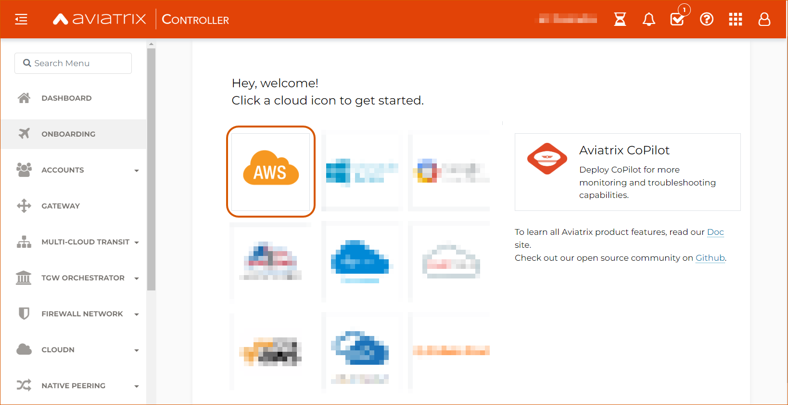

.. meta::
  :description: AWS Getting Started Guide
  :keywords: AWS, Amazon Web Services, VPC, getting started, marketplace, subscription, BYOL, metered, AMI, onboarding, CloudFormation, stack, IAM, IP address, CIDR, Availability Zone, public subnet, private subnet

=========================================================
AWS Getting Started Guide
=========================================================

|aws_getting_started_diagram|

The Aviatrix Controller is a management and control plane or a single pane of glass that enables you to manage and support a single or multi-cloud network architecture. You can deploy an Aviatrix Controller through any of the four major CSP (Cloud Service Provider) marketplaces: 

* AWS (Amazon Web Services)
* Microsoft Azure 
* GCP (Google Cloud Platform)
* OCI (Oracle Cloud Infrastructure)

Aviatrix recommends Controller deployment on AWS or Azure, as these CSPs enable you to set up HA (High Availability) for resiliency.
This document shows you how to set up and launch an Aviatrix Controller through the AWS Marketplace.

.. tip::

  The Aviatrix Controller enables you to design and manage your single or multi-cloud network architecture. 

  `Aviatrix CoPilot <https://docs.aviatrix.com/HowTos/copilot_overview.html>`_ provides a global view of your multi-cloud network. CoPilot includes features like FlowIQ to analyze global network traffic and ThreatIQ to monitor for potential malicious activity. You can deploy and configure CoPilot after launching the Controller.

.. note::

  If you are familiar with Terraform, it is possible to deploy a Controller by using Terraform modules. Please see the Aviatrix Terraform Modules on `GitHub <https://github.com/AviatrixSystems/terraform-modules>`_.

Prerequisites
^^^^^^^^^^^^^^^^^^^^^^^^^^^^^^^^^^^^^^^^

Before launching a Controller from your AWS account, complete the following prerequisites:

Setting up a Dedicated VPC
--------------------------------------------------------------------

To organize and segment resources more easily, set up a dedicated VPC for your Controller. You can use an existing VPC or create a new one, depending on your organization’s resources and needs.

Choosing to Use an Existing VPC vs. Creating a New VPC
********************************************************

+--------------+------------------------------------+----------------------------------+
|              | Using an Existing VPC              | Creating a New VPC               |
+==============+====================================+==================================+
| Cost         | Equal                              |Equal unless your organization’s  |
|              |                                    |policy is to create a dedicated   |
|              |                                    |AWS account for each new VPC      |
+--------------+------------------------------------+----------------------------------+
|Network       |Equal	                            | Equal                            |
|performance   |                                    |                                  |
+--------------+------------------------------------+----------------------------------+
|Simplicity    | Maintaining a VPC with resources   |Improved fault isolation in Day 2 |
|and           | many different requirements may be |operations, as it is less likely  |
|resiliency    | more difficult                     |that changing components in the   |
|              |                                    |same location will harm the       |
|              |                                    |control plane's connectivity      |
+--------------+------------------------------------+----------------------------------+

If you choose to use an existing VPC, make sure it uses the settings specified below in the “Creating a New VPC” section.

Creating a New VPC
***********************

1. Log into your AWS account, preferably an Infrastructure OU – Networking or Shared Services account.
2. If you have decided to launch a new VPC, go to VPC > Create VPC. Make sure this new VPC has the following settings:

Region – Before configuring any settings, click on the dropdown menu in the top right and select the region in which to locate this VPC.

*In the example below, the current region is Oregon.*

|choose_vpc_region|

+----------------------------+----------------------------------------------------------------+
| Setting                    | Value                                                          |
+============================+================================================================+
| Resources to create        | Select the **VPC and more** radio button.                      |
+----------------------------+----------------------------------------------------------------+
| Name tag                   | Enter a clear and recognizable name (such as                   |
|                            | "aviatrix-mgt" or "aviatrix-management").                      |
+----------------------------+----------------------------------------------------------------+
| IPv4 CIDR block            | Enter the IPv4 CDIR block for the Controller                   |
|                            | VPC. The minimum is /24; the maximum is /16. A                 |
|                            | best practice is to use RFC1918 ranges.                        |
+----------------------------+----------------------------------------------------------------+
| IPv6 CDIR block            | No IPv6 CIDR block                                             |
+----------------------------+----------------------------------------------------------------+
| Tenancy                    | Default                                                        |                     
+----------------------------+----------------------------------------------------------------+
| Number of Availability     | Select **1** if you choose **not** to                          |
| Zones (AZs)                | configure                                                      |
| 2208 - Copilot, 24x7       | `HA <https://docs.aviatrix.com/HowTos/controller_ha.html>`_.   |        
| Support**                  | One Availability Zone offers a simpler deployment but no       |
|                            | resiliency.                                                    |
|                            |                                                                |
|                            | Select **2** if you require Controller resiliency through HA.  |
+----------------------------+----------------------------------------------------------------+
| Number of public subnets   | Select **1** if you choose not to configure HA.                |
| Services - Migration       |                                                                |
|                            | Select **2** if you choose to configure HA (make sure you have |        
|                            | also selected two Availability Zones).                         |
+----------------------------+----------------------------------------------------------------+
| Number of private subnets  | 0                                                              |
+----------------------------+----------------------------------------------------------------+
| NAT gateways ($)           | None                                                           |
+----------------------------+----------------------------------------------------------------+
| VPC endpoints              | None                                                           |
+----------------------------+----------------------------------------------------------------+
| DNS options                | Leave these settings at their defaults (both checkboxes        |
|                            | marked).                                                       |
+----------------------------+----------------------------------------------------------------+

3. Click **Create VPC**. See the screenshot below to confirm your settings. This example VPC uses two Availability Zones and two public subnets to enable HA.

|create_vpc_settings|

Saving the Management CIDR Range
------------------------------------------------------------------------

Find and save the **CIDR range** for the device of the main Controller user. Note that this IP address is different than the IP for the VPC itself, which you configured when you launched the VPC.

.. note::

  To find a device’s IP address and determine this CIDR range, search for “what is my IP” on the browser’s search engine. You can also check **icanhazip.com** or **ifconfig.io**.

.. tip::

  Optional steps (not required for deployment):
  * Create an `S3 bucket <https://docs.aws.amazon.com/AmazonS3/latest/userguide/creating-bucket.html>`_ for storage. An S3 bucket is not required to launch a Controller, but is required for `HA (High Availability) <https://docs.aviatrix.com/HowTos/controller_ha.html>`_ and `Backup and Restore Configuration <https://docs.aviatrix.com/HowTos/controller_backup.html>`_. 
  * Create an `Application Load Balancer <https://docs.aws.amazon.com/elasticloadbalancing/latest/application/introduction.html>`_ with a `Web Application Firewall (WAF) <https://aws.amazon.com/waf/#:~:text=AWS%20WAF%20is%20a%20web,security%2C%20or%20consume%20excessive%20resources.>`_ for additional security. This configuration requires a second subnet in a different Availability Zone. Click `here https://docs.aviatrix.com/HowTos/controller_ssl_using_elb.html>`_ for more information about this configuration.

Prerequisite Checklist
-----------------------------------------------------------------

Make sure you have completed these prerequisites before launching your Controller:

- Launched a dedicated VPC with settings listed above
- Saved the CIDR range for the main user of the Controller
- Reviewed the optional steps `above <https://docs.aviatrix.com/StartUpGuides/aws_getting_started_guide.html#setting-up-a-dedicated-vpc>`_ (creating an S3 bucket and an Application Load Balancer) and completed them if needed for your configuration

Launching the Controller
^^^^^^^^^^^^^^^^^^^^^^^^^^^^^^^^^^^^^^^^^^

After completing the Prerequisite Checklist above, you can set up and launch your Aviatrix Controller.

Subscribing to the Aviatrix AMI (Amazon Machine Image)
------------------------------------------------------------------------------------

An Amazon Machine Image (AMI) contains the information required to launch an instance. Your Aviatrix Controller will be listed as an instance, or EC2 (Elastic Cloud Compute), on your AWS account. 

.. note::

  For current pricing information for each AMI, please see each AMI subscription’s page in the AWS Marketplace.

To launch your Controller, subscribe to the correct Aviatrix AMI from the AWS Marketplace.

1. Log into the AWS Marketplace. Enter “Aviatrix” in the search bar under Search AWS Marketplace products. Several options appear:

|aws_marketplace_options|

+----------------------------+-------------------------------------------------+
| License                    | Description                                     |
+============================+=================================================+
| Aviatrix CoPilot           | License for Aviatrix CoPilot only, a separate   |
|                            | product that provides a global view of your     |
|                            | multi-cloud network. This subscription offers   |
|                            | a 64-bit (x86) architecture.                    | 
|                            |                                                 |
|                            | .. note::                                       |
|                            |                                                 |
|                            |   See the Aviatrix CoPilot (ARM) license below  |
|                            |   for a different CoPilot option.               |
+----------------------------+-------------------------------------------------+
| Aviatrix Secure Networking | This license offers the Aviatrix Controller and |
| Platform BYOL (Bring Your  | CoPilot image only. It requires a separate      |
| Own License)               | licensing agreement directly with Aviatrix.     |
+----------------------------+-------------------------------------------------+
| Aviatrix CoPilot (ARM)     | License for Aviatrix CoPilot only, a separate   |
|                            | product that provides a global view of your     |
|                            | multi-cloud network. This subscription offers a |
|                            | a 64-bit ARM architecture.                      |
+----------------------------+-------------------------------------------------+
| Aviatrix Secure Networking | An all-in-one license that allows unlimited     |
| Platform - Enterprise      | deployment. Charged at an hourly rate unless    |
| Subscription               | there is a private offer to adjust pricing with |
|                            | Aviatrix separately.                            |
+----------------------------+-------------------------------------------------+
| Aviatrix Professional      | This license offers an automated and streamlined|                     
| Services - Custom          | process with the help of the Aviatrix           |
|                            | Professional Services Architect (PSA) team.     |
|                            | Contact the `Professional Services team         |
|                            | <ps-info@aviatrix.com>`_ for more information.  |
+----------------------------+-------------------------------------------------+
| **Aviatrix Secure          | With this licensing option, the AWS Marketplace |
| Networking Platform Metered| receives usage data from your Controller and    |
| 2208 - Copilot, 24x7       | charges based on consumption of Aviatrix        |        
| Support**                  | functionality as described within the offer.    |
|                            |                                                 |
|                            | Make sure to subscribe to the correct metered   |
|                            | offer, which has "2208" in the name.            |
+----------------------------+-------------------------------------------------+
| Aviatrix Professional      | Select this option to have the Advanced Services|
| Services - Migration       | team manage your migration from an AWS Transit  |
|                            | Gateway to an Aviatrix secure cloud network     |        
|                            | infrastructure. Contact the `Professional       |
|                            | Services team <ps-info@aviatrix.com>`_ for more |
|                            | information.                                    |
+----------------------------+-------------------------------------------------+

2. Select the **Aviatrix Secure Networking Platform Metered 2208 – Copilot, 24x7 Support** option. On the subscription’s page, click **Continue to Subscribe**. Subscribing means that you can begin deploying the software in later steps using the CloudFormation template.
3. If prompted, click **Accept Terms**. Then, **return to this guide and continue**. Do not proceed to Continue to Configuration yet.

.. warning::

  Do not click Continue to Configuration yet. Instead, use the following steps to launch your Controller using a CloudFormation template.

Launching the Controller with CloudFormation
^^^^^^^^^^^^^^^^^^^^^^^^^^^^^^^^^^^^^^^^^^^^^^^^^^^^^^^^

A CloudFormation template provides a layer of abstraction that makes the configuration process simpler and easier by automating many of the minor steps. Use Aviatrix’s CloudFormation template to launch your Controller.

1. Select `this link <https://us-west-2.console.aws.amazon.com/cloudformation/home?region=us-west-2#/stacks/new?stackName=AviatrixController&templateURL=https://aviatrix-cloudformation-templates.s3-us-west-2.amazonaws.com/aws-cloudformation-aviatrix-metered-controller-copilot-24x7-support.template>`_ to open the correct CloudFormation template to open the correct CloudFormation script.
2. On the CloudFormation page, click on the dropdown menu in the top right corner and select the region in which you want to deploy the Controller. 

|location_for_cloudformation|

.. warning::

  Make sure to choose the correct region before launching the Controller instance (see the “Setting up a Dedicated VPC” prerequisite above). After launching a Controller instance, you can only change that instance’s region by stopping that Controller and re-deploying a new one.

3. Use the options on the CloudFormation template to set up your Controller.

* **Step 1: Create Stack** – Leave the settings on this page at their defaults. Click **Next**.
* **Step 2: Specify stack details** – 

+----------------------------+-------------------------------------------------+
| Setting                    | Value                                           |
+============================+=================================================+
| Stack name                 | Enter a clear and recognizable name, such as    |
|                            | "AviatrixController."                           |
+----------------------------+-------------------------------------------------+
| Which VPC should the       | Select the dedicated VPC you created for the    |
| Aviatrix Controller be     | Aviatrix Controller. Please see the Prerequisite|
| deployed in?               | section.                                        |
+----------------------------+-------------------------------------------------+
| Which public subnet in the | Select a public subnet in the VPC. Make sure    |
| VPC?                       | this subnet is public (it has "public" in the   |
|                            | name).                                          |
+----------------------------+-------------------------------------------------+
| IPv4 address(es) to include| Enter the IP address for the main user or       |
|                            | operator of the Aviatrix Controller. You can    |
|                            | enter a CIDR block, but you must add **/32** to |
|                            | limit the Controller's access.                  |
+----------------------------+-------------------------------------------------+
| Select Controller size     | Leave the size at the default, t3.large.        |                     
+----------------------------+-------------------------------------------------+
| IAM role creation          | * If this is the first time you have attempted  |
|                            |   to launch the Controller, leave this setting  |
|                            |   at **New**.                                   |        
|                            | * If this is the second or later attempt, click |
|                            |   on the dropdown menu and select               |
|                            |   **aviatrix0role-ec2**.                        |
+----------------------------+-------------------------------------------------+

.. note::

  The Aviatrix Controller must be launched on a **public** subnet. 

  * If this your first time launching an Aviatrix Controller, select the default setting **New** for IAM Role Creation. 
  * If an Aviatrix IAM role has been created before, select **aviatrix-role-ec2** for IAM Role Creation.

* **Step 3: Configure stack options** – Leave the settings on this page at their defaults and click **Next**. 

* **Step 4: Review *Stack_Name*** – Review the settings to make sure they are correct. Mark the **I acknowledge that AWS CloudFormation might create IAM resources with custom names** checkbox at the bottom of the page and click **Create stack**.

After configuring the stack options, at the bottom of the **Review *Stack_Name*** page, click **Create**.

Saving the Public and Private IP Address
---------------------------------------------------------------------------------------

When the stack creation completes, its status changes to CREATE_COMPLETE. 

1. Select the new Controller instance on the Aviatrix Controller instance’s Stacks page.
2. Select the **Outputs** tab. 
3. Save the values for the Account ID, Elastic IP (EIP) address, and Private IP addresses listed on the Outputs tab. You will need to use these later to onboard the primary access account for AWS in your Controller. 

|cloudformation_outputs_tab|

.. note::

  You might have to refresh your browser window and/or AWS account to see your Stack displayed with an updated status.

.. note::

  If you experience a rollback error and cannot successfully launch the stack, please see the Troubleshooting section at the end of this document.

Setting up the New Instance in AWS
^^^^^^^^^^^^^^^^^^^^^^^^^^^^^^^^^^^^^^^^^^^^^^^^^^^

1. In the rare situation in which you deployed CoPilot before deploying this Controller, add Aviatrix CoPilot’s IP address to the Controller’s security group.
2. Verify that your own device’s public IP address is listed as one of the Controller’s `security group rules <https://docs.aws.amazon.com/quicksight/latest/user/vpc-security-groups.html>`_. This step ensures that you can open the deployed Controller successfully. 

.. note::

  To find your device’s IP address, you can search for “what is my IP” on your browser’s search engine. You can also check **icanhazip.com** or **ifconfig.io**.

Add IP Addresses to the Controller’s Security Group Rules
-----------------------------------------------------------------------------------

1. Navigate to your AWS account > EC2 > your Controller’s instance > Security tab.
2. Scroll down and select the name of the **Security group** on the left side of the page. 
3. On the security group’s page, click **Edit inbound security rules** on the right.
4. On the **Edit inbound rules** page, click **Add New** and enter the following information: 

+----------------------------+-------------------------------------------------+
| Setting                    | Value                                           |
+============================+=================================================+
| Type                       | HTTPS                                           |
+----------------------------+-------------------------------------------------+
| Port range                 | Leave at 0                                      |
+----------------------------+-------------------------------------------------+
| Source                     | Custom                                          |
+----------------------------+-------------------------------------------------+
| Address                    | Enter the CoPilot’s IP address followed by the  |
|                            | CIDR block (/32 in the example screenshot).     |
+----------------------------+-------------------------------------------------+
| Description (optional)     | Aviatrix CoPilot Public IP address              |                       
+----------------------------+-------------------------------------------------+

5. Click **Save rules**.
6. Repeat the previous steps to add your own device’s Public IP address to the security group rules:

+----------------------------+-------------------------------------------------+
| Setting                    | Value                                           |
+============================+=================================================+
| Type                       | HTTPS                                           |
+----------------------------+-------------------------------------------------+
| Port range                 | Leave at 0                                      |
+----------------------------+-------------------------------------------------+
| Source                     | Custom                                          |
+----------------------------+-------------------------------------------------+
| Address                    | Enter your device’s public IP address followed  |
|                            | by the CIDR block: for example,                 |
|                            | 44.257.233.220/32.                              |
+----------------------------+-------------------------------------------------+
| Description (optional)     | To better remember which IP address this is     |
|                            | later, you can enter the name of your device    |
|                            | here and “public IP address.”                   |                       
+----------------------------+-------------------------------------------------+

.. note::

  If your IP address changes based on device or location, make sure to add those IP addresses to the Security group rules. Make sure this list contains only verified, secure IP addresses listed to limit access to your Controller.

.. note::

  Later, when you launch gateways from your Controller, each gateway creates a new Security group. You will need to add your device’s IP address to each new gateway’s Security group.

7. Return to your instance’s page. If you have not already done so, save the **Public IPv4** and **Private IPv4** for your Controller. 

|save_ip_addresses|

Onboarding your AWS account in your Aviatrix Controller
^^^^^^^^^^^^^^^^^^^^^^^^^^^^^^^^^^^^^^^^^^^^^^^^^^^^^^^^^^^^^^^^^^^^^^^^^^^^^^

After launching your Controller instance in AWS, you can log in and initialize your account.

Log In and Initialize
-------------------------------------------------------------------

1. To log into your Controller, navigate to your AWS account > EC2 > your Controller instance. Select the **open address |open_icon| icon** next to your Controller’s Public IP address near the top of the page.

.. note::

  If you cannot open this Public IP address, make sure your device’s IP address is listed in the Controller instance’s inbound security rules.

2. If a “Your connection is not private” warning appears, click **Advanced > Proceed to *your_Controller’s_Public_IP_Address***.
3. The Controller login page opens. Enter:

* **Username** – admin
* **Password** – Your Controller’s private IP address. This address is listed in the top right of the Controller instance’s page in AWS.

4. Enter your email address. This email will be used for alerts as well as password recovery if needed.
5. When prompted, change your password. Make sure this password is secure. If the (Optional) Proxy Configuration message appears, click **Skip**.
6. Click **Run**. The Controller upgrades itself to the latest software version. Wait for a few minutes for the process to finish.

.. tip::

  The Controller upgrade takes about 3-5 minutes. When the upgrade is complete, you can log in. Use the username “admin” and your new password to log in.

Onboard your Access Account
-----------------------------------------------------------------------------

After logging in and initializing, onboard your AWS account in your Controller.

1. In your Controller, navigate to Onboarding in the left sidebar. Click on the AWS icon.

|click_aws_icon|

2. Enter your AWS account’s Account ID. To find this Account ID, open your AWS account and click on the dropdown menu in the top right corner. Select Account. Your Account ID is listed at the top of the page under Account Settings. 
3. Mark the **Use IAM Roles** checkbox.

.. note::

  If you leave this checkbox unmarked, use ARN values to set up user roles. ARN values are only required if you are onboarding an account that is separate from the one from which you deployed the Controller.

4. Click **Create**.
5. Your AWS account is now onboarded. To verify your email address, open Settings > Controller. Enter the verification code sent to your email address.
You can now use advanced settings for your `IAM roles <https://docs.aviatrix.com/HowTos/iam_policies.html>`_, launch `gateways <https://docs.aviatrix.com/HowTos/gateway.html>`_, and build a single- or multi-cloud network architecture. 

.. note::

  You need to deploy a separate Controller to use AWS China. Please see `this document <https://docs.aviatrix.com/HowTos/aviatrix_china_overview.html?highlight=china>`_.

Troubleshooting if the Stack Creation Fails
^^^^^^^^^^^^^^^^^^^^^^^^^^^^^^^^^^^^^^^^^^^^^^^^^^^^^^

If your stack creation fails to launch your Controller instance in AWS, check the following settings: 

* Subscribing to the AMI first – Make sure you subscribed to the Metered Controller license from the AWS Marketplace **before** launching the CloudFormation template.
* IAM roles – If this attempt was the first time you tried to launch your Controller, make sure the value is set to **New**. In later attempts, click on the dropdown menu and select **aviatrix-role-2**.
* CIDR block – When you enter the primary user’s IP address, make sure the address includes **/32** to ensure that only this user can access the Controller (for now). You can add more users later by:

  * Creating new user accounts in the Controller. See `this document <https://docs.aviatrix.com/HowTos/rbac_faq.html>`_ for more information about new users and permissions.
  * Through `OpenVPN <https://docs.aviatrix.com/HowTos/uservpn.html>`_ using Single Sign On (SSO). 

.. |choose_vpc_region| image:: aws_getting_started_guide_media/choose_vpc_region.png
   :scale: 60%

.. disqus::