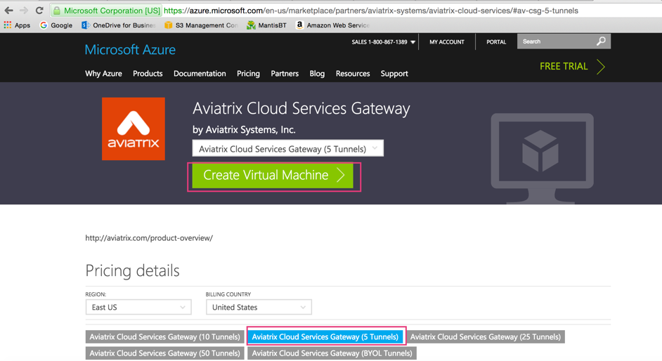
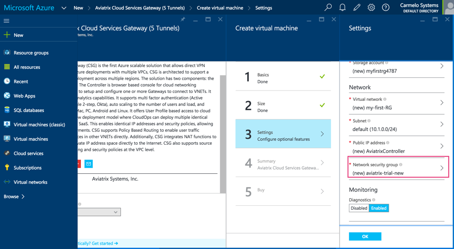
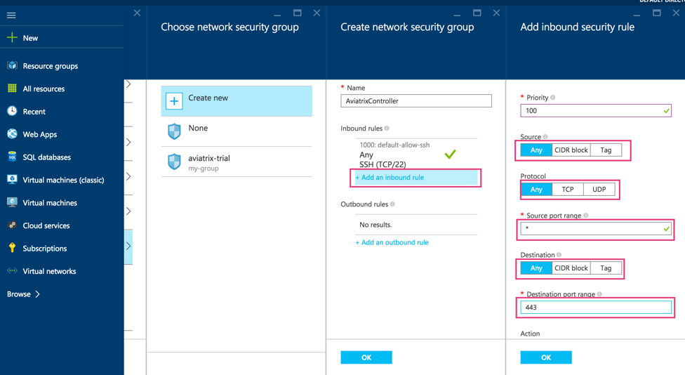
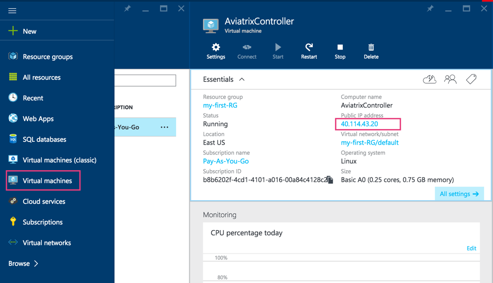
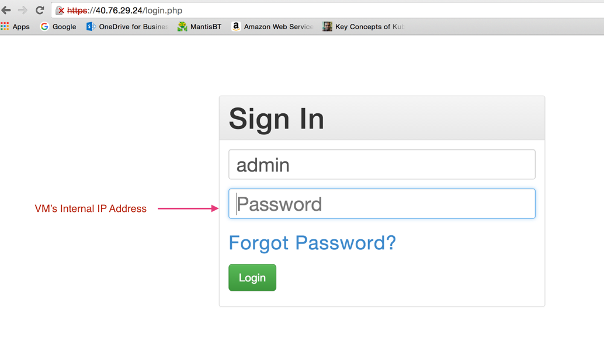

=======================================
Azure
=======================================

The Aviatrix cloud network solution consists of two components, controller and
gateway, both are Azure VMs. Gateways are launched from the controller console to specific VNets. This
guide helps you to launch the controller VM in Azure. Make sure you follow the instructions to also subscribe Aviatrix Companion Gateway described in this guide. 

Steps to Launch the Controller
==============================

Create an Azure Account
-----------------------

Create an Azure account if you do not already have one.

Launch Controller VM from Azure marketplace portal
--------------------------------------------------

1.  Launch from marketplace, select the license type and click Create
    Virtual Machine, as shown below. If you select a “BYOL” image, you
    need a Customer ID. Send email to support@aviatrix.com or
    info@aviatrix.com to request a Customer ID.

    |image1|

2.  Select Create at the next screen.

3.  At Basics column, fill in the VM name, user name, password and
    Resource group, click OK.

4.  At Choose a size, select the VM size, click Select.

5.  At Settings, Click Network security group (This is a critical
    configuration step)

    |image2|

6.  Create a new security group, add an Inbound Rule for HTTPS port 443
    for Inbound Traffic, Allow, as shown below. Make sure Source is Any,
    Source Protocol is Any and Source Port range is \*. Destination Port
    range is 443.

    |image3|

7.  After the new security rule is added, click OK.

8.  Finish launching the VM.

9.  Find the VM’s public IP address, as shown below:

    |image4|

10. Use a browser to access the controller VM. In this example, it is
    https://40.114.43.20

11. At the login page, enter admin as username. Initial password is the
    internal IP address of the VM, as shown below.

    |image5|

12. Go through the login process.

13. Start with onboarding tab at the console.

Subscribe to Aviatrix Companion Gateway
========================================

In order to launch Aviatrix gateway from the controller, you must also subscribe to Aviatrix Companion Gateway which is free in Azure marketplace. Follow the steps in `this doc <http://docs.aviatrix.com/HowTos/CompanionGateway.html>`__ to subscribe. 

Onboarding
==========

After login to the browser console, click Onboarding to go through a few
steps of initial setup.

Once login, click on Help for Frequently Asked Questions (FAQs). All
features have descriptions and should be self-explanatory.

For support, send email to support@aviatrix.com

There will be an alert message on the Dashboard menu when a new release
becomes available.

Enjoy!

.. |image0| image:: AzureAviatrixCloudControllerStartupGuide_media/image001.png
   :width: 2.90683in
   :height: 0.35000in

.. add in the disqus tag

.. disqus::
