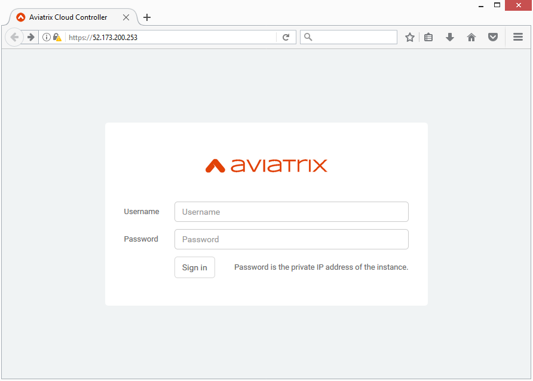

=======================================
Azure Startup Guide
=======================================

The Aviatrix cloud network solution consists of two components, controller and 
gateways, both are Azure VMs. Gateways are launched from the controller console to specific VNets. This
guide helps you to launch the controller VM in Azure. Make sure you follow the instructions to also subscribe Aviatrix Companion Gateway described in this guide. 

.. Note::

  We suggest you consider to deploy the Controller in AWS. The preferred approach is to launch the Controller from AWS Marketplace as an metered AMI by following the `AWS Startup Guide <https://docs.aviatrix.com/StartUpGuides/aviatrix-cloud-controller-startup-guide.html>`_. The Aviatrix Controller is multi cloud, multi subscription and multi region capable. Launching the Controller in AWS maybe a good idea even if you only deploy gateways in Azure, as AWS provides a pay as you go (without up front commitment nor contract negotiation) metered payment system that has the least friction. However if Azure is your choice to deploy the Controller, no worries, proceed to the following sections.

1. Subscribe to Aviatrix Controller
====================================

Go to `Azure Marketplace <https://azuremarketplace.microsoft.com/en-us/marketplace/>`_ to subscribe to one Aviatrix image. 

2. Subscribe to Aviatrix Companion Gateway
===========================================

Aviatrix companion gateway needs to be subscribed as programmable. 

In order to launch Aviatrix gateway from the controller, you must also subscribe to Aviatrix Companion Gateway which is free in Azure marketplace. Follow the steps in `this doc <http://docs.aviatrix.com/HowTos/CompanionGateway.html>`__ to subscribe.

3. Launch the Controller
==============================

Create an Azure Account
-----------------------

Create an Azure account if you do not already have one.

Launch Controller VM from Azure marketplace portal
--------------------------------------------------

a.  Launch from marketplace, select the license type and click Create
    Virtual Machine, as shown below. If you select a “BYOL” image, you
    need a Customer ID. Send email to support@aviatrix.com or
    info@aviatrix.com to request a Customer ID.

    |image1|

#.  Select Create at the next screen.

#.  At Basics column, fill in the VM name, user name, password and
    Resource group, click OK.

#.  At Choose a size, select the VM size, click Select.

#.  At Settings, Click Network security group (This is a critical
    configuration step)

    |image2|

#.  Create a new security group, add an Inbound Rule for HTTPS port 443
    for Inbound Traffic, Allow, as shown below. Make sure Source is Any,
    Service is HTTPS, Protocol is TCP, Port range is 443 and Action is Allow.

    |image3|

#.  After the new security rule is added, click OK.

#.  Finish launching the VM.

#.  Find the VM’s public IP address, as shown below:

    |image4|

#. Use a browser to access the controller VM. In this example, it is
    https://52.173.200.253

#. At the login page, enter admin as username. Initial password is the
    internal IP address of the VM, as shown below.

    |image5|

#. Go through the login process.

#. Start with onboarding tab at the console.

.. Warning:: Any resources created by the controller, such as Aviatrix gateways, Azure routing entries, subnets, etc, must be deleted from the controller console. If you delete them directly on Azure console, controllers view of resources will be incorrect which will lead to features not working properly.

..

5. Access the Controller
=========================

After the Controller instance is in running state in AWS, you can access the Controller
via a browser by `https://Controller_public_IP`, where Controller_public_IP is the static public IP address of the Controller.

The initial password is the private IP address of the instance.

Follow the steps to go through an initial setup phase to download the latest software.
After the latest software is downloaded, re-login again to go through the onboarding process.

4. Onboarding
==============
The purpose of onboarding is to help you setup an account on Aviatrix Controller that
corresponds to Azure account with policies so that the Controller can launch gateways using Azure
API.

Follow the `instructions <http://docs.aviatrix.com/HowTos/Aviatrix_Account_Azure.html>`_ here to 
create an Aviatrix account that corresponds to your Azure account credential. 

Note you can create a single Aviatrix account that corresponds to AWS, Azure and GCloud account credentials. This is a multi cloud platform.

5. Gateway Troubleshoot
========================

If the Controller fail to launch Aviatrix gateway in Azure RM, check out `this troubleshooting guide. <http://docs.aviatrix.com/HowTos/azuregwlaunch.html>`_

Enjoy!

.. |image0| image:: AzureAviatrixCloudControllerStartupGuide_media/image001.png
   :width: 2.90683in
   :height: 0.35000in
.. |image1| image:: AzureAviatrixCloudControllerStartupGuide_media/image02___2017_08_14.PNG
   :width: 5.49426in
   :height: 2.99954in
.. |image2| image:: AzureAviatrixCloudControllerStartupGuide_media/image03___2017_08_14.PNG
   :width: 5.05625in
   :height: 2.77932in
.. |image3| image:: AzureAviatrixCloudControllerStartupGuide_media/image04___2017_08_14.PNG
   :width: 5.40347in
   :height: 2.95863in
.. |image4| image:: AzureAviatrixCloudControllerStartupGuide_media/image05___2017_08_14.PNG
   :width: 5.17776in
   :height: 2.97500in

.. add in the disqus tag

.. disqus::
