.. meta::
    :description: Set up the Aviatrix Controller from Azure
    :keywords: Aviatrix, Azure, set up accounts, Controller, startup guides, VNets

=======================================
Azure Startup Guide
=======================================

The Aviatrix cloud network solution consists of two components, the Controller and 
Gateways, both of which are Azure VMs (Virtual Machines). Gateways are launched from the Controller console to specific VNets. This
guide helps you to launch the Controller VM in Azure. 

Follow the instructions to also subscribe to the Aviatrix Companion Gateway described in this guide:

* `Subscribing to the Aviatrix Metered Offer <https://docs.aviatrix.com/StartUpGuides/azure-aviatrix-cloud-controller-startup-guide.html#id1>`_
* `Subscribing to the Aviatrix Controller BYOL Offer <https://docs.aviatrix.com/StartUpGuides/azure-aviatrix-cloud-controller-startup-guide.html#id2>`_
* `Launching the Controller VM from the Azure Marketplace Portal <https://docs.aviatrix.com/StartUpGuides/azure-aviatrix-cloud-controller-startup-guide.html#id4>`_
* `Onboarding your Azure Account in the Aviatrix Controller <https://docs.aviatrix.com/StartUpGuides/azure-aviatrix-cloud-controller-startup-guide.html#id5>`_

Subscribing to the Aviatrix Metered Offer 
=============================================

Go to `Azure Marketplace <https://azuremarketplace.microsoft.com/en-us/marketplace/apps/aviatrix-systems.aviatrix-controller-saas>`_ to subscribe to Aviatrix Controller Meter License - PAYG. 

Follow the Azure portal instructions to subscribe. 

|subscribe_to_meter|

Subscribing to the Aviatrix Controller BYOL Offer
===================================================

After you subscribe to Aviatrix Meter License offer, you should receive an email from admin@aviatrix.io to inform you with customer ID and a link to subscribe the actual Aviatrix Controller BYOL offer. More to continue in the `Launching the Controller <https://docs.aviatrix.com/StartUpGuides/azure-aviatrix-cloud-controller-startup-guide.html#launch-the-controller>`_ section below.

(Note with Aviatrix Meter License, you are billed monthly. No upfront cost and pay as you go.)

(Optional) Subscribing to an Aviatrix Companion Gateway
===========================================================

This step is not required for most of deployment scenarios as Aviatrix Controller automatically subscribes to the Aviatrix Companion Gateway 
when it is launched. 

There are exceptional cases, such as if you provide Managed Service on Azure, the Aviatrix Companion Gateway requires manual subscription. 

For manual subscription, follow the steps in `this doc <http://docs.aviatrix.com/HowTos/CompanionGateway.html>`__ to subscribe.

Launching the Controller
==============================

Click the link in the email to launch the Controller.
--------------------------------------------------------------

Going back to the email received from admin@aviatrix.io. The email informs you with a customer ID and a 
link to subscribe the actual Aviatrix Controller BYOL offer, as shown below. 

|license_key|

Click the link to return to the Azure Portal to launch the Controller. 

Launching the Controller VM from the Azure Marketplace Portal
-------------------------------------------------------------------------------

#. Get from Azure Marketplace for the actual BYOL Controller. 

    |click_byol|

#.  At Basics header, create new Resource Group titled "aviatrix." The virtual machine name can be "aviatrixController." For instance size, we recommend at least 8GB of RAM so B2ms should be sufficient. 
#. Next, enter a username, password, and Resource group. Please do **not** use "ubuntu" as username if you use password as the authentication type.

    |Azure_Basics|

#. Click **OK**.
#. At the networking header, this will be preconfigured with a default subnet and security group. You should not need to change anything here. For Public IP, click **Create New**.
#. At Assignment, select **Static** and click **OK**. 

    |static_ip|

#. The management, advanced, and tag headers should not need any configuration changes.
#. Click **Create** to finish launching the VM.
#. Find the VM’s public IP address, as shown below:

    |VM|

#.  Use a browser to access the controller VM. In this example, it is
    https://40.77.57.154
#.  At the login page, enter "admin" as the username. The initial password is the internal IP address of the VM, as shown below.

    |login|

#. Go through the login process.
#. After logging in, click on the Onboarding tab at the console.

.. Warning:: Any resources created by the Controller, such as Aviatrix gateways, Azure routing entries, subnets, etc, must be deleted from the Controller console. If you delete them directly on Azure console, The Controller's view of the resources will be incorrect, which will lead to features not working properly.

Onboarding your Azure Account in the Aviatrix Controller
=====================================================

The purpose of Onboarding is to help you setup an account on the Aviatrix Controller that
corresponds to an Azure account with policies so that the Controller can launch gateways using Azure
APIs.

Follow the `instructions <http://docs.aviatrix.com/HowTos/Aviatrix_Account_Azure.html>`_ here to 
create an Aviatrix account that corresponds to your Azure account credential. 

Note: you can create a single Aviatrix account that corresponds to AWS, Azure, and GCloud account credentials. This is a multi-cloud platform.

Gateway Troubleshooting
========================

If the Controller fails to launch an Aviatrix gateway in Azure RM, check out `this troubleshooting guide. <http://docs.aviatrix.com/HowTos/azuregwlaunch.html>`_

Enjoy!

.. |image0| image:: AzureAviatrixCloudControllerStartupGuide_media/image001.png
   :width: 2.90683in
   :height: 0.35000in
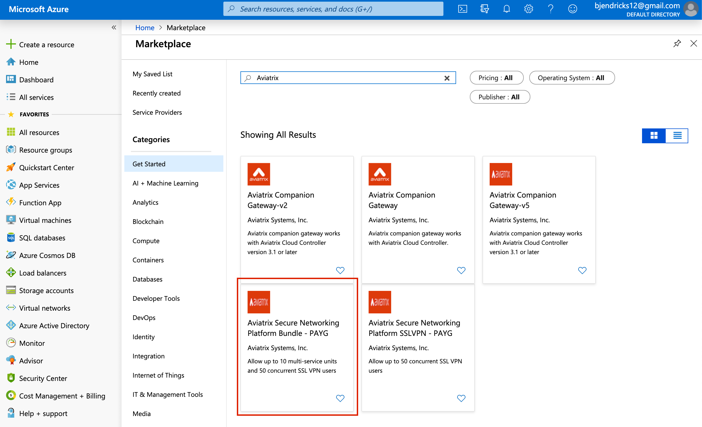
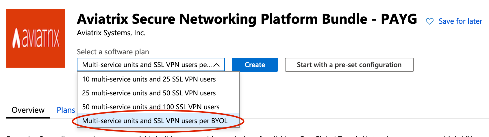
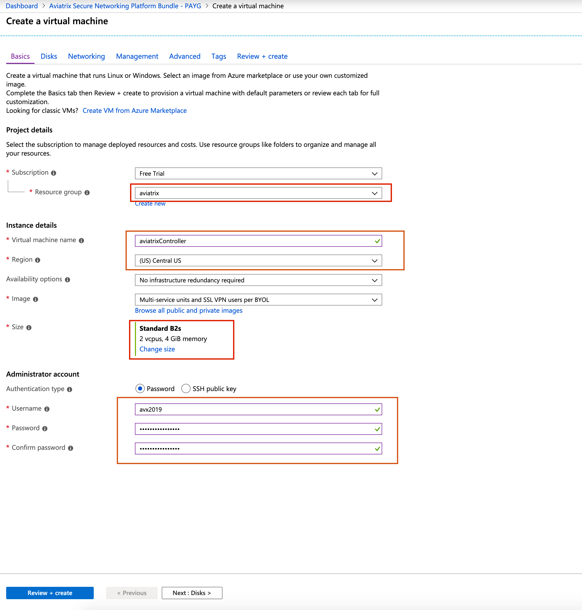
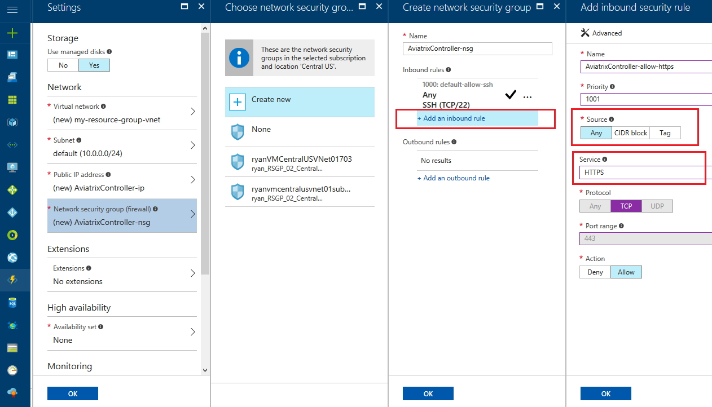
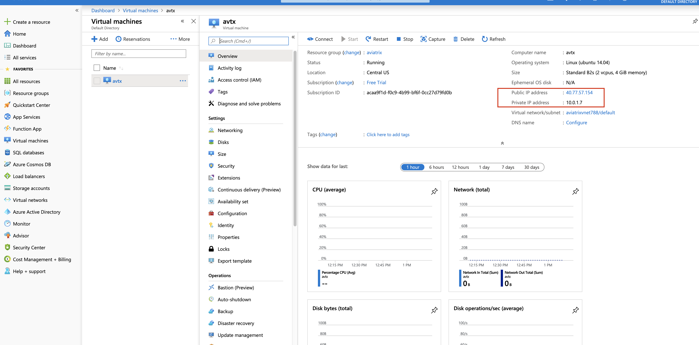
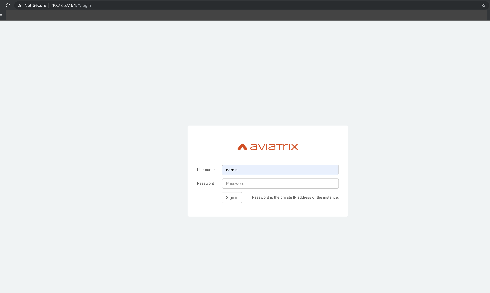
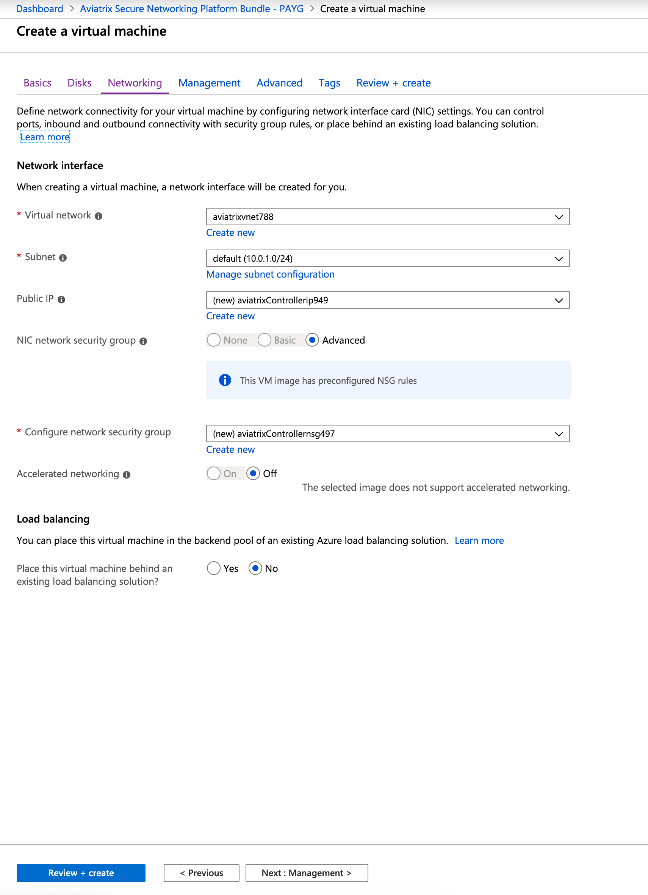

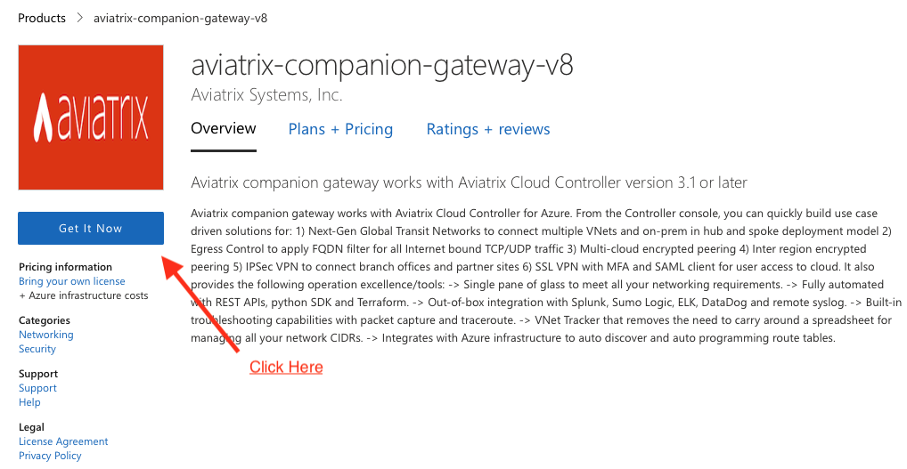

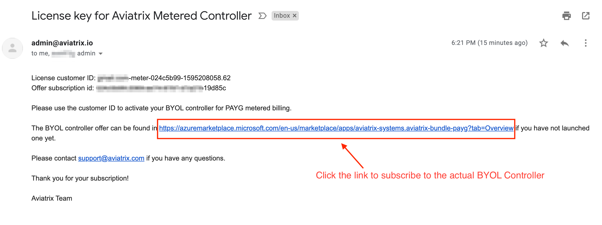

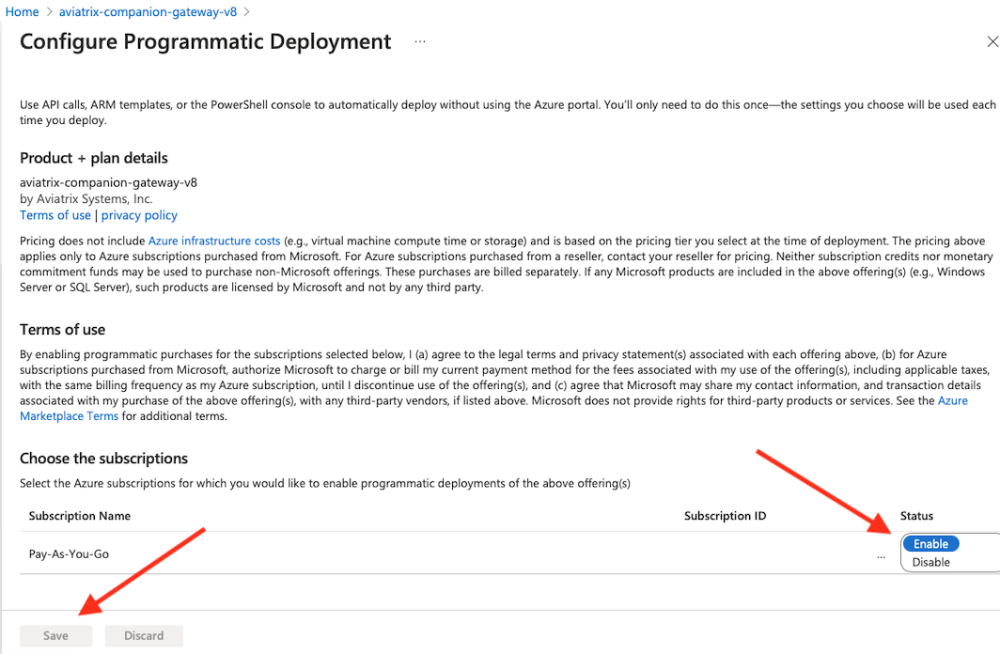

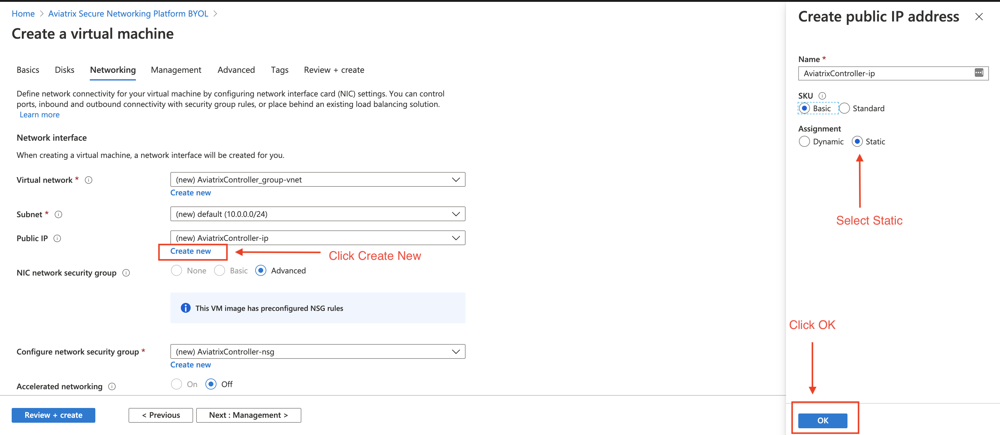

.. add in the disqus tag

.. disqus::
