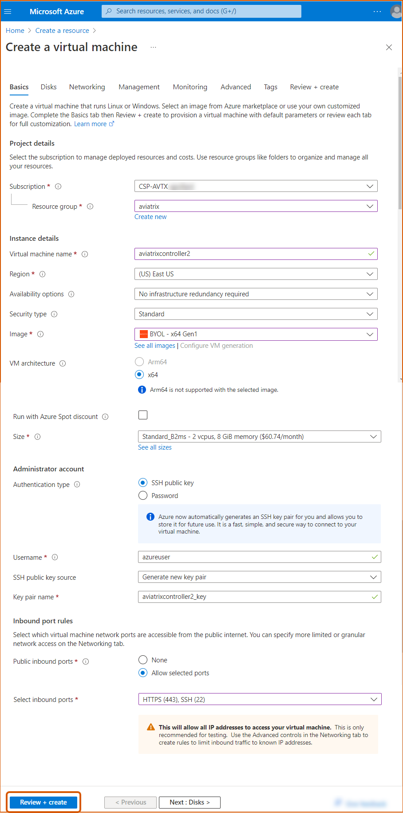
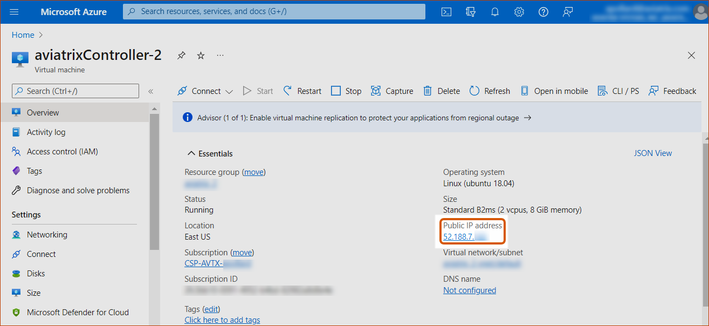
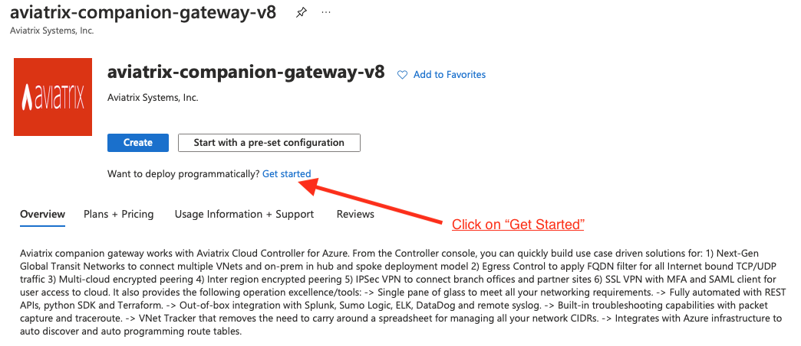

.. meta::
    :description: Set up the Aviatrix Controller from Azure
    :keywords: Aviatrix, Azure, set up accounts, Controller, startup guides, VNets

=======================================
Azure Startup Guide
=======================================

The Aviatrix cloud network solution consists of two components, the Controller and 
Gateways, both of which are Azure VMs (Virtual Machines). Gateways are launched from the Controller console to specific VNets. This
guide helps you to launch the Controller VM in Azure. 

Follow the instructions to also subscribe to the Aviatrix Companion Gateway described in this guide:

* `Subscribing to the Aviatrix Metered Offer <https://docs.aviatrix.com/StartUpGuides/azure-aviatrix-cloud-controller-startup-guide.html#id1>`_
* `Subscribing to the Aviatrix Controller BYOL Offer <https://docs.aviatrix.com/StartUpGuides/azure-aviatrix-cloud-controller-startup-guide.html#id2>`_
* `Launching the Controller VM from the Azure Marketplace Portal <https://docs.aviatrix.com/StartUpGuides/azure-aviatrix-cloud-controller-startup-guide.html#id4>`_
* `Onboarding your Azure Account in the Aviatrix Controller <https://docs.aviatrix.com/StartUpGuides/azure-aviatrix-cloud-controller-startup-guide.html#id5>`_

.. note::

  These instructions apply generally to both Azure commercial and Azure Government clouds for deploying an Aviatrix Controller. Note that some screenshots may show regions that are only available for commercial Azure accounts. Commercial Azure offers multiple regions worldwide while Azure Government offers four US regions: (US) USGov Virginia, (US) UsGov Arizona, (US) UsGov Iowa, and (US) UsGov. For more information about Azure regions, click `here <https://azure.microsoft.com/en-us/global-infrastructure/geographies/#overview>`_. 

Subscribing to the Aviatrix Metered Offer 
=============================================

.. note::

  Launching a new Controller, or migrating Controller images, requires two offers from the Azure Marketplace: 
 
  1) Aviatrix Secure Networking Platform Metered 2208 - Copilot & 24x7 Support
  2) Aviatrix Secure Network Platform BYOL (Bring Your Own License)
 
  Both offers are required because the metered license provides the underlay for the BYOL (Bring Your Own License) offer. Use the steps below to first subscribe to the metered offer, and then activate the metered offer using the BYOL offer, in order to launch or migrate your Controller. Note that your account will only be billed for the metered license.

1. Go to the `Azure Marketplace <https://azuremarketplace.microsoft.com/en-us/marketplace/apps/aviatrix-systems.aviatrix-controller-abu-saas?tab=Overview>`_ to subscribe to the Aviatrix Secure Networking Platform Metered 2208 - Copilot & 24x7 Support offer. 
2. Click **Get it Now** on the left side of the page.
3. Mark the permissions checkbox and click **Continue**.
4. Click **Subscribe**.
5. Enter your Subscription name, Resource group, Name, and Recurring billing preference. Then, click **Review + subscribe**.
6. Click **Subscribe**.
7. After the configuration completes, click **Configure account now**.
8. Enter your email address in the Email field and click **Submit**. 
9. You receive a new email from admin@aviatrix.io with the subject line "License key for Aviatrix Metered Controller and CoPilot." This email contains your Controller customer ID, Copilot customer ID, and offer subscription ID. Save these values in a secure place to use later for onboarding.

Note with the Aviatrix Metered License, you are billed monthly. No upfront cost and pay as you go.

(Optional) Subscribing to an Aviatrix Companion Gateway
===========================================================

This step is not required for most of deployment scenarios as Aviatrix Controller automatically subscribes to the Aviatrix Companion Gateway 
when it is launched. 

There are exceptional cases, such as if you provide Managed Service on Azure, the Aviatrix Companion Gateway requires manual subscription. 

To subscribe manually, follow the steps in `this doc <http://docs.aviatrix.com/HowTos/CompanionGateway.html>`__.

Launching the Controller
==============================

After subscribing to the metered offer and receiving your license key, click the link in the "License key for Aviatrix Metered Controller and Copilot" email you received. This link opens the Azure marketplace to the Aviatrix Secure Networking Platform BYOL (Bring Your Own License) page.

.. note::

  As explained above, this BYOL offer activates the metered subscription. 

Launching the Controller VM from the Azure Marketplace Portal
-------------------------------------------------------------------------------

#. On the Aviatrix Secure Network Platform BYOL page, click **Get it Now**.

    |aviatrix_byol_offer_azure_marketplace|

#. Under Create this app in Azure, click **Continue**.
#. Under Aviatrix Secure Networking Platform BYOL, click **Create**.
#. Create a new Resource Group titled "aviatrix." The virtual machine name can be "aviatrixController." For the instance size, at least 8GB of RAM is recommended; the B2ms instance size should be sufficient. 
#. Next, enter a username, password, and Resource group. Please do **not** use "ubuntu" as username if you use password as the authentication type.

    |Azure_Basics|

#. Click **Review + create**.
#. Click **Create**.
#. Under Generate new key pair, click **Download private key and create resources** to download your secret key.
#. When you receive the message that your deployment is compete, click **Go to resource**.
#. At the networking header, this will be preconfigured with a default subnet and security group. You should not need to change anything here. For Public IP, click **Create New**.
#. At Assignment, select **Static** and click **OK**. 

    |static_ip|

#. The management, advanced, and tag headers should not need any configuration changes.
#. Click **Create** to finish launching the VM.
#. Find the VM’s public IP address, as shown below:

    |VM|

#.  Use a browser to access the controller VM. In this example, it is
    https://52.188.7.183
#.  At the login page, enter "admin" as the username. The initial password is the internal IP address of the VM, as shown below.

    |login|

#. Log into your new Controller.
#. After logging in, click on the Onboarding tab.

.. Warning:: Any resources created by the Controller, such as Aviatrix gateways, Azure routing entries, subnets, etc, must be deleted from the Controller. If you delete them directly on Azure console, The Controller's view of the resources will be incorrect, which will lead to features not working properly.

Onboarding your Azure Account in the Aviatrix Controller
=====================================================

The purpose of onboarding is to help you setup an account on the Aviatrix Controller that
corresponds to an Azure account with policies so that the Controller can launch gateways using Azure
APIs.

Follow the `instructions <http://docs.aviatrix.com/HowTos/Aviatrix_Account_Azure.html>`_ here to 
create an Aviatrix account that corresponds to your Azure account credential. 

Note: you can create a single Aviatrix account that corresponds to AWS, Azure, and GCloud account credentials. This is a multi-cloud platform.

Gateway Troubleshooting
========================

If the Controller fails to launch an Aviatrix gateway in Azure RM, check out `this troubleshooting guide. <http://docs.aviatrix.com/HowTos/azuregwlaunch.html>`_

Enjoy!

.. |image0| image:: AzureAviatrixCloudControllerStartupGuide_media/image001.png
   :width: 2.90683in
   :height: 0.35000in
.. |marketplace| image:: AzureAviatrixCloudControllerStartupGuide_media/marketplace.png
   :width: 5.49426in
   :height: 2.99954in
.. |dropdown| image:: AzureAviatrixCloudControllerStartupGuide_media/dropdown.png
   :width: 10.0in
   :height: 2.0in

.. |image3| image:: AzureAviatrixCloudControllerStartupGuide_media/image04___2017_08_14.PNG
   :width: 5.40347in
   :height: 2.95863in

.. |Networking| image:: AzureAviatrixCloudControllerStartupGuide_media/Networking.png
   :width: 5.0in
   :height: 5.0in

.. |static_ip| image:: AzureAviatrixCloudControllerStartupGuide_media/static_ip.png
   :scale: 30%

.. add in the disqus tag

.. disqus::
