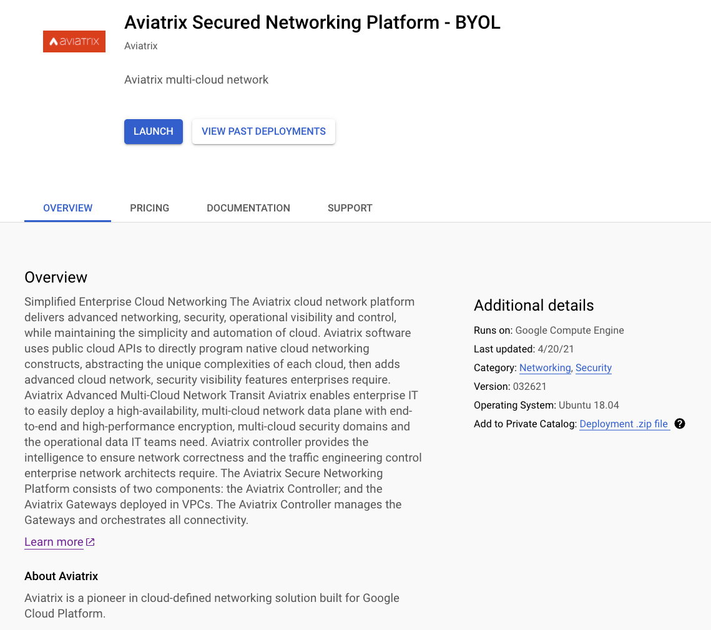
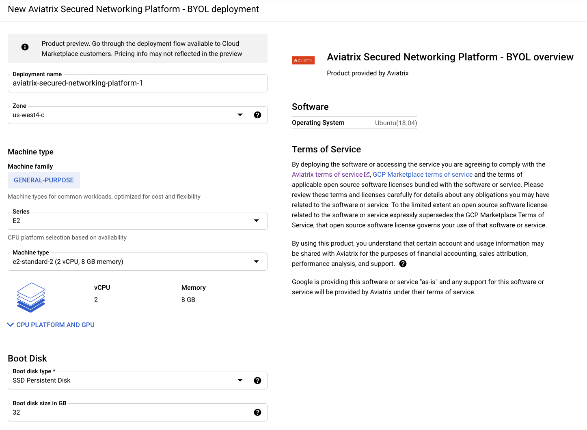
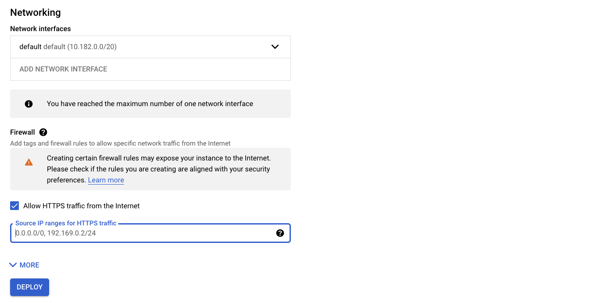
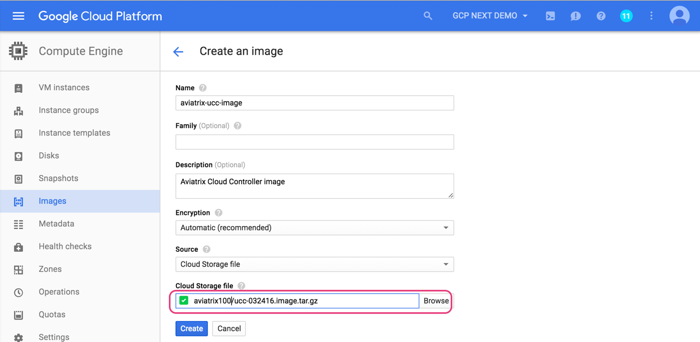
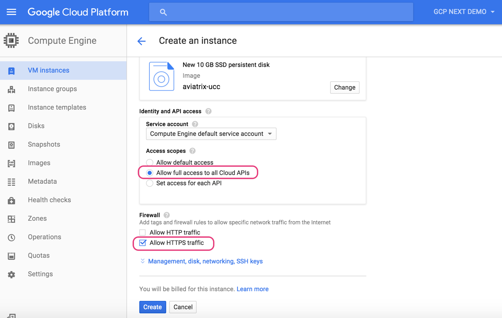
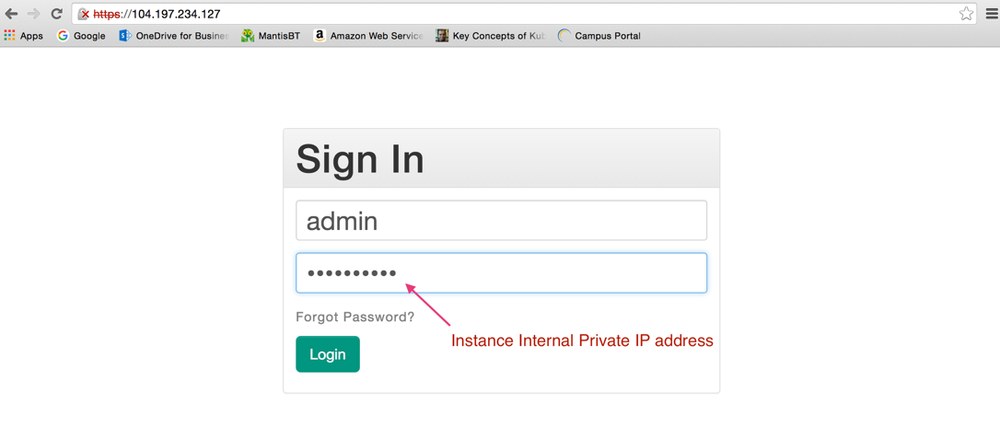



===========================================
Google Startup Guide
===========================================

The Aviatrix cloud network solution consists of two components, the Controller and
Gateway, both of which are GCloud instances. The gateway is launched from the Controller browser console.
This guide helps you to launch the Controller instance in GCloud:

* `Prerequisites <https://docs.aviatrix.com/StartUpGuides/google-aviatrix-cloud-controller-startup-guide.html#id1>`_
* `Launching the Aviatrix Controller <https://docs.aviatrix.com/StartUpGuides/google-aviatrix-cloud-controller-startup-guide.html#option-1-copy-aviatrix-controller-image-to-your-project>`_
* `Accessing the Aviatrix Controller <https://docs.aviatrix.com/StartUpGuides/google-aviatrix-cloud-controller-startup-guide.html#id2>`_
* `Onboarding Your GCP Account to your Aviatrix Controller <https://docs.aviatrix.com/StartUpGuides/google-aviatrix-cloud-controller-startup-guide.html#id3>`_

Note that a GCloud project corresponds to an Aviatrix cloud account
or an AWS (IAM) account with its own credentials. A network in a GCloud
project is logically equivalent to a VPC in AWS, but with a few
significant differences. For example, a network in GCloud project can
have disparate subnets and a subnet can connect across regions.

.. Important::

 
  The Aviatrix Controller is a secure multi-cloud networking platform. Aviatrix recommends you deploy your Controller in clouds that offer metered pricing, then deploy your gateways in any supported cloud. Metered pricing offers you a true pay-as-you-go option without any up-front commitments or contract negotiations. The AWS and Azure clouds offer metered pricing for running the Aviatrix Controller image. The GCP and OCI clouds do not offer metered pricing for running the Aviatrix Controller image.

Prerequisites
============

Get a Customer ID from Aviatrix
-------------------------------

Currently, the Aviatrix Controller for GCloud is only available via community image for BYOL license. Send an email to info@aviatrix.com or open a support ticket at `Aviatrix Support Portal <https://support.aviatrix.com>`_  with your organization name to request a customer ID. We offer a 30-day free trial license.

Creating a Google Cloud Platform (GCloud) Account
--------------------------------------------------------------

Aviatrix Cloud Connect is a software product that is launched in your
own GCloud account. The Controller and the Gateways created from the
Controller console are all in your own network perimeter and completely
under your control.

Create a GCloud account (https://cloud.google.com/). Go on to the next
step if you have already done so.

Note that the Controller supports multiple accounts with each one
associated with a different GCloud projects, but there needs to be at
least one to start with.

Creating a GCloud Project
--------------------------------------

Log in to your GCloud account and go to the project page:
https://console.cloud.google.com/project

Create a project. Go on to the next step if you have already created
one. Note that the project ID will be used in referencing to this project by
Aviatrix Controller.

(As an example, we created a project called Aviatrix-UCC, the project ID is
aviatrix-ucc-1214.)

(Optional) Creating Networks
------------------------------------------

This step creates a network in the project created in the previous step.

When a new project is created, a default network is created. You may
skip this step if you do not need to customize the network address range by
creating a new network, or go on to the next step if you have done so.

Note that the Aviatrix Controller handles a GCloud network like a VPC in AWS.
Whenever a network configuration is mentioned for GCloud, the term VPC
is used. (The VNet is used for Azure.)

At GCloud console, select the project that you have copied the Aviatrix
Controller image to. Click the 3 bars. At the dropdown menu, select
Networking. Click “[+] Create Network”.

Note: if you plan to have multiple projects, we suggest you plan your
subnets so that the network addresses do not overlap. Select Custom to
create subnets.

Deploying the Aviatrix Controller in GCP Marketplace (Preview mode)
=======================================================================

1. Go to the GCP marketplace.
2. Find the product "Aviatrix Secured Networking Platform - BYOL".
3. Click **LAUNCH**.

  |gcp_controller_gcp_marketplace_01|
  
4. Make sure the selected Machine type has at least 2 vCPUs with 8 GB memory.
5. Boot Disk is SSD Persistent Disk with 32 GB.

  |gcp_controller_gcp_marketplace_02|
  
.. Important:: 

  Do not check the **Firewall** box to **Allow HTTPS Traffic**. Aviatrix recommends you improve security by removing any 0.0.0.0 entries on port 443 not allowing the Aviatrix Controller to the world. 

6. Click **DEPLOY**.

Accessing the Aviatrix Controller
==============================

After the instance is created, click the Controller instance name, and
note its External IP address and Internal IP address. Go to
https://External_IP_of_the_controller.

At the login prompt, type "admin" for username and type the internal IP
address for the password, as shown below:

|image3|

Follow the initial setup process to set up an admin email address and password and install the latest software. Log in again with your new admin password.

.. Warning:: Any resources created by the controller, such as Aviatrix gateways, GCP routing tables, subnets, LB, etc., must be deleted from the controller console. If you delete them directly on AWS console, the Controller's view of resources will be incorrect, which will lead to features not working properly.

.. Note:: Upgrade from 5.3 to 5.4 is not supported Controller needs to be migrated. Look at the GCP controller migration section in the below link.
https://docs.aviatrix.com/HowTos/controller_migration.html

Onboarding Your GCP Account to Your Aviatrix Controller
===============================================

If no GCloud account has been set up, you will be guided through the
onboarding process. It takes only a few steps. Once that is done, follow
the quick tour guide to start launching gateways.

For onboarding instructions on GCloud, click `this link. <http://docs.aviatrix.com/HowTos/CreateGCloudAccount.html>`_

Resource Names
===============
The maximum length of a gateway cannot exceed 50 characters when configuring Aviatrix Google Cloud gateway.
Other resource names like subnet and VPC have a maximum character limit of 63, a requirement for Google Cloud. 

Launching Gateway
=================
The following gateway sizes are supported for GCloud:

  'n1-standard-1','n1-highcpu-2',  'n1-standard-2',  'n1-highmem-2',
  'n1-highcpu-4', 'n1-standard-4', 'n1-highmem-4',   'n1-highcpu-8', 
  'n1-standard-8','n1-highmem-8',  'n1-highcpu-16',  'n1-standard-16',
  'n1-highmem-16','n1-highcpu-32', 'n1-standard-32', 'n1-highmem-32'
    
Support
=======

Check out the Help menu for Frequently Asked Questions (FAQs), Reference
Design and Release Notes. All features have descriptions embedded and
should be self-explanatory.

An alert message will be displayed on the Dashboard menu when a new
release becomes available.

For support, please open a support ticket at `Aviatrix Support Portal <https://support.aviatrix.com>`_.

Enjoy!

.. |image0| image:: GoogleAviatrixCloudControllerStartupGuide_media/image001.png
   :width: 2.90683in
   :height: 0.35000in

.. add in the disqus tag

.. disqus::
