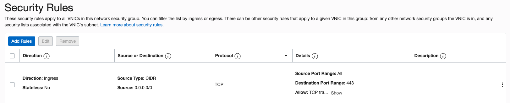

===============================================
Oracle Cloud Infrastructure (OCI) Startup Guide
===============================================

The Aviatrix cloud network solution consists of two components, the Controller and 
Gateways, both of which are cloud VMs (Virtual Machines). Gateways are launched from the Controller console to specific VCNs. This
guide helps you to launch the Controller in OCI.

* `Preparing Your Account in OCI <https://docs.aviatrix.com/StartUpGuides/oracle-aviatrix-cloud-controller-startup-guide.html#preparing-your-account-in-oci>`_
* `Subscribing to the Controller <https://docs.aviatrix.com/StartUpGuides/oracle-aviatrix-cloud-controller-startup-guide.html#subscribing-to-the-controller>`_
* `Accessing the Controller <https://docs.aviatrix.com/StartUpGuides/oracle-aviatrix-cloud-controller-startup-guide.html#accessing-the-controller>`_
* `Onboarding Your OCI Account to your Aviatrix Controller <https://docs.aviatrix.com/StartUpGuides/oracle-aviatrix-cloud-controller-startup-guide.html#onboarding-your-oci-account-to-your-aviatrix-controller>`_

.. Important::

  The Aviatrix Controller is a secure multi-cloud networking platform. Aviatrix recommends you deploy your controller in clouds that offer metered pricing, then deploy your gateways in any supported cloud. Metered pricing offers you a true pay-as-you-go option without any up-front commitments or contract negotiations. The AWS and Azure clouds offer metered pricing for running the Aviatrix Controller image. The GCP and OCI clouds do not offer metered pricing for running the Aviatrix Controller image.

Preparing Your Account in OCI
==============================

#. Create an OCI account if you do not already have one.
#. Set up your compartment. Although you can use default account and root compartment, it is recommended that you follow this doc to create your own user, group, and compartment with the right policy. For more details, refer to  `Setting Up Your Tenancy <https://docs.cloud.oracle.com/iaas/Content/GSG/Concepts/settinguptenancy.htm>`_.
#. Create a VCN that has Internet access by navigating to Networking  > Virtual Cloud Networks in the OCI console. Then, click **Create Virtual Cloud Network** and select **create virtual cloud network plus related resources**.
#. Alternatively,  if you want to create a VCN with your own CIDR, select **create virtual cloud network only**. Continue to create a subnet and Internet gateway. Then, add a default route in the VCN default routing table to point to the newly created Internet gateway. This is to grant Internet access to the Controller inside of this VCN.

Subscribing to the Controller
==============================

1. Go to `Oracle Cloud Marketplace <https://cloudmarketplace.oracle.com/marketplace/en_US/homePage.jspx>`_ and search for Aviatrix to subscribe to the Aviatrix platform.
2. Click **Get App** at the top of the App page.
3. Select an OCI region and click **Launch Image**.

 |inst_region|

4. Choose the version and compartment and click **Launch Instance**.

 |inst_launch|

On the "Create Compute Instance" page:
5. Choose name, availability domain, and Virtual Machine as instance type.
6. Choose an Instance Shape. The recommended shape is **Standard2.2**.

       |inst_flavor|

7. Choose the proper compartment for VCN and subnet. Optional: you could select **Use network security groups to control traffic** if you have one, otherwise leave it as you can create one later.

       |inst_network|

8. Choose an ssh public key file.
9. Click **Create** to launch the instance.

Accessing the Controller
=========================

To be able to reach your Controller public IP via https using your browser, you will need to open port 443 in either the Security List or Security Group.

Security List (easy to configure)
----------------------------------------

#. From the OCI portal, navigate to Networking  > Virtual Cloud Networks  > your VCN name  > Security Lists  > Default Security List.
#. Add an ingress rule to allow port 443. You could further limit the source CIDR if you know all your VCN subnets where the gateway will be launched.

 |inst_seclist|

Security Group (recommended)
------------------------------------------

#. From the OCI portal, navigate to Networking  > Virtual Cloud Networks  > your VCN name  > Network Security Groups.
#. Create a new Security Group. Add an ingress rule to allow port 443. You could further limit the source CIDR if you know all your VCN subnets where gateway will be launched.

 |inst_secgroup|

#. Navigate to Compute  > Instances  > Controller VM detail page, select **Edit** besides the Network Security Groups under Primary VNIC Information.
#. Associate the Security Group you created to the controller VNIC.

 |inst_vnic_secgroup|

Opening your Aviatrix Controller
^^^^^^^^^^^^^^^^^^^^^^^^^^^^^^^

#. After the Aviatrix Controller instance is in a running state, you can access the Controller via a browser by navigating to https://Controller_public_IP, where "Controller_public_IP" is the static public IP address of the Controller. The initial password is the private IP address of the instance.
#. Follow the steps in your browser to go through an initial setup phase to download the latest software. Use "latest" as version if you are not asked to use other version number.
#. After the latest software is downloaded which takes around 5 mins, UI would redirect you to the login page. You could also try to log in again if browser is closed to go through the account onboarding process.

Onboarding Your OCI Account to your Aviatrix Controller
=================================================

Follow the `onboarding instructions <https://docs.aviatrix.com/HowTos/oracle-aviatrix-cloud-controller-onboard.html>`_ to create an Aviatrix account that corresponds to your OCI account credential.

.. Note::

You only need to create a single Aviatrix account that corresponds to many OCI, AWS, Azure and GCloud account credentials. This is a multi-cloud platform.

Congratulations on finishing launching your Aviatrix networking platform. Please take a look at our `Documentation website <https://docs.aviatrix.com/>`_.
Enjoy!

.. |inst_flavor| image:: OCIAviatrixCloudControllerStartupGuide_media/inst_flavor.png
.. |inst_network| image:: OCIAviatrixCloudControllerStartupGuide_media/inst_network.png
.. |inst_seclist| image:: OCIAviatrixCloudControllerStartupGuide_media/inst_seclist.png

.. |inst_vnic_secgroup| image:: OCIAviatrixCloudControllerStartupGuide_media/inst_vnic_secgroup.png
.. |startup_version| image:: OCIAviatrixCloudControllerStartupGuide_media/startup_version.png
.. |startup_first_login| image:: OCIAviatrixCloudControllerStartupGuide_media/startup_first_login.png

