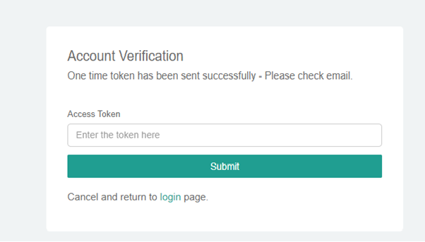
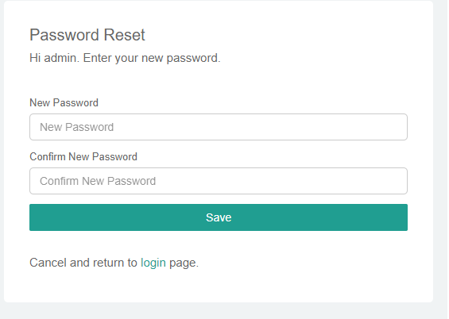
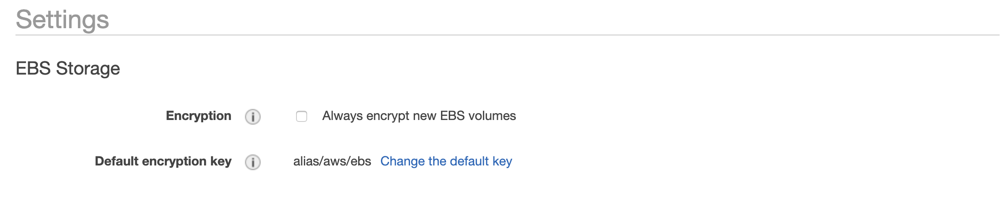
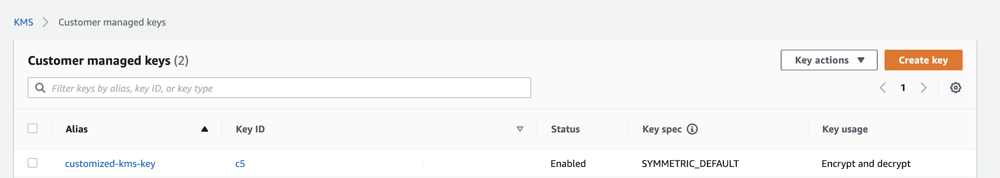
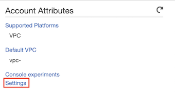
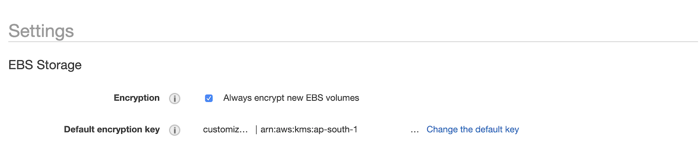
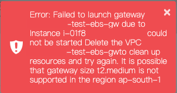
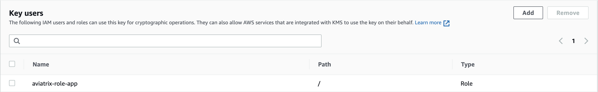

.. meta::
   :description: Aviatrix Support Center
   :keywords: Aviatrix, Support, Support Center, controller, bacakup, iam, upgrade, api, ssl certificate, controller HA, alerts, blackhole, interfaces, keepalive, certificate, dns, idle timeout, migrate controller, ca signed cert, saml auth, lost password

===========================================================================
Controller
===========================================================================

What are the minimum requirements for an instance to run the Aviatrix Controller Software?
---------------------------------------------------------------------------------------------------

We strongly recommend that the instance be at least t2.large and have at least 32GB of storage and at least 8GB of Memory to act as a Controller in AWS. Please check out https://docs.aviatrix.com/StartUpGuides/aviatrix-cloud-controller-startup-guide.html#select-instance-size for more information.

The controller needs to be able to resolve all DNS queries, download software, communicate with the gateways over port 443, redirect inbound SAML VPN connection (if used). The same goes with the gateways in regards to DNS queries and sending keepalive back to the controller. The Aviatrix controller must have an EIP even if it is behind an ELB for all necessary communication to work. However, you may access the UI using its private IP for operation.

If you have enabled `Controller HA functionality <https://docs.aviatrix.com/HowTos/controller_ha.html>`_, please disable before initiating the following process. And do not forget to enable Controller HA after you finish with the disk size upgrade process.
 
If you have less than 32GB of Storage on your controller, please follow these steps to increase your disk space:

1. Make a backup of your controller. (https://docs.aviatrix.com/HowTos/controller_backup.html)
2. Login to the AWS console and locate the Aviatrix controller instance.
3. Click on Root device: /dev/sda1 and then click on EBS ID vol-xxxxxxxxxx.
4. With the volume selected, click Action > Modify Volume to change the size to 32.
5. Click OK to start the resize process. Please make sure you wait until the state of the volume is "in-use - completed (100%)".
6. Select the Aviatrix controller instance in EC2 page. Click Reboot for the disk space to take effect.
7. Confirm that the controller is in running state in AWS console.
8. Login to your controller to sanity test.
9. Take a backup again, by following instructions at https://docs.aviatrix.com/HowTos/controller_backup.html

Note that rebooting the controller will not impact your IPsec tunnels as it's not in the data path. Please send an email to support@aviatrix.com, if you have any questions.

Why are IAM policies important?
---------------------------------

During the launch of your Aviatrix Controller, two IAM roles(aviatrix-role-ec2 & aviatrix-role-app) are created and two associated IAM policies(aviatrix-assume-role-policy & aviatrix-app-policy) are also created. These roles and policies allow the Controller to use AWS APIs to launch gateway instances, create new route entries and build networks and are hence very important to keeping your network operational. Please check out `IAM Policies <https://docs.aviatrix.com/HowTos/iam_policies.html>`_, `Requirements <https://docs.aviatrix.com/HowTos/aviatrix_iam_policy_requirements.html>`_, `Customization <https://docs.aviatrix.com/HowTos/customize_aws_iam_policy.html>`_ and `IAM for Secondary Access Accounts <https://docs.aviatrix.com/HowTos/HowTo_IAM_role.html>`_. After a software upgrade, please update your IAM policies using the instructions in the above links - these updates have to be done for all accounts that have the Controller and the gateway. 

We expect all of your accounts to have the following:
  * Role named "aviatrix-role-ec2" with policy named "aviatrix-assume-role-policy" attached to it. The policy should be identical to the `specified policy requirements <https://s3-us-west-2.amazonaws.com/aviatrix-download/iam_assume_role_policy.txt>`_, unless it is `customized <https://docs.aviatrix.com/HowTos/customize_aws_iam_policy.html>`_ carefully.
  * Role named "aviatrix-role-app" with an IAM policy named "aviatrix-app-policy" attached to it. The policy should be identical to the `specified policy requirements <https://s3-us-west-2.amazonaws.com/aviatrix-download/IAM_access_policy_for_CloudN.txt>`_, unless it is customized carefully
  * If you have secondary accounts, the "aviatrix-role-app" in each and every one of the secondary accounts should be trusting the Controller's AWS account number via the "Trust Relationship" tab on the role in addition to trusting it's own account number.
  * In the case of the primary account(which hosts the controller), "aviatrix-role-app" role should trust it's own account number.
  * All of your Aviatrix Controllers and Gateways need to have "aviatrix-role-ec2" attached

You can follow one of the ways described below to update your IAM policies:
  * If you are running 5.1 or later releases, you can go to "Accounts -> Access Accounts -> Select an account -> Click the 3 dots skewer and click on **Update policy**"
  * You can copy the latest IAM policies from this `link <https://s3-us-west-2.amazonaws.com/aviatrix-download/IAM_access_policy_for_CloudN.txt>`_ and paste it into your IAM policies through your AWS Console (Services/IAM/Dashboard/Policies/search for **aviatrix-app-policy**/Click on **aviatrix-app-policy**/Permissions/EditPolicy/JSON/delete all text and paste the policies you copied from the link above/ReviewPolicies/SaveChanges"
  * Detailed `instructions to create roles/policies <https://docs.aviatrix.com/HowTos/HowTo_IAM_role.html>`_
  * Instructions to `create roles/policies via terraform <https://docs.aviatrix.com/Support/support_center_terraform.html#how-can-i-create-my-iam-roles-and-policies-in-aws-using-terraform>`_

Why should I upgrade my Controller Software?
----------------------------------------------

Our engineering team works very hard to fix issues on a continuous basis. We also continue to add new features and try to enhance the systems to keep your network working effectively and securely. Please take advantage of this and stay on the latest releases.  `Controller upgrade <https://docs.aviatrix.com/HowTos/inline_upgrade.html>`_ does not affect your tunnels. Please keep your controller's size at > t2.large!

Does Aviatrix Controller support automation?
-------------------------------------------------

The Aviatrix Controller supports a `comprehensive set of API <https://s3-us-west-2.amazonaws.com/avx-apidoc/index.htm>`_ to enable automation

We also support Terraform. Please check out `Aviatrix Terraform Tutorial <https://docs.aviatrix.com/HowTos/tf_aviatrix_howto.html>`_, `Aviatrix Terraform Provider <https://docs.aviatrix.com/HowTos/aviatrix_terraform.html>`_, `Transit Network using Terraform <https://docs.aviatrix.com/HowTos/Setup_Transit_Network_Terraform.html>`_ and our `Github Repository <https://github.com/terraform-providers/terraform-provider-aviatrix>`_.

Can I use an SSL Certificate from AWS ACM?
-------------------------------------------

You can place your `controller behind an ELB in AWS <https://docs.aviatrix.com/HowTos/controller_ssl_using_elb.html>`_ and use your certificate from AWS ACM. Remember to increase the `default ELB idle connection timeout <https://docs.aws.amazon.com/elasticloadbalancing/latest/application/application-load-balancers.html#connection-idle-timeout>`_ from 60 seconds to at least 300 seconds.

How do I backup my Aviatrix configuration?
------------------------------------------

Please checkout `backup functionality <https://docs.aviatrix.com/HowTos/controller_backup.html>`_ on your Aviatrix controller. 

* If you have a "."/period character in the S3 bucket name, please ensure you are running software version 4.0.685 or later.)
* We strongly recommend the "Multiple Backup" setting to be turned on at Controller/Settings/Maintenance/Backup&Restore. After turning this option on - click on Disable and then Enable and then click on "Backup Now." Check in your S3 bucket to make sure that the backup function is successful.
* We support `backup using AWS encrypted storage <https://docs.aviatrix.com/HowTos/controller_backup.html#how-to-backup-configuration-with-aws-encrypted-storage>`_
* Please do not use the AWS's AMI to take snapshots - this is not a valid backup mechanism and will not work

How can I customize the Controller GUI?
--------------------------------------

* On the Gateway page, you can customize the columns and add more information(click on the "Name, State, ..." drop down list box and select the fields you are interested in). You can also sort and filter on any column by clicking on header.
* On the gateway page, you can adjust the number of gateways you can see at a time - the default is 5 gateways

How can I troubleshoot connectivity issues?
--------------------------------------------
Please refer to `How to use Aviatrix FlightPath <https://docs.aviatrix.com/HowTos/flightpath_deployment_guide.html>`_!!

Does Aviatrix support High Availability?
------------------------------------------

We have HA built into our system through `Transit HA <https://docs.aviatrix.com/HowTos/transitvpc_workflow.html>`_ and `Single AZ HA <https://docs.aviatrix.com/HowTos/gateway.html#gateway-single-az-ha>`_. The `Gateway HA <https://docs.aviatrix.com/Solutions/gateway_ha.html>`_ is now deprecated. 

`Aviatrix Controller HA <https://docs.aviatrix.com/HowTos/controller_ha.html>`_ does not support HA in multiple regions, but works across multiple AZ's. More information `here <https://github.com/AviatrixSystems/Controller-HA-for-AWS/blob/master/README.md>`_

Does Controller send alerts when Gateway status changes?
--------------------------------------------------------------------

The Aviatrix Controller monitors the gateways and tunnels and whenever there is a tunnel or gateway state change, it will send an email to the admin of the system. You can always override the admin email by updating "ControllerUi/Settings/Controller/Email/StatusChangeEventEmail". If you do not want to see these emails, you can set it to an email address that you don't monitor.

As an alternative, you can also set Cloudwatch Event Alerts in AWS to be alerted when Gateway/Controller Instances are Started or Stopped.

What are blackholes on Alert Bell?
--------------------------------------------------------------------

Blackhole route(s) usually means that the route in your AWS route table points to a non-existant AWS resource.
Besides, a route pointing to an EC2 with the stopped state will have this blackhole state.

The blackhole definition on the AWS website: https://docs.aws.amazon.com/AWSEC2/latest/APIReference/API_DescribeRouteTables.html
route.state - The state of a route in the route table (active | blackhole). The blackhole state indicates that the route's target isn't available (for example, the specified gateway isn't attached to the VPC, the specified NAT instance has been terminated, and so on).

Here is more info for the Aviatrix Alert Bell function: https://docs.aviatrix.com/HowTos/UCC_Release_Notes.html
Alert Bell is a new multi purpose alerting function displayed on the Aviatrix Controller Console. For example, Aviatrix Controller periodically scans your AWS route tables and alerts you if there is any blackhole entry in your AWS route table that needs to be cleaned up as best practice. GuardDuty findings are also recorded by Alert Bell.

You can decide to remove the blackholes in AWS portal if they are not needed.

How can I check and track configuration changes and run audit on my Aviatrix System?
--------------------------------------------------------------------------------------

You have a couple ways to run audits on the Aviatrix System:

 * You can view and download audit logs from "Controller GUI > Troubleshoot > Logs > Display Logs > Display Audit Logs" and "Download Audit Logs". More information `here <https://docs.aviatrix.com/HowTos/UCC_Release_Notes.html#operations>`_
 * If you have `external logging <https://docs.aviatrix.com/HowTos/AviatrixLogging.html>`_ enabled, you can search for "AviatrixCMD" on your logging system. More information `here <https://docs.aviatrix.com/HowTos/AviatrixLogging.html#id11>`_

Which Aviatrix gateway interface to perform packet capture on?
--------------------------------------------------------------

An Aviatrix gateway may have a single or multiple interfaces depending on the type of gateway used for a network deployment. Therefore, it will be helpful if a user knows which interface to perform the packet capture when troubleshooting a network connectivity or packet flow issue. Please note that all interfaces on the Aviatrix gateway are automatically created based on the features enabled.

+-----------------------+--------------------------------+--------------------------------------------------------+
| Gateway Type          | Interface                      | Description                                            |
+=======================+================================+========================================================+
| SSLVPN                | eth0                           | Main interface                                         | 
|                       +--------------------------------+--------------------------------------------------------+
|                       | tun0                           | Interface created for OpenVPN connection               |
+-----------------------+--------------------------------+--------------------------------------------------------+
| Regular               | eth0                           | Main interface                                         | 
| (created in GW page)  |                                |                                                        |
+-----------------------+--------------------------------+--------------------------------------------------------+
| Spoke                 | eth0                           | Main interface                                         |
|                       +--------------------------------+--------------------------------------------------------+
|                       | tun-XXXXXXXX                   | (Optional) VTI to the Aviatrix Transit gateway         |
+-----------------------+--------------------------------+--------------------------------------------------------+
| Transit               | eth0                           | Main interface                                         |
|                       +--------------------------------+--------------------------------------------------------+
|                       | tun-XXXXXXXX                   | VTI to the VGW, external device or CloudN              |
|                       +--------------------------------+--------------------------------------------------------+
|                       | tun-YYYYYYYY (to Gateway_Name) | VTI to each Spoke gateway                              |
+-----------------------+--------------------------------+--------------------------------------------------------+
| Transit for TGW only  | eth0                           | Main interface                                         |
|                       +--------------------------------+--------------------------------------------------------+
|                       | eth1                           | Interface connecting to AWS Transit GW                 |
|                       +--------------------------------+--------------------------------------------------------+
|                       | tun-XXXXXXXX                   | VTI to the VGW, external device or CloudN              |
|                       +--------------------------------+--------------------------------------------------------+
|                       | tun-YYYYYYYY (to Gateway_Name) | (Optional) VTI to each Transit peering gateway         |
+-----------------------+--------------------------------+--------------------------------------------------------+
| Transit DMZ           | eth0                           | Main interface                                         |
| (Main)                +--------------------------------+--------------------------------------------------------+
|                       | eth1                           | (Optional) Interface connecting to AWS Transit Gateway |
|                       +--------------------------------+--------------------------------------------------------+
|                       | eth2                           | Interface connecting to Firewall instance              |
|                       +--------------------------------+--------------------------------------------------------+
|                       | tun-YYYYYYYY (to Gateway_Name) | (Optional) VTI to each Spoke or Transit peering gateway|
+-----------------------+--------------------------------+--------------------------------------------------------+
| Transit DMZ           | eth0                           | Main interface                                         |
| (Companion)           +--------------------------------+--------------------------------------------------------+
|                       | eth2                           | Interface connecting to Firewall instance              |
|                       +--------------------------------+--------------------------------------------------------+
|                       | tun-XXXXXXXX                   | (Optional) VTI to the VGW, external device or CloudN   |
+-----------------------+--------------------------------+--------------------------------------------------------+

In order to perform a packet capture, go to Troubleshoot > Diagnostics > Network page and scroll down to Packet Capture section. Select the target gateway and the interface you want to capture the packet and all other relevant fields. By default, the packet capture will run for 60 seconds when no duration is configured. The maximum packet capture duration is 240 seconds and you may manually stop the process at any time.

 
Why are my Gateways reported as down?
--------------------------------------------------------------

The Aviatrix Controller depends on `Gateway keepalive messages <https://docs.aviatrix.com/HowTos/gateway.html#gateway-keepalives>`_ from the Gateways to determine the `Gateway status <https://docs.aviatrix.com/HowTos/gateway.html#gateway-status>`_. The default configuration for Gateway keepalives is set to "medium" - which means that the Gateway will be sending a keepalive to the Controller every 12 seconds and the Controller runs a health check on the Gateway every 60 seconds. The Gateway is considered to be "UP" if the Controller receives 2 or more message between two consecutive health checks.
 
Sometimes due to Cloud Infrastructure and/or Network issues, there is a temporary glitch in network connectivity which could lead to the Gateway being marked as "Down" and the Controller sending an alert email. If you do receive such a message, please check the status of the tunnels on the Gateway and run `Diagnostics on the Gateway <https://docs.aviatrix.com/HowTos/troubleshooting.html#run-diagnostics-on-a-gateway>`_.

The Gateway could also be reported as "Down" due to the Controller's Security Group not being open to the Gateway’s EIP. To restrict the Security Groups on the Controller to allow traffic from all Gateways automatically, you can turn on the `Controller Security Group Management <https://docs.aviatrix.com/HowTos/FAQ.html#enable-controller-security-group-management>`_ feature at "Controller UI > Settings > Controller > Security Group Management"

Please also note that a Gateway "Down" state does not necessarily mean IPsec or OpenVPN service is down - it only means that the Controller has not received the keepalive messages from the Gateway and that could be due to a few reasons as mentioned above.

What is the preferred way for generating a CSR and uploading a Signed CA Certificate to the Aviatrix Controller?
------------------------------------------------------------------------------------------------------------------------

The recommended way is to generate a CSR and have it signed by your CA and then upload the signed cert, ca cert and the key at "Controller Web Interface > Settings > Advanced > Security > Import Method > Import Certificate with the Key". `Instructions to generate CSR <https://support.comodoca.com/Com_KnowledgeDetailPage?Id=kA01N000000zFU6>`_

Why is having a reachable DNS server important for the Aviatrix Controller?
----------------------------------------------------------------------------------------------------
 
When an Aviatrix Controller is launched, by default it will pick up the DNS used in the VPC DHCP Options and the default AWS DHCP is using AmazonProvidedDNS. If VPC DHCP Options are not set, it will use the AWS's Default DNS server (ex: 10.1.0.2 if VPC CIDR is 10.1.0.0/16).

If you have a DNS server configured in DHCP options, please make sure that it can resolve public FQDNs. The Aviatrix Controller depends on this service to run as designed and will run into unexpected problems if it cannot resolve public FQDNs
 
If you are using AWS's VPC DNS Service, please do make sure that "enableDnsSupport" is turned on - else, AWS will not provide DNS services in the VPC (https://docs.aws.amazon.com/vpc/latest/userguide/vpc-dns.html, https://docs.aws.amazon.com/glue/latest/dg/set-up-vpc-dns.html)

How can I increase the idle timeout when my Aviatrix Controller is deployed behind an ELB, to avoid frequent logins?
----------------------------------------------------------------------------------------------------------------------

If the Aviatrix controller is behind an ELB, you can go to the AWS portal's Load Balancers page. Select the ELB that you use for the controller and Edit the attributes to increase the Idle timeout. We recommend at least 360 seconds. The default is 60 seconds. Please check out https://docs.aws.amazon.com/elasticloadbalancing/latest/application/application-load-balancers.html#connection-idle-timeout for more information.

How can I move my controller from one AWS account to another AWS account?
--------------------------------------------------------------------------

1. Backup the old controller configuration to an S3 bucket using these `instructions  <https://docs.aviatrix.com/HowTos/controller_backup.html>`_. FileName created should look like: CloudN_xxx_config.enc
2. In the target account, create a new controller, running the same Aviatrix Software Version as the old controller using `these directions <https://docs.aviatrix.com/StartUpGuides/aviatrix_overview.html#how-to-launch-aviatrix>`_
3. Build the "Trust-Relationship" between all gateway (AWS) accounts and the new controller's AWS account using these `directions <https://docs.aviatrix.com/HowTos/HowTo_IAM_role.html#establish-trust-relationship-with-primary-account>`_. NOTE: Make sure that you repeat this step for every gateway's (AWS) account
4. Login to the new controller and run "Aviatrix Console/Settings/Maintenance/Backup&Restore/Restore" . Enter the AccessKey & SecretKey (which have the permissions to access the S3 bucket located in the same AWS account of your old controller), BucketName, FileName
5. After restore process is finished, check that the new controller can access/configure all the gateways from old controller.

How can I import a CA signed cert into my controller through API?
--------------------------------------------------------------------------

Here is a sample script to import a CA signed cert:

::

  # Description:
  #    This script demonstrates using Aviatrix API, "import_new_https_certs"

  # Instruction(s):
  #    + Please  replace  the content from line 11 to 23 with your own data

  import requests

  controller_hostname = '1.2.3.4'  # This can be the public IP or domain name of the Aviatrix controller
  api_endpoint_url = 'https://' + controller_hostname + '/v1/api'

  # File paths in local machine
  path_to_input_file_01 = './my-ca-cert.csr'       # assuming this file is in the same folder as this python script is
  path_to_input_file_02 = './my-server-cert.crt'
  path_to_input_file_03 = './my-private-key.key'

  body_payload = {
      'action': 'import_new_https_certs',
      'CID': 'Rzz61dB94uaYwpJX6dWn',  # Please provide your valid CID here
      'gateway_name': 'abg-us-east-1-spoke-s-rateshop-aviatrix-ubuntu'  # Comment out this parameter if this API is invoked against the Aviatrix controller
  }

  # Notes:
  #    + 'ca_cert', 'server_cert' and 'private_key' are actually the body-param names

  file_list = {
      'ca_cert': ('file_name_to_be_saved_in_server_01.cert', open(file=path_to_input_file_01, mode='rb'), 'application/vnd.ms-excel', {'Expires': '0'}),
      'server_cert': ('file_name_to_be_saved_in_server_02.cert', open(file=path_to_input_file_02, mode='rb'), 'application/vnd.ms-excel', {'Expires': '0'}),
      'private_key': ('file_name_to_be_saved_in_server_03.pem', open(file=path_to_input_file_03, mode='rb'), 'application/vnd.ms-excel', {'Expires': '0'})
  }

  response = requests.post(url=api_endpoint_url, data=body_payload, files=file_list, verify=False)
  print(response.text)

How to address "Certificate Chain is Incomplete" or "Missing Intermediate Certificate" issue after you run SSL analysis (ex: ssllabs.com) to the controller URL?
--------------------------------------------------------------------------

Please refer to following steps to prepare CA Certificate and Server Public Certificate

1. Include intermediate CA and root CA in the CA certificate file as full chain, please keep them in this order.

::

	-----BEGIN CERTIFICATE-----
	(Your Intermediate certificate)
	-----END CERTIFICATE-----
	-----BEGIN CERTIFICATE-----
	(Your Root certificate)
	-----END CERTIFICATE-----

2. Include intermediate CA in the Server Public certificate file as full chain, please keep them in this order.

::

	-----BEGIN CERTIFICATE-----
	(Your Server Public certificate)
	-----END CERTIFICATE-----
	-----BEGIN CERTIFICATE-----
	(Your Intermedia certificate)
	-----END CERTIFICATE-----

3. Follow `here <https://docs.aviatrix.com/HowTos/import_cert_with_key.html#step-3-uploading-the-certificates-to-the-controller>`_  to update the controller certificate again.

How can I use SAML for controller auth when I'm also using SAML for VPN authentication?
------------------------------------------------------------------------------------------

By default, we use "Hostname" for "Entity Id" when creating the SAML Endpoint in the Controller Console. When you create a second endpoint for controller login, you would have to pick "Custom" for "Entity Id" and use a custom string. You would have to use the same custom string for EntityId when you provision the SAML App at your IdP(Okta, Onelogin, Azure, etc)

How to reset Controller login password if it's lost or forgotten?
--------------------------------------------------------------

In case if you've lost or forgetten the password to AVX console, please use next steps to repair it:

1. Input the username to Username field, and press “Forgot password” from the login page

|login_page|

2. Check email and find the one time token inside. Message format is :

<<ONE TIME TOKEN>> is the one time Aviatrix token from controller <<IP ADDR AVX CONTROLLER>> and is valid for 15 minutes.

Please pay attention that the token expires in 15 minutes. If you repeatedly get this and think that this is being done by someone with malicious intent, you can restrict the IP's allowed to access your controller through AWS's Security Groups

3. Enter Access Token in Account Verification window:

|verification_window|

4. Type new password for the admin user:

|admin_user|

5. Press Save button and try to login with a new password

.. |login_page| image:: password-recovery-img/Pic1.png
   :scale: 70%
   

   

   

How can I secure my controller?
-----------------------------------

Please follow the instructions `here <https://docs.aviatrix.com/HowTos/FAQ.html#how-do-i-secure-the-controller-access>`_ to secure your controller. We release periodic updates of our software to address any known issues, please do keep your Aviatrix System up to date by following these `upgrade instructions <https://docs.aviatrix.com/HowTos/inline_upgrade.html>`_. If you have any further questions or doubts, please reach out to our technical support by creating a new ticketby sending a new email to support@aviatrix.com or by registering at https://aviatrix.zendesk.com.

Upgrading beyond 5.3 with old Controller Image (Ubuntu 14.04)
-----------------------------------

As Ubuntu 14.04 has reached its' end of life, existing Controllers that are running this image will be unable to upgrade past the latest release of 5.3.
Customers with Controllers running this image will need to first migrate their Controller to a newer image if they are interested in upgrading beyond 5.3. 
The following instructions detail the migration and upgrade process for Controllers in AWS and Azure. 
The workflow for a similar end-result in GCP is also detailed at the end of this document:

AWS:

There are currently two ways to migrate Controllers in AWS:
1) Manually
2) Through the Controller Migration Feature (available in Release 5.3)

Since you will need to reach 5.3 prior to upgrading to 5.4, it is recommended to perform the migration through the Controller Migration Feature as per option 2. 

1) If you are interested in migrating manually, please refer to our migration documentation: 
https://docs.aviatrix.com/HowTos/Migration_From_Marketplace.html

2) One-Click Controller Migration:
https://docs.aviatrix.com/HowTos/controller_migration.html

Prerequisites: 
1. AWS or AWS-Gov
2. Controller Backup must be enabled.
3. Controller HA MUST be disabled. 
4. Ensure no configuration changes are made while the migration is taking place. 

1. This feature can be accessed by logging in to the Controller UI and then navigating to Settings > Maintenance > Migration. 
2. When you are ready to perform the migration, click "Migrate" and wait for the process to complete.
3. Once the Controller has been migrated, complete the upgrade to 5.4 normally as per our Upgrade Guide: https://docs.aviatrix.com/HowTos/inline_upgrade.html#inline-software-upgrade

Azure: 
At the time of this writing Azure Controller migrations can only be performed manually. 
Ensure that any Controller HA has been disabled. 

1. Create a New Controller in Azure: https://docs.aviatrix.com/StartUpGuides/azure-aviatrix-cloud-controller-startup-guide.html#launch-controller-vm-from-azure-marketplace-portal
2. On the Old Controller, ensure you are on the latest version of 5.3. Otherwise, follow our Upgrade Guide to reach 5.3:  https://docs.aviatrix.com/HowTos/inline_upgrade.html#inline-software-upgrade
	a. If you are on a version <5.3, you will need to follow the normal incremental upgrade path to reach 5.3-- doing so will automatically place you at the latest version.
	b. If you are already on 5.3, but have not reached the latest version, log in to the Controller UI and then navigate to Settings > Maintenance > Upgrade > Upgrade to a Custom Release > Specify "5.3" > Dry Run > Click "Upgrade to a custom release". Make sure to complete the Pre-Upgrade Checklist found in the above link before upgrading.
3. IMPORTANT: When the New Controller initializes, configure the admin email address and password then continue with initial setup until you reach the prompt to click "Run" and install the software. Instead of leaving the Software Version field at the default, "latest", specify "5.3" to upgrade the new Controller to the latest version of 5.3. Otherwise the new Controller will upgrade to 5.4 and you will be unable to restore your backup file.
4. On the Old Controller, navigate to Settings > Maintenance > Backup & Restore > and create a Backup.
5. Stop the Old Controller.
6. On the New Controller, log in to the Controller UI, then navigate to Settings > Maintenance > Backup & Restore > Restore > Click Restore (with latest backed-up file)
7. If you want to keep the Old Controller Public IP, detach it from the Old Controller and reattach to the New Controller. Otherwise perform Troubleshoot > Diagnostics > Network > Controller IP Migration > Migrate.
8. Complete the upgrade to 5.4 on the New Controller normally, as per our Upgrade Guide: https://docs.aviatrix.com/HowTos/inline_upgrade.html#inline-software-upgrade

GCP:
For Controllers in GCP, please reference the following documentation: 
https://docs.aviatrix.com/HowTos/controller_migration.html#controller-migration-in-gcp

How to use self-defined KMS key for default EBS encryption of gateway disk in the region?
-----------------------------------

We use default AWS KMS key( alias/aws/ebs ) for EBS encryption of gateway disk in all region. 

|default-kms-key-value|

If you want to use your self-defined KMS key, please use next steps to configure it:

1. Go to AWS Key Management Service (KMS) page and click "Create a key" to create a new KMS key.

2. Select Symmetric and click "Next" to configure key.

3. Enter an alias and a description for this key and click "Next" to add labels.

4. Leave it blank and click "Next".

5. Enter aviatrix-role-app and check the box next to "aviatrix-role-app" and click "Next" to define key usage permissions.

6. Review the policy and click "Finish".

|create-result|

7. Go to AWS console EC2 page and click "Settings" at the right side below to Account Attributes.

|kms-key-setting|

8. Click "Change the default key" at the end of "Default encryption key" and select your self-defined KMS key.

|customized-key|

9. Click "Save Settings" to finish the process.

Notice: If you already used your self-defined key, and controller pop out Error message:

Failed to launch gateway. It is possible that gateway size is not supported in the region.
        
|kms-key-warning|

Please use next steps to add aviatrix-role-app to your self-defined KMS key:

1. Go to AWS Key Management Service (KMS) page -> Customer managed keys -> click your self-defined key.
        
2. Scroll down to "Key users" section and click "Add" at the right side.
        
3. Enter aviatrix-role-app and check the box next to "aviatrix-role-app" and click "Add"

|kms-customer-managed-kms-key-users|

Why did my SAML Login on the Controller stopped working after Controller AMI migration?
------------------------------------------------------------------------------------------

In our latest AMI, we have made the EntityID checks more stricter. It is possible that your EntityID in your IdP settings might be slightly different. Please login to the controller and go to Settings/Controller/SAMLLogin and click on the "SP Metadata" button - that should open a new tab on your browser and display some data, including your EntityId. Please make sure that the EntityId in the IdP's SAML application is configured to be exactly as the string between the quotes including any slashes at the end as shown by the controller. (For example if your entityID="https://mysite.example.com/test/, use the entire string: https://mysite.example.com/test/ in your IdP for EntityId)

Upgrading Aviatrix Controller on GCloud Project beyond 5.3 with old Controller Image (Ubuntu 14.04)
------------------------------------------------------------------------------------------

1. On old controller please make sure all the gateways, s2c tunnels, peerings are up and healthy. You can also take a screenshot of the dashboard page. This screenshot will contain with all the important numbers of your old Aviatrix Controller.

2. Check the version of your old controller and upgrade to the latest 5.3 version if it's not ( upgrade method can reference to: https://docs.aviatrix.com/HowTos/inline_upgrade.html#inline-software-upgrade ). Then, perform “Settings -> Maintenance -> Backup&Restore -> Backup -> Backup Now”. Check the backup file on your cloud bucket and note the bucket name and backup file name for later use.

3. Please create a new external ip on GCloud console. Go to GCloud main page -> Click the 3 bars at the top left corner -> Drop down menu and select VPC Network -> External IP addresses. Click “Reserve a static address” at the top of the middle and create a new external ip with the same Network Service Tier and region as the old controller external ip address( we assume the migration is above the same VPC).

4. Create a new controller based of latest GCP controller image following instructions at https://docs.aviatrix.com/StartUpGuides/google-aviatrix-cloud-controller-startup-guide.html( Notice: When creating the controller instance, please extend the network option and click the networking tap to change your external ip address to a static ip that you create at step3 for the new controller ).

5. Access to the new Aviatrix Controller with new external ip address( https:// New_External_IP_of_the_controller ), and login with id / password : admin / internal ip address.

6. Important: Initialize new controller with latest 5.3 version, please replace the default "latest" version with "5.3".

7. Select Onboarding on Aviatrix Controller, and make sure you onboard the same account name of the GCloud project as old controller.

8. If you want to keep the old controller external ip address, please stop the old controller first. Then, detach the old external ip from the old controller and reattach to new controller.

9. Access to the new Aviatrix Controller with old external ip address and perform “Troubleshoot -> Diagnostics -> Network -> Controller IP Migration -> Migrate”, finishing migrate your old external ip to new controller.

10. On the new controller perform “Settings -> Maintenance -> Backup&Restore -> Restore -> Restore with noted bucket name and backup file name at step2.

11. Re-login and check all the gateways, s2c tunnels and peerings are up and healthy. Compare the numbers on the dashboard page with the screenshot you take from step1.

12. Upgrade new controller to latest 5.4 or above verion.
