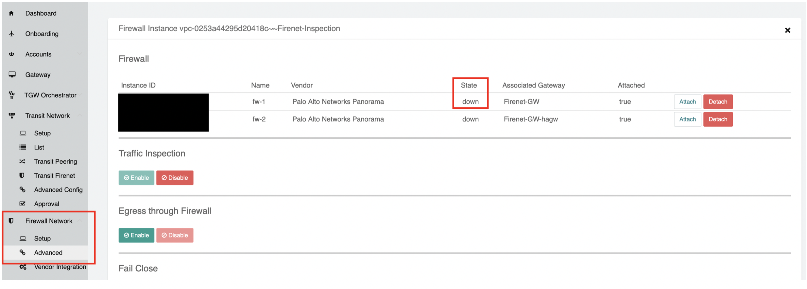

.. meta::
   :description: Aviatrix Support Center
   :keywords: Aviatrix, Support, Support Center

===========================================================================
Firenet
===========================================================================

Firewall status on the Aviatrix Controller:
---------------------------------------------

Firewall status on the Aviatrix Controller can be checked by going to firewall network -> advanced -> click on 3 dots on the right.

|image1|

If firewalls are **not** managed by **Panorama**:

1. "**up**": Aviatrix Controller can ping and query status info from PaloAlto Firewall

2. "**unaccessible**":  Aviatrix Controller can ping, but not query status info from PaloAlto Firewaall

3. "**down**": Aviatrix Controller cannot ping nor query status from PaloAlto Firewall

If firewalls are managed by **Panorama**:

Firewall has 3 status, **up**, **unaccessible**, **down**.

1. If Panorama is accessible from the Aviatrix Controller, the device in Panorama shows “connected”, and the Aviatrix Controller is able to ping the Management Interface of the Firewall, the Aviatrix Controller consider the firewall to be **up**

2. If either Panorama is not accessible, or device is not in managed device list, or device shows “disconnected”, Aviatrix Controller then pings the firewall to check status

     * If ping passes, Aviatrix Controller consider the firewall to be **unaccessible**

     * If ping fails, Aviatrix Controller consider the firewall to be **down**.

