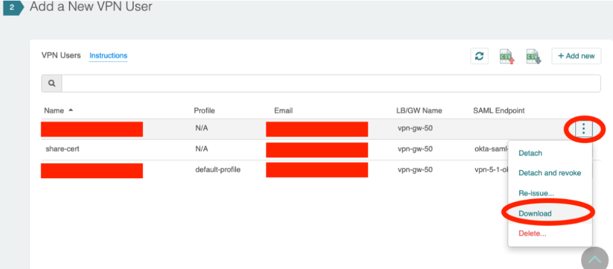

.. meta::
   :description: Aviatrix Support Center
   :keywords: Aviatrix, Support, Support Center, openvpn, saml, aviatrix vpn client, .ovpn file, okta token authentication, openvpn profiles, tunnelblick, ldap, csv upload, QuotaExceededException

===========================================================================
OpenVPN Gateway
===========================================================================

What is the recommended design for Aviatrix OpenVPN Solution?
---------------------------------------------------------------

**Our recommended design** is to let your VPN users connect into your cloud environment through an Aviatrix OpenVPN gateway, with one or more behind a load balancer, and use the peering between VPCs to allow access to your VPN Clients into your other VPCs. We recommend using VPN profiles to control/limit access to other VPC’s as you see fit.

How do I generate an .ovpn file for my SAML VPN users?
---------------------------------------------------------------------

Once you enable SAML auth for an OpenVPN gateway, you need to create a dummy user on the controller to generate an .ovpn file – you can share this file with all of your users. As the second authentication is through SAML, this should provide good security. This is per VPC+ELB/GW setup. If you have more than one such deployed VPC+ELB/GW setups, you would need a .ovpn file for each of those setups.

Can I connect via multiple VPN sessions from the same PC using Aviatrix VPN Client?
----------------------------------------------------------------------------------------------

Currently we do not support multiple VPN sessions from the same PC via the Aviatrix VPN Client

Which VPN Clients are supported with SAML authentication?
-----------------------------------------------------------------

At this time, we support SAML authentication for our VPN clients only for our `Aviatrix VPN Client <https://docs.aviatrix.com/Downloads/samlclient.html>`_

When using Okta Authentication with Okta API Token, what is the suggested Okta App administrator role to Token?
-----------------------------------------------------------------

You can refer to this link about OKTA `App administrator role permission table <https://help.okta.com/en/prod/Content/Topics/Security/Administrators.htm?cshid=Security_Administrators#Security_Administrators>`_.
You will need Super Admin or Read-Only Admin to allow the privilege to create a Token for API access.

Can I set a profile for my VPN user via SAML?
-----------------------------------------------------------------

You can add a custom attribute “Profile” in your IdP and the value will be passed to the Aviatrix OpenVPN gateway during authentication. The Aviatrix controller will then attach the Profile provided by the IdP to the VPN user. Currently we only allow one profile value to be passed via SAML auth. This will override any local settings on the controller for this user.

Can I assign multiple profiles to the same users?
------------------------------------------------------------

You can assign multiple profiles to a VPN user, but please make sure that they all have the same base policies (allow all or deny all).

What is the recommended default browser for Aviatrix OpenVPN with SAML Authentication?
--------------------------------------------------------------------------------------------

Microsoft Edge does not work well with the SAML authentication process when it is set as the default browser. Please try setting your default browser to Firefox or Chrome.

How do I delete a Network Load Balancer created by Aviatrix? 
---------------------------------------------------------------------------------------------------

An ELB will be automatically deleted by the Aviatrix Controller if all the gateways behind it are deleted and if there are no more users attached to it. The last resort to delete an ELB is delete it from Troubleshoot > ELB. Please refrain from deleting an ELB from the AWS portal for any ELBs created by the Aviatrix controller.

Should I be worried about Tunnelblick VPN Client's warning message about "comp-lzo"?
----------------------------------------------------------------------------------------

Tunneblick VPN Client might show a warning about "comp-lzo" being deprecated when connecting to Aviatrix OpenVPN Gateway. You can safely ignore this message. We have kept this option in for backward compatibility

Why is my VPN client failing to connect with this error: “Network is unreachable for DNS resolution”?
-------------------------------------------------------------------------------------------------------

The Aviatrix VPN Client needs to have a successful name resolution for “localhost.aviatrix.com” to a local address 127.0.0.1. We need a publicly resolvable FQDN to use the browser to communicate on signed TLS. Some DNS servers do not allow this, resulting in the Aviatrix VPN Client failing to connect, displaying this error. If your dns server is resolving other domains, but failing to resolve localhost.aviatrix.com ("nslookup localhost.aviatrix.com" doesn’t return 127.0.0.1), you can employ a simple workaround of adding “localhost.aviatrix.com” pointing to “127.0.0.1” in the hosts file.
 
  * Mac/Linux: add “127.0.0.1  localhost.aviatrix.com” to /etc/hosts. You would need a sudo access for this
  * Windows: add “127.0.0.1  localhost.aviatrix.com” to C:\Windows\System32\Drivers\etc\hosts file. Please open your editor/notepad with “run as administrator” (edited)

Another option is to set the DNS server to a different one - we recommend that you test it with 8.8.8.8 to make sure that the Aviatrix Client works well.

Any known issue with DD-WRT routers?
-----------------------------------------------

Aviatrix VPN Client needs to be able to resolve localhost.aviatrix.com to 127.0.0.1. The DD-WRT router is known to have an issue resolving this, so your VPN connection might fail. Please take a look at this `link <https://forum.dd-wrt.com/phpBB2/viewtopic.php?p=1064711>`_ for a workaround.

What should I do if Aviatrix VPN Client displays "Permission Denied" error?
--------------------------------------------------------------------------

If you encounter a "Permission Denied" error while starting Aviatrix VPN Client on Microsoft Windows, you can fix this by running it with an administrator role. Here are the steps for Windows 10:
    
  * From Start Menu, find the Aviatrix VPN Client. Right-click and select Open File Location.
  * Right-click the program and go to Properties.
  * On the Properties window, click the Compatibility tab.
  * Under the Compatibility mode section, check the "Run as administrator" checkbox.
  * Click the OK button to save the settings and start the program again.
  

Looking for an easy LDAP solution for Aviatrix OpenVPN Solution?
------------------------------------------------------------------------------

Check out `AWS's LDAP <https://aws.amazon.com/directoryservice/faqs/>`_

How can I scale my VPN user setup?
---------------------------------------------------

Deploy your Aviatrix OpenVPN Gateways behind a Load Balancer so you can scale up by adding more VPN gateways behind the ELB when needed and not have to worry about losing an IP address and having to reissue certificates to all of your VPN users. Alternatively, you may choose to use `Aviatrix UDP LoadBalanced VPN using DNS <https://docs.aviatrix.com/HowTos/DNSVPN.html>`_
.

We recommend that you use multiple t2 instances behind an ELB to make your openvpn deployment leverage the scalability, ha and  loadbalancing features that we built in. Also configuring the connection to be split-tunnel will help you serve more remote users, so you can offload traffic to internet locally instead of routing it through the Aviatrix OpenVPN Gateways. Please monitor the "Rate Total" and "CPU Idle" metrics for your openvpn gateways from the dashboard page and add more gateways as needed.

How can the OpenVPN made Highly Available?
-----------------------------------------------

We have HA built into our OpenVPN system. By default, the OpenVPN gateways are deployed behind a `Load Balancer <https://docs.aviatrix.com/HowTos/gateway.html#enable-elb>`_ in AWS. When you deploy additional OpenVPN gateways in the same VPC, they are deployed behind the same ELB, so the system becomes HA and resilient to any failures.

Here are `instructions <https://docs.aviatrix.com/HowTos/DNSVPN.html>`_ to use LB with UDP OpenVPN sessions.

What is the recommended VPN CIDR Block (default is 192.168.43.0/24)?
------------------------------------------------------------------------------

Make sure that there is no overlap between the local subnet of the computer running the VPN Client and the VPN CIDR Block. `Link <https://docs.aviatrix.com/HowTos/gateway.html#vpn-cidr-block>`_. Also make sure that you have enough ip address space to support all of your VPN users since we use 4 IP addresses per user - the default vpn cidr, 192.168.43.0/24, should be good for ~60 users. Pick a larger subnet for more users.
 
If you were to use 192.168.42.0/23, you can have up to 120 users connect to a single OpenVPN Gateway. Note that this is per gateway - so if you have 4 OpenVPN Gateways behind an ELB, each of them will have the same CIDR allowing 120 users each. The IP Addresses of the VPN Users will be NAT'ed by the OpenVPN Gateway so the traffic would look like it originated from the OpenVPN Gateway.
 
Please look `here <https://docs.aviatrix.com/HowTos/gateway.html#vpn-cidr-block>`_ for more information on VPN CIDR Block.

 

How does a vpn client access resources from different VPCs when connecting to OpenVPN gateway?
-------------------------------------------------------------------------------------------------

Be default, split VPN clients can only reach the VPC that the OpenVPN gateway is deployed. If you want them to reach other VPC's, please add them to "VPN CIDR" - `instructions <https://docs.aviatrix.com/HowTos/Cloud_Networking_Ref_Des.html#multiple-vpcs-in-multi-regions-split-tunnel>`_

If an OpenVPN gateway is created in a Spoke Gateway VPC in a Transit Network, can my VPN users access the other Spoke's resources?
---------------------------------------------------------------------------------------------------------------

In a Transit solution, note that traffic between spokes is not allowed by default and hence your clients will not be able to reach other spoke VPCs - check out "`Connected Mode <https://docs.aviatrix.com/HowTos/site2cloud.html#connected-transit>`_". Also traffic from `Transit VPC <https://docs.aviatrix.com/HowTos/site2cloud.html#advertise-transit-vpc-network-cidr-s>`_ is also not advertised by default.

We recommend that you deploy OpenVPN on a separate Gateway to take advantage of the Load Balancer for scalability.

Why do my VPN clients take longer to connect, sometimes?
--------------------------------------------------------------------

Sometimes the clients might take some time to connect due to ELB's load - check the logs on the client. Temporary network connectivity issues, DNS resolution on your PC and other factors may contribute to this slow connection issue.

Why are my DNS settings changes not taking effect?
--------------------------------------------------------

In the case of a full tunnel deployment, if an OpenVPN Gateway is edited to toggle the "Use VPC/VNet DNS Server" setting, please follow it by clicking on  OpenVPN/EditConfig/ReloadDHCPConfiguration to let the changes take effect. Note that this will restart the OpenVPN processes on the gateway, affecting all the connected clients. The VPC DNS settings are shared with an OpenVPN user only in a Full tunnel setup. For split tunnel setup, the configured Nameservers field in OpenVPN/EditConfig/Modify Split Tunnel will be pushed to the connected clients. An empty Nameservers field will not push any DNS settings to the connected clients but instead will use the client's local DNS from his local network or manually configured. 

How can I send the VPN config files to my users?
------------------------------------------------------

By default, when you add the email address to a user, they will receive the VPN config file (.ovpn) via email. If you do not want to share these files via email, please do not enter the email address for the vpn users. You can then download these files one at a time from the Controller UI per user. You can use our `REST API <https://s3-us-west-2.amazonaws.com/avx-apidoc/API.htm#_get_vpn_ssl_ca_configuration>`_ - and then share it via your preferred mechanism with your VPN user. The REST API allows you to scale up if you deploy it via automation.

How can I customize the email that is sent out when a new VPN user is added?
--------------------------------------------------------------------------------------------

You can customize the message of the email and the filename of the .ovpn file by following the instructions `here <https://docs.aviatrix.com/HowTos/openvpn_faq.html?highlight=openvpn%20email#how-do-i-add-a-vpn-user>`_.  We will enhance this feature in the future to allow you to customize the subject as well, stay tuned. 

My Mac is not picking up the DNS server setting when connected?
-------------------------------------------------------------------------

The OpenVPN gateway will push the DNS setting to the vpn clients (by default for full tunnel and when configured for split-tunnel). Note that an empty Nameservers field in split-tunnel mode will not push any DNS settings to the connected clients but instead will use the client's local DNS from his local network or manually configured.

If the Mac has the DNS configured manually, then it cannot be overwritten by the VPN Client. We have a couple of workarounds for this issue. 

* Turn on the "Allow override of manually set DNS" option in the VPN Client / Advanced / Advanced
* Change the DNS setting on your Mac so that it will be picked up from the DHCP server

How do I create a new gateway behind my existing ELB/OpenVPN Gateway?
-------------------------------------------------------------------------

Go to "Controller/Gateway/+NewGateway"
  * provide a gateway name
  * pick the same vpc as your first gateway
  * you can pick a subnet in a different AZ for more reliability
  * turn on "VPN Access"
  * turn on "Advanced Options"
  * pick the same "authentication" and use the same auth information as your existing gateway (you can find this information from "Controller/OpenVPN/EditConfig/Authentication") [CK] For ELB, it has to use the same authentication method if you need multiple OpenVPN gateways for redundancy.
  * use exactly the same configuration as the first gateway
  * click on OK
  
  
How can I resolve my private VPC Instance's name when connecting via remote VPN?
-------------------------------------------------------------------------------------
 
Our recommended approach is for you to advertise your VPC Instance Names via your domain registrar. For example, if you have an instance with a private ip of 10.10.5.6, you can register it with your domain registrar as myinstance.example.com (assuming you own example.com) to resolve it to 10.10.5.6. This would allow the instance to be reachable via any public DNS server and not be dependent on having the "right" DNS setting.
 
OpenVPN Gateways are deployed with a default DNS server of 8.8.8.8. A remote user can be configured to connect to this gateway via VPN Client either through a full tunnel or a split tunnel

  * For full tunnel, the DNS server from the OpenVPNGateway is pushed to the remote user's computer. You can change from the default 8.8.8.8 to the VPC's DNS server by going to "Controller > Gateways > Select Gateway > Edit > Use VPC/VNet DNS Server > Enable". You can control this through "DHCP Options Sets" in your AWS VPC settings. After making this change, please make sure to go to "Controller > OpenVPN > Edit Config > Pick ELB/Gateway > Reload DHCP Configuration and click on the red button" for the OpenVPN software to pick these settings. Please validate by reconnecting your VPN client.
  * For split tunnel, the DNS server settings are not pushed by default. You can configure this setting from "Controller > OpenVPN > Edit Config > Modify Split Tunnel > Yes > Nameservers". You can provide multiple DNS servers separated by commas
 

How can I have my laptop reconnect if the user VPN session gets disconnected?
-------------------------------------------------------------------------------------

Most of the VPN clients have a setting to reconnect when they discover that the session has been disconnected. On the Aviatrix VPN client, please check out "Menu > Advanced > Advanced > Reconnect on disconnection"

How long will the user VPN session be connected when my laptop is in sleep or loses network connection?
--------------------------------------------------------------------------------------------------------------

If the user VPN session is setup to use TCP(default setting with ELB), the session will be torn down anywhere from 4-6 minutes after the server stops receiving any traffic from the client. Our keepalives timeout after 4 minutes and most of the TCP sessions timeout based on the client's OS settings.
 

How can I use a CSV file to do bulk import of vpn users?
--------------------------------------------------------------------------------------------------------------

The Aviatrix Controller supports to read a CSV file to import users using Aviatrix Console GUI started from version 5.0, please refer to this `instruction <https://docs.aviatrix.com/HowTos/uservpn.html#import-vpn-users>`_.
If you prefer to use API to add vpn users from a csv file, here is an example using python and REST API

::

  First: Prepare your data file("vpn-users.csv" in this example) for your VPN users. Format is "vpc_id, lb_name, username, user_email, profile_name". The first line is needed. The first three args are required. Email and profile are optional. If you do not want to use them, please delete them from the csv header line and update the python file as well - remove the lines from the payload. Here's an example, the first header line is required:
  
    vpc_id,lb_name,username,user_email,profile_name
    vpc-0a64f49d9w8kdjde,Aviatrix-vpc-0aidj3sk80x341898c02,test1,test1@example.com,test-fqdn
    vpc-0a64f49d9w8kdjde,Aviatrix-vpc-0aidj3sk80x341898c02,test2,test2@example.com,test-fqdn
    vpc-0a64f49d9w8kdjde,Aviatrix-vpc-0aidj3sk80x341898c02,test3,test3@example.com,test-fqdn
    vpc-0a64f49d9w8kdjde,Aviatrix-vpc-0aidj3sk80x341898c02,test4,test4@example.com,test-fqdn
 
  Next: Using REST API, login to your controller and generate a CID. This works on a Mac - replace the username, password and controller's IP/FQDN. https://s3-us-west-2.amazonaws.com/avx-apidoc/API.htm#_login
  curl -k -s --data "action=login" --data "username=admin" --data "password=My-Pass-3484" "https://1.1.2.55/v1/api"
 
  Next: Copy the following python code into a file, lets say, import-vpn-users.py. Update the CID value from the above command, and run it:
 
  #!/usr/local/bin/python3
  import requests
  import os
  import csv
 
  CID = "Uj8rE7cJsoENKS7wltkm"   #update with your CID look to
  vpn_users_file = "vpn-users.csv"
  url="https://your-controllers-ip-or-fqdn/v1/api"
 
  # first line should have the data needed for the rest api - vpc_id, lb_name, username, user_email, profile_name with open(vpn_users_file, mode='r') as csv_file:
  
    csv_reader = csv.DictReader(csv_file)
    line_count = 0
    for row in csv_reader:
        # skipping first line as it has the headers
        if line_count == 0:
            line_count += 1
        line_count += 1
 
        payload = {
            "action": "add_vpn_user",
            "CID": CID,
            "vpc_id": row["vpc_id"],
            "lb_name": row["lb_name"],
            "username": row["username"],
            "user_email": row["user_email"],
            "profile_name": row["profile_name"]
        }
 
        response = requests.post(url=url, data=payload, verify=False)
        print(response.json())
 
  # printing all vpn users configured on this controller
  payload = {
    "action": "list_vpn_users",
    "CID": CID
  }
 
  response = requests.post(url=url, data=payload, verify=False)
  parsed = json.loads(json.dumps(response.json()))
  print("--------------------------")
  print("id, email, vpc_id, lb_name")
  print("--------------------------")
  for items in parsed['results']:
      print(f"{items['_id']}, {items['email']}, {items['vpc_id']}, {items['lb_name']}")
  print("--------------------------")
  

I need to migrate all my Aviatrix setup and resource from one AWS account A to Account B, what is the suggestion of migrating my VPN users?
---------------------------------------------------------------------------------------------------------------------------------------------------

To migrate controller from one AWS account to another, please follow the instructions at https://docs.aviatrix.com/Support/support_center_controller.html#how-can-i-move-my-controller-from-one-aws-account-to-another-aws-account. However you will need to make sure your controller is running the latest software version by upgrading to the current controller. Upgrade instructions are `here <https://docs.aviatrix.com/HowTos/inline_upgrade.html#inline-software-upgrade>`_.

For the OpenVPN GW with ELB migration, the ovpn file is associated with the ELB name used in AWS account A. When a user is connected to the OpenVPN, it's actually connected via the ELB created in AWS. If AWS can migrate everything from one AWS account in the VPC to another AWS account, there is possibly a chance to re-use the same ovpn file. 

Here are our recommendation instead of doing the migration we believe the steps below are faster and less complicated.

1. Spin up a brand new controller in the account B. Follow the instructions here to subscribe and launch a new controller. This could be done ahead of migration.
2. After controller is initialized to the latest version, onboard the new account and create a new OpenVPN gateway in the new account.
3. Upgrade the current controller to the latest version. Go to OpenVPN > VPN Users page, detach all users and then export the list of users.
4. Import the OpenVPN users to the new controller at OpenVPN > VPN Users page.
5. Attach them to the new OpenVPN gateway ELB in the new controller.
6. All users should receive the new ovpn file. 
7. Once your user confirm the connection to the new OpenVPN gateway, you can delete all users, gateway from the old controller and terminate the controller.

How can I limit the duration on my vpn user's sessions?
------------------------------------------------------------

"Idle-timeout" option is off by default. As long as the client's computer is up and running, we do not disconnect the user vpn session. If this option is enabled, the server will disconnect any user sessions, which have not had any traffic for the duration it is set to. Please look `here <https://docs.aviatrix.com/HowTos/openvpn_faq.html#how-to-fix-aviatrix-vpn-times-out-too-quickly>`_ for more information.

How can I force my VPN users to authorize at every interval?
------------------------------------------------------------

Renegotiation interval is off by default and if you enable it, the client will be challenged to authorize at every interval you have configured it to. Please look `here <https://docs.aviatrix.com/HowTos/openvpn_faq.html#how-to-fix-aviatrix-vpn-times-out-too-quickly>`_ for more information.

How can I resolve my VPC Instance FQDN Names when connecting via remote VPN?
--------------------------------------------------------------------------------

Our recommended approach is for you to advertise your FQDNs via public DNS(you should be able to tie your instance's private ip address to a public dns name), if you cannot do that, you can use your VPC's DNS server to let your clients resolve the names.
 
OpenVPN Gateways are deployed with a default DNS server of 8.8.8.8. A remote user can be configured to connect to this gateway via VPN Client either through a full tunnel or a split tunnel

  * For full tunnel, the DNS server from the OpenVPNGateway is pushed to the remote user's computer. You can change from the default 8.8.8.8 to the VPC's DNS server by going to "Controller > Gateways > Select Gateway > Edit > Use VPC/VNet DNS Server > Enable". You can control this through "DHCP Options Sets" in your AWS VPC settings. After making this change, please make sure to go to "Controller > OpenVPN > Edit Config > Pick ELB/Gateway > Reload DHCP Configuration and click on the red button" for the OpenVPN software to pick these settings. Please validate by reconnecting your VPN client.
  * For split tunnel, the DNS server settings are not pushed, by default. You can configure this setting from "Controller > OpenVPN > Edit Config > Modify Split Tunnel > Yes > Nameservers". You can provider multiple DNS servers separated by commas
 

Which ports should I have open in my firewall to allow OpenVPN users to come in?
-----------------------------------------------------------------------------------------

If you have deployed a TCP based Aviatrix OpenVPN Gateways behind an AWS ElasticLoadBalancer (this is the default in Aviatrix Console), please allow

  * IP Address: AWS Load Balancers' public IP
  * Port: 443
  * Please note that the Network Load Balancer will communicate with the Aviatrix OpenVPN Gateways on port 943. Since the source IP's are preserved, you need to keep this port open to 0.0.0.0/0 to allow all clients to connect.

If you have deployed a UDP based OpenVPN Gateway (i.e. without an ELB enabled)

  * IP: Aviatrix OpenVPN Gateway's public IP
  * Port: 1194

If you are using SAML authentication for your OpenVPN users, please also allow the following:

  * IP: Aviatrix Controller's public IP 
  * Port: 443

Is Aviatrix VPN Client supported on Windows running in a proxy environment?
------------------------------------------------------------------------------

Our client is not supported in a proxy environment, but please try the following command. It has worked for one of our customers

  * netsh winhttp import proxy source=ie
  
  
How can Aviatrix VPN Client and a VPN configuration file(.ovpn file) be pushed to their computers?
----------------------------------------------------------------------------------------------------

We do not have an API or a programmatic way to push the Aviatrix VPN Client app and configurations, but here is a workflow you can automate:

* You can push the Aviatrix VPN Client with any of your current App push tools for each of the platform. In Windows, an unattended install can be done by “AVPNC_win_x64.exe /SILENT”.
* You can use `Aviatrix REST API <https://api.aviatrix.com/?version=latest>`_ to generate the .ovpn file for each user - look at `OpenVPN/VPNUsers/Download/Get VPN Configuration <https://api.aviatrix.com/?version=latest#01323fe0-91d9-42da-a3ad-23a6616bfdc7>`_. Regarding the configuration
* You would also need the ".AviProf.conf" file for Macs in home directory and for Windows you need "%APPDATA%/AviProf.conf"

  * Please look at your own AviProf.conf file to figure out the format, it is a simple json file
  * Regarding the encoded strings per profile in the above AviProf.conf - it is a base64encode of the fullpath+.ovpn file. You would have to generate it. (On Mac: "base64 --encode" or "base64 --decode")
  * If you deploy a profile with `certificate sharing <https://docs.aviatrix.com/HowTos/openvpn_features.html#authentication-options>`_, and deploy in a directory path which identical for all users, then you can build and deploy the same ".AviProf.conf" for all your users.

How can I find out log history of my VPN users?
------------------------------------------------------

There are different options to find this information:

  * Please look at "Controller > OpenVPN > Troubleshooting > VPN USER HISTORY SEARCH section" 
  * You can look for a `disconnect log <https://docs.aviatrix.com/HowTos/AviatrixLogging.html#id1>`_ if you have `external logging feature  <https://docs.aviatrix.com/HowTos/AviatrixLogging.html#aviatrix-log-format-for-log-management-systems>`_ turned on. 
  * You could also look at our `REST API <https://api.aviatrix.com/?version=latest#79695109-338c-4569-8f6c-824eb5ed5602>`_ to get this data.

How can I address incomptibility between my Aviatrix VPN Client application and Cisco Umbrella Client running on my PC for DNS?
----------------------------------------------------------------------------------------------------------------------------------------------

Cisco Umbrella Client updates the DNS settings to point to itself on your local computer and could have an issue in letting you resolve your internal properties which cannot be resolved by public dns servers. Umbrella Client is known to be `incompatible with many vpn clients <https://support.umbrella.com/hc/en-us/articles/230561147-Umbrella-Roaming-Client-Compatibility-Guide-for-Software-and-VPNs#IncompatibleVPNs>`_.

One of the solution is for you to configure Umbrella to not resolve your internal domains. In Umbrella preferences, you can head to Deployments/Configuration/DeomainManagements and add the domains you want to be resolved outside umbrella. Please reach out to your Cisco Support if you have more questions

How can I set DNS NameServer for my remote vpn users?
-------------------------------------------------------

For Full tunnel, by default, we push the DNS NameServer from the openvpn gateway. You can change the the DNS NameServer on the gateway at "Controller/Gateway/SelectGateway/Edit/Use VPC-VNet DNS Server" if you want to use the DNS server from the VPC settings instead of the default 8.8.8.8. Please note that if you enable/disable this setting, you would have to go to "Controller/OpenVPN/EditConfig/ReloadDHCPConfiguration" to have this setting take effect.

For split tunnel, by default, we do not push a DNS NameServer from the Aviatrix OpenVPN Gateway. But, you can configure it at “Controller/OpenVPN/EditConfig/Select-elb-gateway/ModifySplitTunnel/Nameserver” - this will override the local setting on your clients - only if your clients allow you to do that. On Aviatrix VPN Client, you can check at “Settings/AllowOverrideofManuallySetDNS”

What can I do when I saw the email QuotaExceededException while creating a VPN user or re-issuing a VPN user certificate?
-------------------------------------------------------------------------------------------------------------------------

This is a known issue with our email service provider office365 that is integrated with Controller 5.2
and earlier releases.
From time to time, we will run into quota problem.
There are three solutions:

#. You can use your own SMTP server.
   Change controller's default SMTP setting and point to your preferred SMTP server
   for sending out email: Controller/Settings/Controller/Email/Change email notification source.
#. For an immediate solution, download the certificate and send it out manually.
   |download-ovpn|
#. Upgrade to Controller 5.3 or later release where we use a different email service provider with no quota limit.

How can I improve the performance of my gateways and clients?
---------------------------------------------------------------

Our engineering team has tuned the performance of our openvpn features on the gateways and the clients. Please do the following to pick up these changes 

* Please `upgrade the VPN Client <https://docs.aviatrix.com/Downloads/samlclient.html>`_ to v2.8.2 or above
* Please upgrade your Controller to the latest 5.4 release (5.4.1140)
* Please replace all of your Aviatrix OpenVPN Gateways using Controller/Troubleshoot/Diagnostics/Gateway/ReplaceGateway
