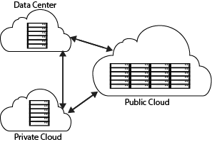

# Enterprise Cloud Adoption Journey: Technical Challenges

For full documentation visit [aviatrix.com/docs](http://aviatrix.com/docs).

## Introduction

The enterprise journey to cloud adoption can be driven by two different types of incentives.  The business drives one type, building new, transformative capabilities.  
Here the cloud is an enabler that has become more accessible. 
 The other type is focused on optimizing the legacy data center environments within IT.  
 These two types are usually happening in parallel.  
 In all cases, cloud adoption is accelerating, and along with it an increasing number of challenges.
 

Migrating, deploying and running applications in the cloud is amongst the top priorities of every CIO. Massive application workloads like Enterprise Resource Planning applications (ERP), large custom applications, high performance computing applications and backup and disaster recovery applications are migrating to the public cloud. Most enterprises are stepping into the cloud with a hybrid approach. Aviatrix for Hybrid Cloud enables enterprises to design, configure and operate secure and scalable hybrid cloud networks to migrate, access and run applications in the public cloud.

Aviatrix for Hybrid Cloud eliminates the complexity of connecting to and across public clouds and VPCs (Virtual Public Cloud) with a simple mesh architecture. Aviatrix is fully integrated with Amazon Web Services (AWS), Microsoft Azure and Google Cloud Platform.

## Business Reasons
This is a typical list of CIO and enterprise motives that drive the move of enterprise applications to the cloud.
### New business models
>•	pay-as-you-go flexibility to expand / reduce IT footprint as needed

>•	untested workloads, “fail-fast, fail-cheap” POC’s

### New application architectures
>•	design new apps for the cloud day1
### Disaster recovery and high availability
>•	geo-dispersed sites

>•	system redundancy

>•	significantly easier and automated periodic testing

### Cost savings
>•	especially storage costs

>•	limited IT staff and resource growth

>•	temporary spikes in capacity demands

### International expansion and collaboration
>•	M&A activities resulting in geographically dispersed disparate systems 
>•	Expansion into new global markets
### Compelling events
>•	Expiring data center equipment support
>•	Expiring data center leases
### Compliance
>•	Requirements for local data hosting in the region being served vs centralized 

## Use Cases
The following use cases represent examples of the above scenarios.

### Use Case #1: Disaster recovery and high availability
Instances in the cloud are not much different than instances in the data center in terms of failure possibilities.  This includes server/service/VM failures and reboots, zone failures, and multi-zone cloud failures.  To achieve multiple 9s of availability, processes need to be in place for these types of failure mechanisms, including the need to automate everything and do on-going assurance testing on a regular basis. 
Cloud customers can use hybrid clouds to promote both DR and HA, oftentimes extending DR protection to important, yet previously unprotected systems.

### Use Case #3: Big data, storage and backup/archiving 
Enterprises have accumulated huge volumes of data, stored in databases, which power the applications that their end users and customers rely on every day. These applications often involve many VMs as part of their architecture, and their databases often hold terabytes worth of data, even though much of that data lays “at rest” for large portions of the time.
There are two major benefits to getting these applications and their datasets into the cloud. First, a greatly reduced on-premises hardware footprint by reducing both servers and storage. Second, these applications can now benefit from the elasticity of the cloud, by easily adding more compute (for the application) or storage (for the databases) whenever needed.

### Use Case #4:  DevOps/QA/Test 
Developers need an agile, flexible, dynamic environment for developing and testing software applications. Moving CI/CD applications for development and testing to the cloud has clear benefits, including cost savings and increased time-to-market. These applications are lower-risk, lower performance, mostly self-contained with no dependencies, and good “phase 1” candidates for migration.

### Use Case #5: Home grown (legacy) applications
HR departments may have large workloads: recruitment management, relocation, benefits administration, human capital management, finance and accounting, SCM/procurement, expense reporting, time management, etc. These applications are used sporadically and have low performance requirements, making them an ideal choice to offload from on-premises and into the cloud.
Other legacy applications used by finance/legal departments may be used infrequently and have low performance needs, as well as legacy custom stubs for SSO or employee VPN access all would benefit by moving to the cloud.
Offloading these applications means that IT can reallocate this hardware to applications that require more steady computing power, or decommission the hardware altogether. Either scenario means time and efficiency gains for the IT department, without any noticeable change in performance from end users.

## Technical Challenges

The technical requirements and challenges enterprises face during this journey to the cloud are multi-faceted.

### Latency
### Throughput
### Security
### VPN access
### Site-to-Cloud/ Cloud-to-Cloud
### Multi-Vendor
### Peering
### Custom network configurations
### Large data-sets
### Multi-tenancy

## Summary
<should say something about how Aviatrix address some of these challenges?>
